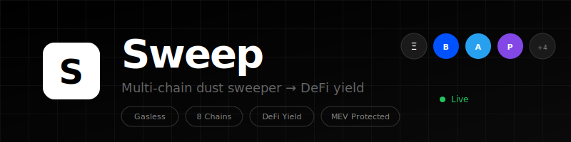

<p align="center"> 
  <picture>
    <source media="(prefers-color-scheme: dark)" srcset="docs/assets/sweep-banner.svg">
    <source media="(prefers-color-scheme: light)" srcset="docs/assets/sweep-banner-light.svg">
    
  </picture>
</p> 

<p align="center">
  <strong>Multi-chain dust sweeper that consolidates small token balances into DeFi yield positions.</strong>
</p>

<p align="center">
  <a href="https://github.com/nirholas/sweep/blob/main/LICENSE"></a>
  <a href="https://github.com/nirholas/sweep"></a>
  
</p>

<p align="center">
  <a href="#quick-start">Quick Start</a> · 
  <a href="#features">Features</a> · 
  <a href="docs/">Docs</a> · 
  <a href="#contributing">Contributing</a>
</p>

<br/>

<p align="center">
  <code>TypeScript</code> · <code>Solidity</code> · <code>Next.js 14</code> · <code>Foundry</code> · <code>Hono</code>
</p>

---

## Problem

Crypto users accumulate "dust" — small token balances worth $0.50-$10 that are economically impractical to move because gas fees exceed the token value.

```
Wallet Analysis
───────────────────────────────────────────
  Ethereum    $3.20 SHIB, $2.10 PEPE    ✗ no ETH for gas
  Base        $5.40 memecoins          ✗ no ETH for gas
  Arbitrum    $4.80 ARB dust           ✗ no ETH for gas
  Solana      $8.50 memecoins          ✗ no SOL for gas
───────────────────────────────────────────
  Total Trapped Value: $24.00
```

## Solution

Sweep consolidates dust across chains, pays gas with tokens you have, and routes everything into DeFi yield.

**Features**

| | |
|---|---|
| Multi-Chain | Ethereum · Base · Arbitrum · Polygon · BSC · Linea · Optimism · Solana |
| Gasless | Pay gas with any ERC-20 via ERC-4337 account abstraction |
| DeFi Yield | Route to Aave · Yearn · Beefy · Lido · Jito |
| Cross-Chain | Consolidate from all chains to one destination |
| MEV Protected | CoW Protocol batch auctions |

## Structure

```
sweep/
├── contracts/     Solidity (Foundry)
├── src/           Backend API (Hono)
├── frontend/      Next.js 14
├── docs/          Documentation
└── tests/         Test suites
```

## Quick Start

**Prerequisites:** Node.js 20+, Docker, Foundry

```bash
git clone https://github.com/nirholas/sweep.git && cd sweep
cp .env.example .env        # Configure your keys
docker-compose up -d        # Start Postgres + Redis
npm install && npm run db:migrate && npm run dev
```

**Contracts**

```bash
cd contracts && forge install && forge build && forge test
```

**Frontend**

```bash
cd frontend && npm install && npm run dev
```

## Docs

| | |
|---|---|
| [Architecture](./docs/architecture/SYSTEM_ARCHITECTURE.md) | System design |
| [API Reference](./docs/API.md) | REST endpoints |
| [OpenAPI Spec](./docs/openapi.yaml) | OpenAPI 3.1 |
| [Contracts](./docs/CONTRACTS.md) | Smart contracts |
| [Security](./docs/SECURITY.md) | Security policy |

## Tech Stack

| | |
|---|---|
| Contracts | Solidity · Foundry · OpenZeppelin |
| Backend | Node.js · Hono · BullMQ · Drizzle |
| Frontend | Next.js 14 · wagmi · viem · Tailwind |
| Infra | PostgreSQL · Redis · Docker · K8s |
| AA | ERC-4337 · Pimlico · Coinbase Smart Wallet |
| DEX | 1inch · Jupiter · Li.Fi · CoW Protocol |
| DeFi | Aave V3 · Yearn V3 · Beefy · Lido |

## Contributing

```
fork → branch → commit → push → PR
```

## License

Apache 2.0 — see [LICENSE](./LICENSE)

<details>
<summary>.</summary>
# ERC-8004 Keywords & SEO Terms

> Comprehensive keyword list for ERC-8004 Trustless Agents ecosystem

---

## Core Protocol Keywords

ERC-8004, ERC8004, EIP-8004, EIP8004, Trustless Agents, trustless agent, trustless AI, trustless AI agents, agent protocol, agent standard, Ethereum agent standard, blockchain agent protocol, on-chain agents, onchain agents, on-chain AI, onchain AI, decentralized agents, decentralized AI agents, autonomous agents, autonomous AI agents, AI agent protocol, AI agent standard, agent discovery, agent trust, agent reputation, agent validation, agent identity, agent registry, identity registry, reputation registry, validation registry, agent NFT, ERC-721 agent, agent tokenId, agentId, agentURI, agentWallet, agent registration, agent registration file, agent-registration.json, agent card, agent metadata, agent endpoints, agent discovery protocol, agent trust protocol, open agent protocol, open agent standard, permissionless agents, permissionless AI, censorship-resistant agents, portable agent identity, portable AI identity, verifiable agents, verifiable AI agents, accountable agents, accountable AI, agent accountability

## Blockchain & Web3 Keywords

Ethereum, Ethereum mainnet, ETH, EVM, Ethereum Virtual Machine, smart contracts, Solidity, blockchain, decentralized, permissionless, trustless, on-chain, onchain, L2, Layer 2, Base, Optimism, Polygon, Linea, Arbitrum, Scroll, Monad, Gnosis, Celo, Sepolia, testnet, mainnet, singleton contracts, singleton deployment, ERC-721, NFT, non-fungible token, tokenURI, URIStorage, EIP-712, ERC-1271, wallet signature, EOA, smart contract wallet, gas fees, gas sponsorship, EIP-7702, subgraph, The Graph, indexer, blockchain indexing, IPFS, decentralized storage, content-addressed, immutable data, public registry, public good, credibly neutral, credibly neutral infrastructure, open protocol, open standard, Web3, crypto, cryptocurrency, DeFi, decentralized finance

## AI & Agent Technology Keywords

AI agents, artificial intelligence agents, autonomous AI, AI autonomy, LLM agents, large language model agents, machine learning agents, ML agents, AI assistant, AI chatbot, intelligent agents, software agents, digital agents, virtual agents, AI automation, automated agents, agent-to-agent, A2A, A2A protocol, Google A2A, Agent2Agent, MCP, Model Context Protocol, agent communication, agent interoperability, agent orchestration, agent collaboration, multi-agent, multi-agent systems, agent capabilities, agent skills, agent tools, agent prompts, agent resources, agent completions, AgentCard, agent card, agent endpoint, agent service, AI service, AI API, agent API, AI infrastructure, agent infrastructure, agentic, agentic web, agentic economy, agentic commerce, agent economy, agent marketplace, AI marketplace, agent platform, AI platform

## Trust & Reputation Keywords

trust, trustless, reputation, reputation system, reputation protocol, reputation registry, feedback, client feedback, user feedback, on-chain feedback, on-chain reputation, verifiable reputation, portable reputation, reputation aggregation, reputation scoring, reputation algorithm, trust signals, trust model, trust verification, trust layer, recursive reputation, reviewer reputation, spam prevention, Sybil attack, Sybil resistance, anti-spam, feedback filtering, trusted reviewers, rating, rating system, quality rating, starred rating, uptime rating, success rate, response time, performance history, track record, audit trail, immutable feedback, permanent feedback, feedback response, appendResponse, giveFeedback, revokeFeedback, feedback tags, feedback value, valueDecimals, feedbackURI, feedbackHash, clientAddress, reviewer address

## Validation & Verification Keywords

validation, validation registry, validator, validator contract, cryptographic validation, cryptographic proof, cryptographic attestation, zero-knowledge, ZK, zkML, zero-knowledge machine learning, ZK proofs, trusted execution environment, TEE, TEE attestation, TEE oracle, stake-secured, staking validators, crypto-economic security, inference re-execution, output validation, work verification, third-party validation, independent validation, validation request, validation response, validationRequest, validationResponse, requestHash, responseHash, verifiable computation, verified agents, verified behavior, behavioral validation, agent verification

## Payment & Commerce Keywords

x402, x402 protocol, x402 payments, programmable payments, micropayments, HTTP payments, pay-per-request, pay-per-task, agent payments, AI payments, agent monetization, AI monetization, agent commerce, AI commerce, agentic commerce, agent economy, AI economy, agent marketplace, service marketplace, agent-to-agent payments, A2A payments, stablecoin payments, USDC, crypto payments, on-chain payments, payment settlement, programmable settlement, proof of payment, proofOfPayment, payment receipt, payment verification, Coinbase, Coinbase x402, agent pricing, API pricing, service pricing, subscription, API keys, revenue, trading yield, cumulative revenues, agent wallet, payment address, toAddress, fromAddress, txHash

## Discovery & Registry Keywords

agent discovery, service discovery, agent registry, identity registry, agent registration, register agent, mint agent, agent NFT, agent tokenId, agent browsing, agent explorer, agent scanner, 8004scan, 8004scan.io, agentscan, agentscan.info, 8004agents, 8004agents.ai, agent leaderboard, agent ranking, top agents, agent listing, agent directory, agent catalog, agent index, browse agents, search agents, find agents, discover agents, agent visibility, agent discoverability, no-code registration, agent creation, create agent, my agents, agent owner, agent operator, agent transfer, transferable agent, portable agent

## Endpoints & Integration Keywords

endpoint, agent endpoint, service endpoint, API endpoint, MCP endpoint, A2A endpoint, web endpoint, HTTPS endpoint, HTTP endpoint, DID, decentralized identifier, ENS, Ethereum Name Service, ENS name, agent.eth, vitalik.eth, email endpoint, OASF, Open Agent Specification Format, endpoint verification, domain verification, endpoint ownership, .well-known, well-known, agent-registration.json, endpoint domain, endpoint URL, endpoint URI, base64 data URI, on-chain metadata, off-chain metadata, metadata storage, JSON metadata, agent JSON, registration JSON

## SDK & Developer Tools Keywords

SDK, Agent0 SDK, Agent0, ChaosChain SDK, ChaosChain, Lucid Agents, Daydreams AI, create-8004-agent, npm, TypeScript SDK, Python SDK, JavaScript, Solidity, smart contract, ABI, contract ABI, deployed contracts, contract addresses, Hardhat, development tools, developer tools, dev tools, API, REST API, GraphQL, subgraph, The Graph, indexer, blockchain explorer, Etherscan, contract verification, open source, MIT license, CC0, public domain, GitHub, repository, code repository, documentation, docs, best practices, reference implementation

## Ecosystem & Community Keywords

ecosystem, community, builder, builders, developer, developers, contributor, contributors, partner, partners, collaborator, collaborators, co-author, co-authors, MetaMask, Ethereum Foundation, Google, Coinbase, Consensys, AltLayer, Virtuals Protocol, Olas, EigenLayer, Phala, ElizaOS, Flashbots, Polygon, Base, Optimism, Arbitrum, Scroll, Linea, Monad, Gnosis, Celo, Near Protocol, Filecoin, Worldcoin, ThirdWeb, ENS, Collab.land, DappRadar, Giza Tech, Theoriq, OpenServ, Questflow, Semantic, Semiotic, Cambrian, Nevermined, Oasis, Towns Protocol, Warden Protocol, Terminal3, Pinata Cloud, Silence Labs, Rena Labs, Index Network, Trusta Network, Turf Network

## Key People & Organizations Keywords

Marco De Rossi, MetaMask AI Lead, Davide Crapis, Ethereum Foundation AI, Head of AI, Jordan Ellis, Google engineer, Erik Reppel, Coinbase engineering, Head of Engineering, Sumeet Chougule, ChaosChain founder, YQ, AltLayer co-founder, Wee Kee, Virtuals contributor, Cyfrin audit, Nethermind audit, Ethereum Foundation Security Team, security audit, audited contracts

## Use Cases & Applications Keywords

trading bot, DeFi agent, yield optimizer, data oracle, price feed, analytics agent, research agent, coding agent, development agent, automation agent, task agent, workflow agent, portfolio management, asset management, supply chain, service agent, API service, chatbot, AI assistant, virtual assistant, personal agent, enterprise agent, B2B agent, agent-as-a-service, AaaS, SaaS agent, AI SaaS, delegated agent, proxy agent, helper agent, worker agent, coordinator agent, orchestrator agent, validator agent, auditor agent, insurance agent, scoring agent, ranking agent

## Technical Specifications Keywords

ERC-8004 specification, EIP specification, Ethereum Improvement Proposal, Ethereum Request for Comment, RFC 2119, RFC 8174, MUST, SHOULD, MAY, OPTIONAL, REQUIRED, interface, contract interface, function signature, event, emit event, indexed event, storage, contract storage, view function, external function, public function, uint256, int128, uint8, uint64, bytes32, string, address, array, struct, MetadataEntry, mapping, modifier, require, revert, transfer, approve, operator, owner, tokenId, URI, hash, keccak256, KECCAK-256, signature, deadline

## Events & Conferences Keywords

8004 Launch Day, Agentic Brunch, Builder Nights Denver, Trustless Agent Day, Devconnect, ETHDenver, community call, meetup, hackathon, workshop, conference, summit, builder program, grants, bounties, ecosystem fund

## News & Media Keywords

announcement, launch, mainnet launch, testnet launch, protocol update, upgrade, security review, audit, milestone, breaking news, ecosystem news, agent news, AI news, blockchain news, Web3 news, crypto news, DeFi news, newsletter, blog, article, press release, media coverage

## Competitor & Alternative Keywords

agent framework, agent platform, AI platform, centralized agents, closed agents, proprietary agents, gatekeeper, intermediary, platform lock-in, vendor lock-in, data silos, walled garden, open alternative, decentralized alternative, permissionless alternative, trustless alternative

## Future & Roadmap Keywords

cross-chain, multi-chain, chain agnostic, bridge, interoperability, governance, community governance, decentralized governance, DAO, protocol upgrade, upgradeable contracts, UUPS, proxy contract, ERC1967Proxy, protocol evolution, standard finalization, EIP finalization, mainnet feedback, testnet feedback, security improvements, gas optimization, feature request, enhancement, proposal

---

## Long-tail Keywords & Phrases

how to register AI agent on blockchain, how to create ERC-8004 agent, how to build trustless AI agent, how to verify agent reputation, how to give feedback to AI agent, how to monetize AI agent, how to accept crypto payments AI agent, how to discover AI agents, how to trust AI agents, how to validate AI agent output, decentralized AI agent marketplace, on-chain AI agent registry, blockchain-based AI reputation, verifiable AI agent identity, portable AI agent reputation, permissionless AI agent registration, trustless AI agent discovery, autonomous AI agent payments, agent-to-agent micropayments, AI agent service discovery, AI agent trust protocol, open source AI agent standard, Ethereum AI agent protocol, EVM AI agent standard, blockchain AI agent framework, decentralized AI agent infrastructure, Web3 AI agent ecosystem, crypto AI agent platform, DeFi AI agent integration, NFT-based agent identity, ERC-721 agent registration, on-chain agent metadata, off-chain agent data, IPFS agent storage, subgraph agent indexing, agent explorer blockchain, agent scanner Ethereum, agent leaderboard ranking, agent reputation scoring, agent feedback system, agent validation proof, zkML agent verification, TEE agent attestation, stake-secured agent validation, x402 agent payments, MCP agent endpoint, A2A agent protocol, ENS agent name, DID agent identity, agent wallet address, agent owner operator, transferable agent NFT, portable agent identity, censorship-resistant agent registry, credibly neutral agent infrastructure, public good agent data, open agent economy, agentic web infrastructure, trustless agentic commerce, autonomous agent economy, AI agent economic actors, accountable AI agents, verifiable AI behavior, auditable AI agents, transparent AI agents, decentralized AI governance, community-driven AI standards, open protocol AI agents, permissionless AI innovation

---

## Brand & Product Keywords

8004, 8004.org, Trustless Agents, trustlessagents, trustless-agents, 8004scan, 8004scan.io, agentscan, agentscan.info, 8004agents, 8004agents.ai, Agent0, agent0, sdk.ag0.xyz, ChaosChain, chaoschain, docs.chaoscha.in, Lucid Agents, lucid-agents, daydreams.systems, create-8004-agent, erc-8004-contracts, best-practices, agent0lab, subgraph

---

## Hashtags & Social Keywords

#ERC8004, #TrustlessAgents, #AIAgents, #DecentralizedAI, #OnChainAI, #AgenticWeb, #AgentEconomy, #Web3AI, #BlockchainAI, #EthereumAI, #CryptoAI, #AutonomousAgents, #AIAutonomy, #AgentDiscovery, #AgentTrust, #AgentReputation, #x402, #MCP, #A2A, #AgentProtocol, #OpenAgents, #PermissionlessAI, #VerifiableAI, #AccountableAI, #AIInfrastructure, #AgentInfrastructure, #BuildWithAgents, #AgentBuilders, #AgentDevelopers, #AgentEcosystem

---

## Statistical Keywords

10000+ agents, 10300+ agents, 10000+ testnet registrations, 20000+ feedback, 5 months development, 80+ teams, 100+ partners, January 28 2026, January 29 2026, mainnet live, production ready, audited contracts, singleton deployment, per-chain singleton, ERC-721 token, NFT minting, gas fees, $5-20 mainnet gas

---

## Additional Core Protocol Terms

ERC 8004, EIP 8004, trustless agent protocol, trustless agent standard, trustless agent framework, trustless agent system, trustless agent network, trustless agent infrastructure, trustless agent architecture, trustless agent specification, trustless agent implementation, trustless agent deployment, trustless agent integration, trustless agent ecosystem, trustless agent platform, trustless agent marketplace, trustless agent registry, trustless agent identity, trustless agent reputation, trustless agent validation, trustless agent discovery, trustless agent verification, trustless agent authentication, trustless agent authorization, trustless agent registration, trustless agent management, trustless agent operations, trustless agent services, trustless agent solutions, trustless agent technology, trustless agent innovation, trustless agent development, trustless agent research, trustless agent security, trustless agent privacy, trustless agent transparency, trustless agent accountability, trustless agent governance, trustless agent compliance, trustless agent standards, trustless agent protocols, trustless agent interfaces, trustless agent APIs, trustless agent SDKs, trustless agent tools, trustless agent utilities, trustless agent libraries, trustless agent modules, trustless agent components, trustless agent extensions

## Extended Blockchain Terms

Ethereum blockchain, Ethereum network, Ethereum protocol, Ethereum ecosystem, Ethereum infrastructure, Ethereum development, Ethereum smart contract, Ethereum dApp, Ethereum application, Ethereum transaction, Ethereum gas, Ethereum wallet, Ethereum address, Ethereum account, Ethereum signature, Ethereum verification, Ethereum consensus, Ethereum finality, Ethereum block, Ethereum chain, Ethereum node, Ethereum client, Ethereum RPC, Ethereum JSON-RPC, Ethereum Web3, Ethereum ethers.js, Ethereum viem, Ethereum wagmi, Ethereum hardhat, Ethereum foundry, Ethereum truffle, Ethereum remix, Ethereum deployment, Ethereum verification, Ethereum explorer, Ethereum scanner, Base blockchain, Base network, Base L2, Base layer 2, Base mainnet, Base testnet, Base Sepolia, Optimism blockchain, Optimism network, Optimism L2, Optimism mainnet, Optimism Sepolia, Polygon blockchain, Polygon network, Polygon PoS, Polygon zkEVM, Polygon mainnet, Polygon Mumbai, Arbitrum blockchain, Arbitrum One, Arbitrum Nova, Arbitrum Sepolia, Arbitrum Stylus, Linea blockchain, Linea network, Linea mainnet, Linea testnet, Scroll blockchain, Scroll network, Scroll mainnet, Scroll Sepolia, Monad blockchain, Monad network, Monad testnet, Gnosis Chain, Gnosis Safe, Celo blockchain, Celo network, Avalanche, Fantom, BNB Chain, BSC, Binance Smart Chain, zkSync, StarkNet, Mantle, Blast, Mode, Zora, opBNB, Manta, Taiko

## Extended AI Agent Terms

artificial intelligence agent, machine learning agent, deep learning agent, neural network agent, transformer agent, GPT agent, Claude agent, Gemini agent, Llama agent, Mistral agent, AI model agent, foundation model agent, language model agent, multimodal agent, vision agent, audio agent, speech agent, text agent, code agent, coding assistant, programming agent, developer agent, software agent, application agent, web agent, mobile agent, desktop agent, cloud agent, edge agent, IoT agent, robotic agent, automation agent, workflow agent, process agent, task agent, job agent, worker agent, assistant agent, helper agent, support agent, service agent, utility agent, tool agent, function agent, capability agent, skill agent, knowledge agent, reasoning agent, planning agent, decision agent, execution agent, monitoring agent, logging agent, analytics agent, reporting agent, notification agent, alert agent, scheduling agent, calendar agent, email agent, messaging agent, chat agent, conversation agent, dialogue agent, interactive agent, responsive agent, reactive agent, proactive agent, predictive agent, adaptive agent, learning agent, evolving agent, self-improving agent, autonomous agent system, multi-agent architecture, agent swarm, agent collective, agent network, agent cluster, agent pool, agent fleet, agent army, agent workforce, agent team, agent group, agent ensemble, agent coalition, agent federation, agent consortium, agent alliance, agent partnership, agent collaboration, agent cooperation, agent coordination, agent orchestration, agent choreography, agent composition, agent aggregation, agent integration, agent interoperability, agent compatibility, agent standardization, agent normalization, agent harmonization

## Extended Trust & Reputation Terms

trust protocol, trust system, trust network, trust infrastructure, trust layer, trust framework, trust model, trust algorithm, trust computation, trust calculation, trust score, trust rating, trust level, trust tier, trust grade, trust rank, trust index, trust metric, trust indicator, trust signal, trust factor, trust weight, trust coefficient, trust threshold, trust minimum, trust maximum, trust average, trust median, trust distribution, trust aggregation, trust normalization, trust scaling, trust decay, trust growth, trust accumulation, trust history, trust timeline, trust evolution, trust trajectory, trust prediction, trust forecast, trust estimation, trust inference, trust derivation, trust propagation, trust transfer, trust delegation, trust inheritance, trust chain, trust path, trust graph, trust network analysis, trust community detection, trust clustering, trust similarity, trust distance, trust proximity, trust relationship, trust connection, trust link, trust edge, trust node, trust vertex, reputation protocol, reputation system, reputation network, reputation infrastructure, reputation layer, reputation framework, reputation model, reputation algorithm, reputation computation, reputation calculation, reputation score, reputation rating, reputation level, reputation tier, reputation grade, reputation rank, reputation index, reputation metric, reputation indicator, reputation signal, reputation factor, reputation weight, reputation coefficient, reputation threshold, reputation minimum, reputation maximum, reputation average, reputation median, reputation distribution, reputation aggregation, reputation normalization, reputation scaling, reputation decay, reputation growth, reputation accumulation, reputation history, reputation timeline, reputation evolution, reputation trajectory, reputation prediction, reputation forecast, reputation estimation, reputation inference, reputation derivation, reputation propagation, reputation transfer, reputation delegation, reputation inheritance, reputation chain, reputation path, reputation graph, reputation network analysis, reputation community detection, reputation clustering, reputation similarity, reputation distance, reputation proximity, reputation relationship, reputation connection, reputation link, feedback protocol, feedback system, feedback network, feedback infrastructure, feedback layer, feedback framework, feedback model, feedback algorithm, feedback computation, feedback calculation, feedback score, feedback rating, feedback level, feedback tier, feedback grade, feedback rank, feedback index, feedback metric, feedback indicator, feedback signal, feedback factor, feedback weight, feedback coefficient, feedback threshold, feedback minimum, feedback maximum, feedback average, feedback median, feedback distribution, feedback aggregation, feedback normalization, feedback scaling, review system, rating system, scoring system, ranking system, evaluation system, assessment system, appraisal system, judgment system, quality assurance, quality control, quality metrics, quality standards, quality benchmarks, performance metrics, performance indicators, performance benchmarks, performance standards, performance evaluation, performance assessment, performance monitoring, performance tracking, performance analytics, performance reporting, performance dashboard

## Extended Validation & Verification Terms

validation protocol, validation system, validation network, validation infrastructure, validation layer, validation framework, validation model, validation algorithm, validation computation, validation process, validation procedure, validation workflow, validation pipeline, validation chain, validation sequence, validation step, validation stage, validation phase, validation checkpoint, validation gate, validation barrier, validation filter, validation criteria, validation rules, validation logic, validation conditions, validation requirements, validation specifications, validation standards, validation benchmarks, validation metrics, validation indicators, validation signals, validation evidence, validation proof, validation attestation, validation certification, validation confirmation, validation approval, validation acceptance, validation rejection, validation failure, validation success, validation result, validation outcome, validation report, validation log, validation audit, validation trace, validation record, validation history, verification protocol, verification system, verification network, verification infrastructure, verification layer, verification framework, verification model, verification algorithm, verification computation, verification process, verification procedure, verification workflow, verification pipeline, verification chain, verification sequence, verification step, verification stage, verification phase, verification checkpoint, verification gate, verification barrier, verification filter, verification criteria, verification rules, verification logic, verification conditions, verification requirements, verification specifications, verification standards, verification benchmarks, verification metrics, verification indicators, verification signals, verification evidence, verification proof, verification attestation, verification certification, verification confirmation, verification approval, verification acceptance, verification rejection, verification failure, verification success, verification result, verification outcome, verification report, verification log, verification audit, verification trace, verification record, verification history, cryptographic verification, mathematical verification, formal verification, automated verification, manual verification, human verification, machine verification, AI verification, hybrid verification, multi-party verification, distributed verification, decentralized verification, consensus verification, probabilistic verification, deterministic verification, real-time verification, batch verification, streaming verification, incremental verification, partial verification, complete verification, exhaustive verification, sampling verification, statistical verification, heuristic verification, rule-based verification, model-based verification, data-driven verification, evidence-based verification, proof-based verification, attestation-based verification, signature-based verification, hash-based verification, merkle verification, zero-knowledge verification, ZK verification, zkSNARK, zkSTARK, PLONK, Groth16, recursive proof, proof composition, proof aggregation, proof batching, proof compression, proof generation, proof verification, prover, verifier, trusted setup, universal setup, transparent setup, TEE verification, SGX verification, TDX verification, SEV verification, enclave verification, secure enclave, hardware security, hardware attestation, remote attestation, local attestation, platform attestation, application attestation, code attestation, data attestation, execution attestation, result attestation

## Extended Payment & Commerce Terms

payment protocol, payment system, payment network, payment infrastructure, payment layer, payment framework, payment model, payment algorithm, payment computation, payment process, payment procedure, payment workflow, payment pipeline, payment chain, payment sequence, payment step, payment stage, payment phase, payment gateway, payment processor, payment provider, payment service, payment solution, payment platform, payment application, payment interface, payment API, payment SDK, payment integration, payment compatibility, payment interoperability, payment standardization, payment normalization, payment harmonization, payment settlement, payment clearing, payment reconciliation, payment confirmation, payment verification, payment validation, payment authorization, payment authentication, payment security, payment privacy, payment transparency, payment accountability, payment compliance, payment regulation, payment governance, payment audit, payment reporting, payment analytics, payment monitoring, payment tracking, payment logging, payment history, payment record, payment receipt, payment invoice, payment statement, payment notification, payment alert, payment reminder, payment schedule, payment recurring, payment subscription, payment one-time, payment instant, payment delayed, payment batch, payment streaming, payment conditional, payment escrow, payment refund, payment chargeback, payment dispute, payment resolution, micropayment protocol, micropayment system, micropayment network, micropayment infrastructure, nanopayment, minipayment, small payment, fractional payment, partial payment, incremental payment, progressive payment, milestone payment, completion payment, success payment, performance payment, outcome payment, result payment, delivery payment, service payment, product payment, subscription payment, usage payment, consumption payment, metered payment, measured payment, tracked payment, verified payment, validated payment, confirmed payment, settled payment, cleared payment, finalized payment, irreversible payment, reversible payment, conditional payment, unconditional payment, guaranteed payment, insured payment, secured payment, unsecured payment, collateralized payment, uncollateralized payment, stablecoin payment, USDC payment, USDT payment, DAI payment, FRAX payment, LUSD payment, ETH payment, Ether payment, native token payment, ERC-20 payment, token payment, crypto payment, cryptocurrency payment, digital payment, electronic payment, online payment, internet payment, web payment, mobile payment, in-app payment, embedded payment, invisible payment, seamless payment, frictionless payment, instant payment, real-time payment, near-instant payment, fast payment, quick payment, rapid payment, speedy payment, efficient payment, low-cost payment, cheap payment, affordable payment, economical payment, cost-effective payment, value payment, premium payment, standard payment, basic payment, free payment, zero-fee payment, low-fee payment, minimal-fee payment, reduced-fee payment, discounted payment, promotional payment, incentivized payment, rewarded payment, cashback payment, rebate payment, bonus payment, tip payment, donation payment, contribution payment, support payment, funding payment, investment payment, capital payment, equity payment, debt payment, loan payment, credit payment, debit payment, prepaid payment, postpaid payment, pay-as-you-go payment, pay-per-use payment, pay-per-request payment, pay-per-call payment, pay-per-query payment, pay-per-task payment, pay-per-job payment, pay-per-result payment, pay-per-outcome payment, pay-per-success payment, pay-per-completion payment, pay-per-delivery payment, pay-per-service payment, pay-per-product payment, pay-per-access payment, pay-per-view payment, pay-per-download payment, pay-per-stream payment, pay-per-minute payment, pay-per-second payment, pay-per-byte payment, pay-per-token payment, pay-per-inference payment, pay-per-generation payment, pay-per-response payment, pay-per-answer payment, pay-per-solution payment, pay-per-recommendation payment, pay-per-prediction payment, pay-per-analysis payment, pay-per-insight payment, pay-per-report payment

## Extended Discovery & Registry Terms

discovery protocol, discovery system, discovery network, discovery infrastructure, discovery layer, discovery framework, discovery model, discovery algorithm, discovery computation, discovery process, discovery procedure, discovery workflow, discovery pipeline, discovery chain, discovery sequence, discovery step, discovery stage, discovery phase, discovery mechanism, discovery method, discovery technique, discovery approach, discovery strategy, discovery tactic, discovery pattern, discovery template, discovery schema, discovery format, discovery standard, discovery specification, discovery interface, discovery API, discovery SDK, discovery tool, discovery utility, discovery library, discovery module, discovery component, discovery extension, discovery plugin, discovery addon, discovery integration, discovery compatibility, discovery interoperability, discovery standardization, discovery normalization, discovery harmonization, registry protocol, registry system, registry network, registry infrastructure, registry layer, registry framework, registry model, registry algorithm, registry computation, registry process, registry procedure, registry workflow, registry pipeline, registry chain, registry sequence, registry step, registry stage, registry phase, registry mechanism, registry method, registry technique, registry approach, registry strategy, registry tactic, registry pattern, registry template, registry schema, registry format, registry standard, registry specification, registry interface, registry API, registry SDK, registry tool, registry utility, registry library, registry module, registry component, registry extension, registry plugin, registry addon, registry integration, registry compatibility, registry interoperability, registry standardization, registry normalization, registry harmonization, agent catalog, agent directory, agent index, agent database, agent repository, agent store, agent hub, agent center, agent portal, agent gateway, agent aggregator, agent collector, agent curator, agent organizer, agent manager, agent administrator, agent operator, agent controller, agent supervisor, agent monitor, agent tracker, agent watcher, agent observer, agent listener, agent subscriber, agent publisher, agent broadcaster, agent announcer, agent advertiser, agent promoter, agent marketer, agent distributor, agent connector, agent linker, agent bridge, agent router, agent dispatcher, agent scheduler, agent allocator, agent balancer, agent optimizer, agent enhancer, agent improver, agent upgrader, agent updater, agent maintainer, agent supporter, agent helper, agent assistant, agent advisor, agent consultant, agent expert, agent specialist, agent professional, agent practitioner, agent implementer, agent developer, agent builder, agent creator, agent designer, agent architect, agent engineer, agent programmer, agent coder, agent hacker, agent maker, agent producer, agent manufacturer, agent provider, agent supplier, agent vendor, agent seller, agent buyer, agent consumer, agent user, agent customer, agent client, agent subscriber, agent member, agent participant, agent contributor, agent collaborator, agent partner, agent ally, agent friend, agent colleague, agent peer, agent neighbor, agent community, agent ecosystem, agent network, agent cluster, agent group, agent team, agent squad, agent unit, agent division, agent department, agent organization, agent company, agent enterprise, agent business, agent startup, agent project, agent initiative, agent program, agent campaign, agent movement, agent revolution, agent evolution, agent transformation, agent innovation, agent disruption, agent advancement, agent progress, agent growth, agent expansion, agent scaling, agent multiplication, agent proliferation, agent adoption, agent acceptance, agent integration, agent incorporation, agent assimilation, agent absorption, agent merger, agent acquisition, agent partnership, agent collaboration, agent cooperation, agent coordination, agent synchronization, agent harmonization, agent alignment, agent optimization, agent maximization, agent minimization, agent efficiency, agent effectiveness, agent productivity, agent performance, agent quality, agent reliability, agent availability, agent accessibility, agent usability, agent scalability, agent flexibility, agent adaptability, agent extensibility, agent maintainability, agent sustainability, agent durability, agent longevity, agent persistence, agent continuity, agent stability, agent security, agent safety, agent privacy, agent confidentiality, agent integrity, agent authenticity, agent validity, agent accuracy, agent precision, agent correctness, agent completeness, agent consistency, agent coherence, agent clarity, agent simplicity, agent elegance, agent beauty, agent aesthetics

## Extended Technical Implementation Terms

smart contract development, smart contract programming, smart contract coding, smart contract writing, smart contract design, smart contract architecture, smart contract pattern, smart contract template, smart contract library, smart contract framework, smart contract toolkit, smart contract suite, smart contract collection, smart contract set, smart contract bundle, smart contract package, smart contract module, smart contract component, smart contract function, smart contract method, smart contract procedure, smart contract routine, smart contract subroutine, smart contract logic, smart contract algorithm, smart contract computation, smart contract calculation, smart contract operation, smart contract action, smart contract transaction, smart contract call, smart contract invocation, smart contract execution, smart contract deployment, smart contract migration, smart contract upgrade, smart contract update, smart contract patch, smart contract fix, smart contract bug, smart contract vulnerability, smart contract exploit, smart contract attack, smart contract defense, smart contract protection, smart contract security, smart contract audit, smart contract review, smart contract analysis, smart contract testing, smart contract verification, smart contract validation, smart contract certification, smart contract documentation, smart contract specification, smart contract interface, smart contract ABI, smart contract bytecode, smart contract opcode, smart contract gas, smart contract optimization, smart contract efficiency, smart contract performance, smart contract scalability, smart contract reliability, smart contract availability, smart contract maintainability, smart contract upgradeability, smart contract proxy, smart contract implementation, smart contract storage, smart contract memory, smart contract stack, smart contract heap, smart contract variable, smart contract constant, smart contract immutable, smart contract state, smart contract event, smart contract log, smart contract emit, smart contract modifier, smart contract require, smart contract assert, smart contract revert, smart contract error, smart contract exception, smart contract fallback, smart contract receive, smart contract payable, smart contract view, smart contract pure, smart contract external, smart contract internal, smart contract public, smart contract private, smart contract virtual, smart contract override, smart contract abstract, smart contract interface, smart contract library, smart contract import, smart contract inheritance, smart contract composition, smart contract delegation, smart contract proxy pattern, UUPS proxy, transparent proxy, beacon proxy, minimal proxy, clone factory, diamond pattern, EIP-2535, upgradeable contract, upgradeable proxy, upgrade mechanism, upgrade process, upgrade procedure, upgrade workflow, upgrade pipeline, upgrade chain, upgrade sequence, upgrade step, upgrade stage, upgrade phase, upgrade checkpoint, upgrade gate, upgrade barrier, upgrade filter, upgrade criteria, upgrade rules, upgrade logic, upgrade conditions, upgrade requirements, upgrade specifications, upgrade standards, upgrade benchmarks, upgrade metrics, upgrade indicators, upgrade signals, upgrade evidence, upgrade proof, upgrade attestation, upgrade certification, upgrade confirmation, upgrade approval, upgrade acceptance, upgrade rejection, upgrade failure, upgrade success, upgrade result, upgrade outcome, upgrade report, upgrade log, upgrade audit, upgrade trace, upgrade record, upgrade history

## Extended Use Case Terms

DeFi agent, DeFi bot, DeFi automation, DeFi yield, DeFi farming, DeFi staking, DeFi lending, DeFi borrowing, DeFi trading, DeFi arbitrage, DeFi liquidation, DeFi governance, DeFi voting, DeFi proposal, DeFi treasury, DeFi vault, DeFi pool, DeFi liquidity, DeFi swap, DeFi exchange, DeFi DEX, DeFi AMM, DeFi orderbook, DeFi perpetual, DeFi options, DeFi futures, DeFi derivatives, DeFi insurance, DeFi prediction, DeFi oracle, DeFi bridge, DeFi cross-chain, DeFi multichain, DeFi aggregator, DeFi router, DeFi optimizer, DeFi maximizer, DeFi compounder, DeFi harvester, DeFi rebalancer, DeFi hedger, DeFi protector, DeFi guardian, DeFi sentinel, DeFi watchdog, DeFi monitor, DeFi tracker, DeFi analyzer, DeFi reporter, DeFi alerter, DeFi notifier, trading agent, trading bot, trading automation, trading algorithm, trading strategy, trading signal, trading indicator, trading pattern, trading trend, trading momentum, trading volume, trading liquidity, trading spread, trading slippage, trading execution, trading order, trading limit, trading market, trading stop, trading take-profit, trading stop-loss, trading position, trading portfolio, trading balance, trading equity, trading margin, trading leverage, trading risk, trading reward, trading return, trading profit, trading loss, trading performance, trading history, trading record, trading log, trading report, trading analytics, trading dashboard, trading interface, trading API, trading SDK, trading integration, trading compatibility, trading interoperability, data agent, data bot, data automation, data collection, data aggregation, data processing, data transformation, data cleaning, data validation, data verification, data enrichment, data augmentation, data annotation, data labeling, data classification, data categorization, data clustering, data segmentation, data filtering, data sorting, data ranking, data scoring, data rating, data evaluation, data assessment, data analysis, data analytics, data visualization, data reporting, data dashboard, data interface, data API, data SDK, data integration, data compatibility, data interoperability, research agent, research bot, research automation, research collection, research aggregation, research processing, research analysis, research synthesis, research summarization, research extraction, research identification, research discovery, research exploration, research investigation, research examination, research evaluation, research assessment, research review, research critique, research comparison, research benchmarking, research testing, research experimentation, research validation, research verification, research confirmation, research publication, research dissemination, research communication, research collaboration, research cooperation, research coordination, customer service agent, customer support agent, customer success agent, customer experience agent, customer engagement agent, customer retention agent, customer acquisition agent, customer onboarding agent, customer training agent, customer education agent, sales agent, marketing agent, advertising agent, promotion agent, outreach agent, engagement agent, conversion agent, retention agent, loyalty agent, advocacy agent, referral agent, partnership agent, collaboration agent, cooperation agent, coordination agent, communication agent, messaging agent, notification agent, alert agent, reminder agent, scheduling agent, calendar agent, booking agent, reservation agent, appointment agent, meeting agent, conference agent, event agent, webinar agent, presentation agent, demonstration agent, tutorial agent, training agent, education agent, learning agent, teaching agent, coaching agent, mentoring agent, advising agent, consulting agent, expert agent, specialist agent, professional agent, practitioner agent, implementer agent, developer agent, builder agent, creator agent, designer agent, architect agent, engineer agent, programmer agent, coder agent, hacker agent, maker agent, producer agent, manufacturer agent, provider agent, supplier agent, vendor agent, content agent, writing agent, copywriting agent, editing agent, proofreading agent, translation agent, localization agent, transcription agent, summarization agent, extraction agent, generation agent, creation agent, production agent, publication agent, distribution agent, syndication agent, aggregation agent, curation agent, recommendation agent, personalization agent, customization agent, optimization agent, enhancement agent, improvement agent, refinement agent, polishing agent, finishing agent, completion agent, delivery agent, fulfillment agent, execution agent, implementation agent, deployment agent, integration agent, configuration agent, setup agent, installation agent, maintenance agent, support agent, troubleshooting agent, debugging agent, fixing agent, patching agent, updating agent, upgrading agent, migrating agent, transitioning agent, transforming agent, converting agent, adapting agent, adjusting agent, modifying agent, changing agent, evolving agent, growing agent, expanding agent, scaling agent, multiplying agent, proliferating agent

---

## Industry & Vertical Keywords

healthcare agent, medical agent, clinical agent, diagnostic agent, treatment agent, pharmaceutical agent, drug discovery agent, patient agent, doctor agent, nurse agent, hospital agent, clinic agent, telemedicine agent, telehealth agent, health monitoring agent, wellness agent, fitness agent, nutrition agent, mental health agent, therapy agent, counseling agent, psychology agent, psychiatry agent, insurance agent, claims agent, underwriting agent, risk assessment agent, actuarial agent, policy agent, coverage agent, benefits agent, reimbursement agent, billing agent, invoicing agent, accounting agent, bookkeeping agent, tax agent, audit agent, compliance agent, regulatory agent, legal agent, contract agent, agreement agent, negotiation agent, dispute agent, arbitration agent, mediation agent, litigation agent, court agent, judge agent, lawyer agent, attorney agent, paralegal agent, notary agent, real estate agent, property agent, housing agent, rental agent, lease agent, mortgage agent, appraisal agent, valuation agent, inspection agent, construction agent, architecture agent, engineering agent, design agent, planning agent, zoning agent, permit agent, licensing agent, certification agent, accreditation agent, quality agent, testing agent, inspection agent, manufacturing agent, production agent, assembly agent, logistics agent, supply chain agent, inventory agent, warehouse agent, shipping agent, delivery agent, transportation agent, fleet agent, routing agent, dispatch agent, tracking agent, monitoring agent, surveillance agent, security agent, protection agent, safety agent, emergency agent, disaster agent, crisis agent, response agent, recovery agent, restoration agent, maintenance agent, repair agent, service agent, support agent, helpdesk agent, ticketing agent, incident agent, problem agent, change agent, release agent, deployment agent, configuration agent, asset agent, resource agent, capacity agent, performance agent, optimization agent, efficiency agent, productivity agent, automation agent, integration agent, migration agent, transformation agent, modernization agent, innovation agent, research agent, development agent, experimentation agent, prototyping agent, testing agent, validation agent, verification agent, certification agent, documentation agent, training agent, education agent, learning agent, teaching agent, tutoring agent, mentoring agent, coaching agent, consulting agent, advisory agent, strategy agent, planning agent, forecasting agent, prediction agent, analysis agent, reporting agent, visualization agent, dashboard agent, monitoring agent, alerting agent, notification agent, communication agent, collaboration agent, coordination agent, scheduling agent, calendar agent, meeting agent, conference agent, presentation agent, demonstration agent, proposal agent, quotation agent, estimation agent, budgeting agent, costing agent, pricing agent, discount agent, promotion agent, marketing agent, advertising agent, branding agent, campaign agent, outreach agent, engagement agent, conversion agent, retention agent, loyalty agent, advocacy agent, referral agent, partnership agent, alliance agent, consortium agent, federation agent, network agent, community agent, ecosystem agent, platform agent, marketplace agent, exchange agent, trading agent, brokerage agent, clearing agent, settlement agent, custody agent, escrow agent, trust agent, fiduciary agent, investment agent, portfolio agent, wealth agent, asset management agent, fund agent, hedge fund agent, mutual fund agent, ETF agent, index agent, bond agent, equity agent, derivative agent, option agent, future agent, swap agent, commodity agent, currency agent, forex agent, crypto agent, bitcoin agent, ethereum agent, altcoin agent, token agent, NFT agent, DeFi agent, yield agent, staking agent, lending agent, borrowing agent, liquidity agent, AMM agent, DEX agent, CEX agent, bridge agent, oracle agent, governance agent, DAO agent, treasury agent, proposal agent, voting agent, delegation agent, staking agent, validator agent, node agent, miner agent, block agent, transaction agent, gas agent, fee agent, reward agent, penalty agent, slashing agent, epoch agent, finality agent, consensus agent, proof agent, attestation agent, signature agent, encryption agent, decryption agent, hashing agent, merkle agent, trie agent, state agent, storage agent, memory agent, cache agent, database agent, query agent, index agent, search agent, retrieval agent, ranking agent, recommendation agent, personalization agent, segmentation agent, targeting agent, attribution agent, analytics agent, metrics agent, KPI agent, OKR agent, goal agent, objective agent, milestone agent, deadline agent, timeline agent, roadmap agent, backlog agent, sprint agent, iteration agent, release agent, version agent, changelog agent, documentation agent, specification agent, requirement agent, user story agent, acceptance criteria agent, test case agent, bug agent, issue agent, ticket agent, task agent, subtask agent, epic agent, feature agent, enhancement agent, improvement agent, optimization agent, refactoring agent, debugging agent, profiling agent, benchmarking agent, load testing agent, stress testing agent, penetration testing agent, security testing agent, vulnerability agent, exploit agent, patch agent, hotfix agent, update agent, upgrade agent, migration agent, rollback agent, backup agent, restore agent, disaster recovery agent, business continuity agent, high availability agent, fault tolerance agent, redundancy agent, replication agent, synchronization agent, consistency agent, durability agent, availability agent, partition tolerance agent, CAP agent, ACID agent, BASE agent, eventual consistency agent, strong consistency agent, linearizability agent, serializability agent, isolation agent, atomicity agent, transaction agent, commit agent, rollback agent, savepoint agent, checkpoint agent, snapshot agent, backup agent, archive agent, retention agent, lifecycle agent, expiration agent, deletion agent, purging agent, cleanup agent, garbage collection agent, memory management agent, resource management agent, capacity planning agent, scaling agent, autoscaling agent, load balancing agent, traffic management agent, rate limiting agent, throttling agent, circuit breaker agent, retry agent, timeout agent, fallback agent, graceful degradation agent, feature flag agent, A/B testing agent, canary deployment agent, blue-green deployment agent, rolling deployment agent, immutable deployment agent, infrastructure agent, platform agent, container agent, kubernetes agent, docker agent, serverless agent, function agent, lambda agent, edge agent, CDN agent, caching agent, proxy agent, gateway agent, API gateway agent, service mesh agent, sidecar agent, envoy agent, istio agent, linkerd agent, consul agent, vault agent, terraform agent, ansible agent, puppet agent, chef agent, saltstack agent, cloudformation agent, pulumi agent, crossplane agent, argocd agent, fluxcd agent, jenkins agent, github actions agent, gitlab CI agent, circleci agent, travisci agent, drone agent, tekton agent, spinnaker agent, harness agent, octopus agent, buildkite agent, teamcity agent, bamboo agent, azure devops agent, AWS codepipeline agent, GCP cloud build agent, monitoring agent, observability agent, logging agent, tracing agent, metrics agent, alerting agent, incident management agent, on-call agent, pagerduty agent, opsgenie agent, victorops agent, datadog agent, newrelic agent, dynatrace agent, splunk agent, elastic agent, prometheus agent, grafana agent, loki agent, tempo agent, jaeger agent, zipkin agent, opentelemetry agent, sentry agent, rollbar agent, bugsnag agent, honeybadger agent, raygun agent, airbrake agent

## Technology Stack Keywords

JavaScript agent, TypeScript agent, Python agent, Go agent, Rust agent, Java agent, Kotlin agent, Swift agent, Objective-C agent, C++ agent, C# agent, Ruby agent, PHP agent, Scala agent, Clojure agent, Elixir agent, Erlang agent, Haskell agent, OCaml agent, F# agent, Dart agent, Flutter agent, React agent, Vue agent, Angular agent, Svelte agent, Solid agent, Next.js agent, Nuxt agent, Remix agent, Gatsby agent, Astro agent, Qwik agent, Fresh agent, SvelteKit agent, Express agent, Fastify agent, Koa agent, Hapi agent, NestJS agent, Adonis agent, Sails agent, Meteor agent, Django agent, Flask agent, FastAPI agent, Starlette agent, Tornado agent, Pyramid agent, Bottle agent, Falcon agent, Sanic agent, Quart agent, Rails agent, Sinatra agent, Hanami agent, Roda agent, Grape agent, Spring agent, Quarkus agent, Micronaut agent, Vert.x agent, Play agent, Akka agent, Lagom agent, ASP.NET agent, Blazor agent, MAUI agent, Xamarin agent, Unity agent, Godot agent, Unreal agent, Bevy agent, Amethyst agent, ggez agent, macroquad agent, Raylib agent, SDL agent, SFML agent, OpenGL agent, Vulkan agent, DirectX agent, Metal agent, WebGL agent, WebGPU agent, Three.js agent, Babylon.js agent, PlayCanvas agent, A-Frame agent, React Three Fiber agent, Pixi.js agent, Phaser agent, Cocos agent, Defold agent, Construct agent, GameMaker agent, RPG Maker agent, Twine agent, Ink agent, Yarn Spinner agent, Dialogflow agent, Rasa agent, Botpress agent, Microsoft Bot Framework agent, Amazon Lex agent, IBM Watson agent, Google Dialogflow agent, Wit.ai agent, Snips agent, Mycroft agent, Jasper agent, Leon agent, Hugging Face agent, OpenAI agent, Anthropic agent, Cohere agent, AI21 agent, Stability AI agent, Midjourney agent, DALL-E agent, Stable Diffusion agent, Imagen agent, Gemini agent, Claude agent, GPT agent, LLaMA agent, Mistral agent, Mixtral agent, Phi agent, Qwen agent, Yi agent, DeepSeek agent, Falcon agent, MPT agent, BLOOM agent, OPT agent, Pythia agent, Cerebras agent, Inflection agent, Adept agent, Character.AI agent, Poe agent, Perplexity agent, You.com agent, Neeva agent, Kagi agent, Brave Search agent, DuckDuckGo agent, Startpage agent, Ecosia agent, Qwant agent, Mojeek agent, Yandex agent, Baidu agent, Naver agent, Seznam agent, Sogou agent

## Emerging Technology Keywords

quantum computing agent, quantum machine learning agent, quantum optimization agent, quantum simulation agent, quantum cryptography agent, post-quantum agent, lattice-based agent, hash-based agent, code-based agent, isogeny-based agent, multivariate agent, neuromorphic agent, spiking neural network agent, memristor agent, photonic agent, optical computing agent, DNA computing agent, molecular computing agent, biological computing agent, wetware agent, biocomputing agent, synthetic biology agent, gene editing agent, CRISPR agent, mRNA agent, protein folding agent, AlphaFold agent, drug discovery agent, virtual screening agent, molecular dynamics agent, computational chemistry agent, materials science agent, nanotechnology agent, metamaterials agent, 2D materials agent, graphene agent, quantum dots agent, nanoparticles agent, nanorobots agent, nanomedicine agent, targeted delivery agent, biosensors agent, wearables agent, implantables agent, brain-computer interface agent, neural interface agent, Neuralink agent, EEG agent, fMRI agent, PET agent, MEG agent, TMS agent, tDCS agent, optogenetics agent, chemogenetics agent, connectomics agent, brain mapping agent, cognitive computing agent, affective computing agent, emotion AI agent, sentiment analysis agent, opinion mining agent, social listening agent, brand monitoring agent, reputation management agent, crisis communication agent, public relations agent, media monitoring agent, press agent, journalist agent, editor agent, writer agent, author agent, content creator agent, influencer agent, streamer agent, YouTuber agent, TikToker agent, podcaster agent, blogger agent, vlogger agent, photographer agent, videographer agent, animator agent, illustrator agent, graphic designer agent, UI designer agent, UX designer agent, product designer agent, industrial designer agent, fashion designer agent, interior designer agent, architect agent, landscape architect agent, urban planner agent, city planner agent, transportation planner agent, traffic agent, autonomous vehicle agent, self-driving agent, ADAS agent, V2X agent, connected vehicle agent, smart transportation agent, smart city agent, smart grid agent, smart meter agent, smart home agent, smart building agent, smart factory agent, Industry 4.0 agent, IoT agent, IIoT agent, edge computing agent, fog computing agent, mist computing agent, cloudlet agent, mobile edge agent, MEC agent, NOMA agent, massive MIMO agent, beamforming agent, millimeter wave agent, terahertz agent, 6G agent, 5G agent, LTE agent, NB-IoT agent, LoRa agent, Sigfox agent, Zigbee agent, Z-Wave agent, Thread agent, Matter agent, HomeKit agent, Alexa agent, Google Home agent, SmartThings agent, Home Assistant agent, OpenHAB agent, Domoticz agent, Hubitat agent, Homey agent, Tuya agent, eWeLink agent, Sonoff agent, Shelly agent, Tasmota agent, ESPHome agent, WLED agent, Zigbee2MQTT agent, deCONZ agent, ZHA agent, Philips Hue agent, IKEA Tradfri agent, Aqara agent, Xiaomi agent, Yeelight agent, Nanoleaf agent, LIFX agent, TP-Link Kasa agent, Wyze agent, Ring agent, Nest agent, Ecobee agent, Honeywell agent, Emerson agent, Carrier agent, Trane agent, Lennox agent, Daikin agent, Mitsubishi Electric agent, LG agent, Samsung agent, Bosch agent, Siemens agent, ABB agent, Schneider Electric agent, Rockwell agent, Emerson agent, Honeywell agent, Yokogawa agent, Endress+Hauser agent, SICK agent, Pepperl+Fuchs agent, Balluff agent, ifm agent, Banner agent, Turck agent, Omron agent, Keyence agent, Cognex agent, Basler agent, FLIR agent, Teledyne agent, Allied Vision agent, JAI agent, IDS agent, Baumer agent, Stemmer agent, MVTec agent, Matrox agent, National Instruments agent, Beckhoff agent, Phoenix Contact agent, Wago agent, Weidmuller agent, Murrelektronik agent, Pilz agent, SICK agent, Leuze agent, Datalogic agent, Honeywell agent, Zebra agent, SATO agent, Citizen agent, TSC agent, Godex agent, Printronix agent, Epson agent, Brother agent, DYMO agent, Rollo agent, Munbyn agent, iDPRT agent, HPRT agent

## Business & Enterprise Keywords

enterprise agent, corporate agent, business agent, commercial agent, industrial agent, manufacturing agent, retail agent, wholesale agent, distribution agent, logistics agent, supply chain agent, procurement agent, sourcing agent, purchasing agent, vendor management agent, supplier agent, contractor agent, subcontractor agent, freelancer agent, consultant agent, advisor agent, strategist agent, analyst agent, researcher agent, scientist agent, engineer agent, developer agent, programmer agent, architect agent, designer agent, artist agent, creative agent, copywriter agent, content strategist agent, SEO agent, SEM agent, PPC agent, social media agent, community manager agent, brand ambassador agent, spokesperson agent, evangelist agent, advocate agent, champion agent, mentor agent, coach agent, trainer agent, instructor agent, professor agent, teacher agent, tutor agent, educator agent, facilitator agent, moderator agent, host agent, presenter agent, speaker agent, panelist agent, guest agent, expert agent, specialist agent, generalist agent, polymath agent, renaissance agent, versatile agent, adaptive agent, flexible agent, agile agent, lean agent, efficient agent, effective agent, productive agent, performant agent, scalable agent, reliable agent, available agent, durable agent, resilient agent, robust agent, stable agent, secure agent, safe agent, compliant agent, regulated agent, certified agent, accredited agent, licensed agent, authorized agent, approved agent, verified agent, validated agent, tested agent, audited agent, reviewed agent, assessed agent, evaluated agent, measured agent, quantified agent, qualified agent, skilled agent, experienced agent, knowledgeable agent, informed agent, educated agent, trained agent, certified agent, professional agent, expert agent, master agent, senior agent, principal agent, lead agent, chief agent, head agent, director agent, manager agent, supervisor agent, coordinator agent, administrator agent, operator agent, technician agent, specialist agent, analyst agent, associate agent, assistant agent, intern agent, trainee agent, apprentice agent, junior agent, mid-level agent, intermediate agent, advanced agent, expert agent, senior agent, staff agent, contractor agent, consultant agent, freelance agent, part-time agent, full-time agent, remote agent, hybrid agent, onsite agent, offshore agent, nearshore agent, outsourced agent, insourced agent, managed agent, unmanaged agent, autonomous agent, semi-autonomous agent, supervised agent, unsupervised agent, reinforcement agent, self-learning agent, adaptive agent, evolving agent, improving agent, optimizing agent, maximizing agent, minimizing agent, balancing agent, tradeoff agent, pareto agent, multi-objective agent, constraint agent, bounded agent, limited agent, unlimited agent, infinite agent, finite agent, discrete agent, continuous agent, hybrid agent, mixed agent, ensemble agent, committee agent, voting agent, consensus agent, majority agent, plurality agent, weighted agent, ranked agent, preference agent, utility agent, reward agent, penalty agent, cost agent, benefit agent, value agent, worth agent, price agent, fee agent, charge agent, rate agent, tariff agent, duty agent, tax agent, levy agent, surcharge agent, premium agent, discount agent, rebate agent, refund agent, credit agent, debit agent, balance agent, account agent, ledger agent, journal agent, record agent, entry agent, transaction agent, transfer agent, payment agent, receipt agent, invoice agent, bill agent, statement agent, report agent, summary agent, detail agent, breakdown agent, itemization agent, categorization agent, classification agent, taxonomy agent, ontology agent, schema agent, model agent, framework agent, architecture agent, design agent, pattern agent, template agent, blueprint agent, plan agent, strategy agent, tactic agent, technique agent, method agent, process agent, procedure agent, workflow agent, pipeline agent, chain agent, sequence agent, order agent, priority agent, queue agent, stack agent, heap agent, tree agent, graph agent, network agent, mesh agent, grid agent, cluster agent, pool agent, farm agent, fleet agent, swarm agent, hive agent, colony agent, pack agent, herd agent, flock agent, school agent, pod agent, pride agent, troop agent, band agent, gang agent, crew agent, team agent, squad agent, unit agent, division agent, department agent, branch agent, office agent, location agent, site agent, facility agent, plant agent, factory agent, warehouse agent, depot agent, hub agent, center agent, station agent, terminal agent, port agent, dock agent, pier agent, wharf agent, quay agent, berth agent, slip agent, marina agent, harbor agent, airport agent, heliport agent, spaceport agent, launchpad agent, runway agent, taxiway agent, apron agent, gate agent, terminal agent, concourse agent, lounge agent, checkpoint agent, security agent, customs agent, immigration agent, passport agent, visa agent, permit agent, license agent, registration agent, certification agent, accreditation agent, qualification agent, credential agent, badge agent, ID agent, identity agent, authentication agent, authorization agent, access agent, permission agent, role agent, privilege agent, right agent, entitlement agent, claim agent, assertion agent, declaration agent, statement agent, expression agent, formula agent, equation agent, function agent, variable agent, constant agent, parameter agent, argument agent, input agent, output agent, result agent, return agent, response agent, request agent, query agent, command agent, instruction agent, directive agent, order agent, message agent, signal agent, event agent, trigger agent, action agent, reaction agent, effect agent, consequence agent, outcome agent, impact agent, influence agent, change agent, transformation agent, transition agent, conversion agent, migration agent, evolution agent, revolution agent, disruption agent, innovation agent, invention agent, discovery agent, breakthrough agent, advancement agent, progress agent, growth agent, expansion agent, scaling agent, multiplication agent, proliferation agent, adoption agent, acceptance agent, integration agent, incorporation agent, assimilation agent, absorption agent, merger agent, acquisition agent, partnership agent, collaboration agent, cooperation agent, coordination agent, synchronization agent, harmonization agent, alignment agent, optimization agent, maximization agent, minimization agent, efficiency agent, effectiveness agent, productivity agent, performance agent, quality agent, reliability agent, availability agent, accessibility agent, usability agent, scalability agent, flexibility agent, adaptability agent, extensibility agent, maintainability agent, sustainability agent, durability agent, longevity agent, persistence agent, continuity agent, stability agent, security agent, safety agent, privacy agent, confidentiality agent, integrity agent, authenticity agent, validity agent, accuracy agent, precision agent, correctness agent, completeness agent, consistency agent, coherence agent, clarity agent, simplicity agent, elegance agent, beauty agent, aesthetics agent

---

## Web3 & Crypto Extended Keywords

blockchain agent, distributed ledger agent, consensus mechanism agent, proof of work agent, proof of stake agent, proof of authority agent, proof of history agent, proof of space agent, proof of capacity agent, proof of burn agent, proof of elapsed time agent, delegated proof of stake agent, nominated proof of stake agent, liquid proof of stake agent, bonded proof of stake agent, threshold proof of stake agent, BFT agent, PBFT agent, Tendermint agent, HotStuff agent, DAG agent, hashgraph agent, tangle agent, blockchain trilemma agent, scalability agent, decentralization agent, security agent, layer 1 agent, layer 2 agent, layer 3 agent, sidechain agent, plasma agent, rollup agent, optimistic rollup agent, ZK rollup agent, validium agent, volition agent, data availability agent, data availability sampling agent, DAS agent, erasure coding agent, KZG commitment agent, blob agent, EIP-4844 agent, proto-danksharding agent, danksharding agent, sharding agent, beacon chain agent, execution layer agent, consensus layer agent, merge agent, Shanghai upgrade agent, Cancun upgrade agent, Dencun agent, Pectra agent, Verkle tree agent, stateless client agent, light client agent, full node agent, archive node agent, validator node agent, sentry node agent, RPC node agent, indexer node agent, sequencer agent, proposer agent, builder agent, searcher agent, MEV agent, maximal extractable value agent, frontrunning agent, backrunning agent, sandwich attack agent, arbitrage agent, liquidation agent, just-in-time liquidity agent, order flow agent, private mempool agent, flashbots agent, MEV-boost agent, PBS agent, proposer-builder separation agent, enshrined PBS agent, inclusion list agent, censorship resistance agent, liveness agent, safety agent, finality agent, economic finality agent, social consensus agent, fork choice agent, LMD GHOST agent, Casper FFG agent, inactivity leak agent, slashing agent, whistleblower agent, attestation agent, sync committee agent, withdrawal agent, exit agent, activation agent, effective balance agent, validator lifecycle agent, epoch agent, slot agent, block proposer agent, randao agent, VRF agent, verifiable random function agent, threshold signature agent, BLS signature agent, aggregate signature agent, multi-signature agent, multisig agent, Gnosis Safe agent, Safe agent, social recovery agent, guardian agent, account abstraction agent, ERC-4337 agent, bundler agent, paymaster agent, entry point agent, user operation agent, smart account agent, smart contract wallet agent, MPC wallet agent, HSM agent, hardware wallet agent, cold wallet agent, hot wallet agent, custodial wallet agent, non-custodial wallet agent, self-custody agent, seed phrase agent, mnemonic agent, BIP-39 agent, BIP-32 agent, BIP-44 agent, derivation path agent, HD wallet agent, hierarchical deterministic agent, key derivation agent, private key agent, public key agent, address agent, checksum agent, ENS agent, Ethereum Name Service agent, DNS agent, IPNS agent, content hash agent, avatar agent, text records agent, resolver agent, registrar agent, controller agent, wrapped ETH agent, WETH agent, ERC-20 agent, ERC-721 agent, ERC-1155 agent, ERC-777 agent, ERC-2981 agent, ERC-4626 agent, ERC-6551 agent, token bound account agent, soulbound token agent, SBT agent, ERC-5192 agent, dynamic NFT agent, dNFT agent, composable NFT agent, nested NFT agent, fractional NFT agent, rental NFT agent, ERC-4907 agent, lending NFT agent, staking NFT agent, governance NFT agent, membership NFT agent, access NFT agent, credential NFT agent, certificate NFT agent, badge NFT agent, POAP agent, attendance NFT agent, achievement NFT agent, reward NFT agent, loyalty NFT agent, coupon NFT agent, ticket NFT agent, pass NFT agent, subscription NFT agent, license NFT agent, royalty NFT agent, creator economy agent, creator agent, collector agent, curator agent, gallery agent, museum agent, auction agent, marketplace agent, OpenSea agent, Blur agent, LooksRare agent, X2Y2 agent, Rarible agent, Foundation agent, SuperRare agent, Nifty Gateway agent, Art Blocks agent, generative art agent, on-chain art agent, pixel art agent, PFP agent, profile picture agent, avatar project agent, metaverse agent, virtual world agent, virtual land agent, virtual real estate agent, Decentraland agent, Sandbox agent, Otherside agent, Voxels agent, Somnium Space agent, Spatial agent, Gather agent, virtual event agent, virtual conference agent, virtual meetup agent, virtual office agent, virtual coworking agent, virtual collaboration agent, social token agent, creator coin agent, community token agent, fan token agent, governance token agent, utility token agent, security token agent, wrapped token agent, bridged token agent, synthetic token agent, rebasing token agent, elastic token agent, algorithmic token agent, stablecoin agent, fiat-backed stablecoin agent, crypto-backed stablecoin agent, algorithmic stablecoin agent, fractional stablecoin agent, CDP agent, collateralized debt position agent, vault agent, trove agent, liquidation agent, stability pool agent, redemption agent, peg agent, depeg agent, oracle agent, price oracle agent, Chainlink agent, Band Protocol agent, API3 agent, UMA agent, Tellor agent, Pyth agent, Redstone agent, Chronicle agent, price feed agent, TWAP agent, time-weighted average price agent, VWAP agent, volume-weighted average price agent, spot price agent, fair price agent, reference price agent, index price agent, mark price agent, funding rate agent, perpetual agent, perp agent, futures agent, options agent, structured products agent, vault strategy agent, yield strategy agent, delta neutral agent, basis trade agent, cash and carry agent, funding arbitrage agent, cross-exchange arbitrage agent, CEX-DEX arbitrage agent, triangular arbitrage agent, statistical arbitrage agent, market making agent, liquidity provision agent, concentrated liquidity agent, range order agent, limit order agent, stop order agent, TWAP order agent, iceberg order agent, fill or kill agent, immediate or cancel agent, good til cancelled agent, post only agent, reduce only agent, order book agent, matching engine agent, clearing house agent, settlement layer agent, netting agent, margin agent, cross margin agent, isolated margin agent, portfolio margin agent, initial margin agent, maintenance margin agent, margin call agent, auto-deleveraging agent, ADL agent, insurance fund agent, socialized loss agent, clawback agent, position agent, long position agent, short position agent, leverage agent, notional value agent, unrealized PnL agent, realized PnL agent, funding payment agent, borrowing fee agent, trading fee agent, maker fee agent, taker fee agent, gas fee agent, priority fee agent, base fee agent, EIP-1559 agent, fee market agent, gas auction agent, gas estimation agent, gas optimization agent, gas token agent, gas rebate agent, flashloan agent, flash mint agent, atomic transaction agent, bundle agent, simulation agent, tenderly agent, fork agent, mainnet fork agent, local fork agent, anvil agent, hardhat agent, foundry agent, remix agent, truffle agent, brownie agent, ape agent, slither agent, mythril agent, echidna agent, medusa agent, certora agent, formal verification agent, symbolic execution agent, fuzzing agent, property testing agent, invariant testing agent, differential testing agent, mutation testing agent, coverage agent, gas snapshot agent, storage layout agent, proxy storage agent, diamond storage agent, app storage agent, unstructured storage agent, eternal storage agent, upgradeable storage agent

## AI & Machine Learning Extended Keywords

machine learning agent, deep learning agent, reinforcement learning agent, supervised learning agent, unsupervised learning agent, semi-supervised learning agent, self-supervised learning agent, contrastive learning agent, transfer learning agent, meta-learning agent, few-shot learning agent, zero-shot learning agent, one-shot learning agent, multi-task learning agent, curriculum learning agent, active learning agent, online learning agent, offline learning agent, batch learning agent, incremental learning agent, continual learning agent, lifelong learning agent, federated learning agent, distributed learning agent, parallel learning agent, gradient descent agent, stochastic gradient descent agent, SGD agent, Adam agent, AdamW agent, LAMB agent, LARS agent, RMSprop agent, Adagrad agent, Adadelta agent, momentum agent, Nesterov agent, learning rate agent, learning rate scheduler agent, warmup agent, cosine annealing agent, step decay agent, exponential decay agent, polynomial decay agent, cyclic learning rate agent, one cycle agent, weight decay agent, L1 regularization agent, L2 regularization agent, dropout agent, batch normalization agent, layer normalization agent, group normalization agent, instance normalization agent, spectral normalization agent, weight normalization agent, gradient clipping agent, gradient accumulation agent, mixed precision agent, FP16 agent, BF16 agent, FP8 agent, INT8 agent, INT4 agent, quantization agent, post-training quantization agent, quantization-aware training agent, pruning agent, structured pruning agent, unstructured pruning agent, magnitude pruning agent, movement pruning agent, knowledge distillation agent, teacher-student agent, model compression agent, neural architecture search agent, NAS agent, AutoML agent, hyperparameter optimization agent, Bayesian optimization agent, random search agent, grid search agent, population-based training agent, evolutionary algorithm agent, genetic algorithm agent, particle swarm agent, ant colony agent, simulated annealing agent, neural network agent, feedforward network agent, recurrent network agent, RNN agent, LSTM agent, GRU agent, bidirectional RNN agent, seq2seq agent, encoder-decoder agent, attention mechanism agent, self-attention agent, cross-attention agent, multi-head attention agent, scaled dot-product attention agent, transformer agent, BERT agent, GPT agent, T5 agent, BART agent, XLNet agent, RoBERTa agent, ALBERT agent, DistilBERT agent, ELECTRA agent, DeBERTa agent, Longformer agent, BigBird agent, Performer agent, Linformer agent, Reformer agent, Sparse Transformer agent, Flash Attention agent, Multi-Query Attention agent, Grouped Query Attention agent, Sliding Window Attention agent, Local Attention agent, Global Attention agent, Relative Position agent, Rotary Position Embedding agent, RoPE agent, ALiBi agent, context length agent, context window agent, long context agent, retrieval augmented generation agent, RAG agent, vector database agent, embedding agent, sentence embedding agent, document embedding agent, image embedding agent, multimodal embedding agent, CLIP agent, BLIP agent, Flamingo agent, LLaVA agent, GPT-4V agent, Gemini Vision agent, vision language model agent, VLM agent, image captioning agent, visual question answering agent, VQA agent, image generation agent, text-to-image agent, image-to-image agent, inpainting agent, outpainting agent, super resolution agent, upscaling agent, style transfer agent, neural style agent, diffusion model agent, DDPM agent, DDIM agent, score matching agent, noise schedule agent, classifier-free guidance agent, CFG agent, ControlNet agent, LoRA agent, low-rank adaptation agent, QLoRA agent, PEFT agent, parameter-efficient fine-tuning agent, adapter agent, prefix tuning agent, prompt tuning agent, instruction tuning agent, RLHF agent, reinforcement learning from human feedback agent, DPO agent, direct preference optimization agent, PPO agent, proximal policy optimization agent, reward model agent, preference model agent, constitutional AI agent, red teaming agent, adversarial training agent, safety training agent, alignment agent, AI alignment agent, value alignment agent, goal alignment agent, reward hacking agent, reward gaming agent, specification gaming agent, goodhart agent, mesa-optimization agent, inner alignment agent, outer alignment agent, corrigibility agent, interpretability agent, explainability agent, XAI agent, SHAP agent, LIME agent, attention visualization agent, feature attribution agent, concept activation agent, probing agent, mechanistic interpretability agent, circuit analysis agent, polysemanticity agent, superposition agent, sparse autoencoder agent, dictionary learning agent, activation patching agent, causal tracing agent, logit lens agent, tuned lens agent, model editing agent, ROME agent, MEMIT agent, knowledge editing agent, fact editing agent, belief editing agent, steering vector agent, activation steering agent, representation engineering agent, latent space agent, embedding space agent, feature space agent, manifold agent, topology agent, geometry agent, curvature agent, dimensionality reduction agent, PCA agent, t-SNE agent, UMAP agent, clustering agent, K-means agent, DBSCAN agent, hierarchical clustering agent, spectral clustering agent, Gaussian mixture agent, GMM agent, variational autoencoder agent, VAE agent, beta-VAE agent, VQ-VAE agent, autoencoder agent, denoising autoencoder agent, sparse autoencoder agent, contractive autoencoder agent, GAN agent, generative adversarial network agent, DCGAN agent, StyleGAN agent, BigGAN agent, Progressive GAN agent, CycleGAN agent, Pix2Pix agent, conditional GAN agent, cGAN agent, Wasserstein GAN agent, WGAN agent, mode collapse agent, discriminator agent, generator agent, latent code agent, latent interpolation agent, disentanglement agent, flow model agent, normalizing flow agent, RealNVP agent, Glow agent, NICE agent, autoregressive model agent, PixelCNN agent, WaveNet agent, Transformer-XL agent, XLNet agent, causal language model agent, masked language model agent, next token prediction agent, span corruption agent, denoising objective agent, contrastive objective agent, SimCLR agent, MoCo agent, BYOL agent, SwAV agent, DINO agent, MAE agent, masked autoencoder agent, BEiT agent, data2vec agent, I-JEPA agent, V-JEPA agent, world model agent, predictive model agent, dynamics model agent, environment model agent, model-based RL agent, model-free RL agent, value function agent, Q-function agent, policy function agent, actor-critic agent, A2C agent, A3C agent, SAC agent, soft actor-critic agent, TD3 agent, DDPG agent, DQN agent, double DQN agent, dueling DQN agent, rainbow DQN agent, C51 agent, IQN agent, distributional RL agent, hierarchical RL agent, option framework agent, goal-conditioned RL agent, hindsight experience replay agent, HER agent, curiosity-driven agent, intrinsic motivation agent, exploration agent, exploitation agent, epsilon-greedy agent, UCB agent, Thompson sampling agent, multi-armed bandit agent, contextual bandit agent, MCTS agent, Monte Carlo tree search agent, AlphaGo agent, AlphaZero agent, MuZero agent, Gato agent, generalist agent, foundation model agent, large language model agent, LLM agent, small language model agent, SLM agent, on-device agent, edge AI agent, TinyML agent, embedded AI agent, mobile AI agent, neural engine agent, NPU agent, TPU agent, GPU agent, CUDA agent, ROCm agent, Metal agent, CoreML agent, ONNX agent, TensorRT agent, OpenVINO agent, TFLite agent, PyTorch Mobile agent, GGML agent, llama.cpp agent, whisper.cpp agent, vLLM agent, TGI agent, text generation inference agent, serving agent, inference server agent, batch inference agent, streaming inference agent, speculative decoding agent, assisted generation agent, beam search agent, greedy decoding agent, nucleus sampling agent, top-k sampling agent, top-p sampling agent, temperature agent, repetition penalty agent, presence penalty agent, frequency penalty agent, stop sequence agent, max tokens agent, context window agent, tokenizer agent, BPE agent, byte-pair encoding agent, SentencePiece agent, WordPiece agent, Unigram agent, vocabulary agent, special tokens agent, chat template agent, system prompt agent, user prompt agent, assistant response agent, function calling agent, tool use agent, code interpreter agent, retrieval agent, web browsing agent, multi-turn conversation agent, dialogue agent, chat agent, completion agent, instruction following agent, chain-of-thought agent, CoT agent, tree-of-thought agent, ToT agent, graph-of-thought agent, GoT agent, self-consistency agent, self-reflection agent, self-critique agent, self-improvement agent, self-play agent, debate agent, ensemble agent, mixture of experts agent, MoE agent, sparse MoE agent, switch transformer agent, GShard agent, routing agent, load balancing agent, expert parallelism agent, tensor parallelism agent, pipeline parallelism agent, data parallelism agent, FSDP agent, fully sharded data parallel agent, DeepSpeed agent, ZeRO agent, Megatron agent, 3D parallelism agent, activation checkpointing agent, gradient checkpointing agent, offloading agent, CPU offloading agent, NVMe offloading agent, memory efficient agent, flash attention agent, paged attention agent, continuous batching agent, dynamic batching agent, request scheduling agent, preemption agent, priority queue agent, SLA agent, latency agent, throughput agent, tokens per second agent, time to first token agent, TTFT agent, inter-token latency agent, ITL agent, end-to-end latency agent, cold start agent, warm start agent, model loading agent, weight loading agent, KV cache agent, prefix caching agent, prompt caching agent, semantic caching agent

## Geographic & Localization Keywords

North America agent, South America agent, Europe agent, Asia agent, Africa agent, Australia agent, Oceania agent, Middle East agent, Central America agent, Caribbean agent, Southeast Asia agent, East Asia agent, South Asia agent, Central Asia agent, Eastern Europe agent, Western Europe agent, Northern Europe agent, Southern Europe agent, Nordic agent, Scandinavian agent, Baltic agent, Balkan agent, Mediterranean agent, Alpine agent, Iberian agent, British agent, Irish agent, French agent, German agent, Italian agent, Spanish agent, Portuguese agent, Dutch agent, Belgian agent, Swiss agent, Austrian agent, Polish agent, Czech agent, Slovak agent, Hungarian agent, Romanian agent, Bulgarian agent, Greek agent, Turkish agent, Russian agent, Ukrainian agent, Belarusian agent, Moldovan agent, Georgian agent, Armenian agent, Azerbaijani agent, Kazakh agent, Uzbek agent, Turkmen agent, Tajik agent, Kyrgyz agent, Afghan agent, Pakistani agent, Indian agent, Bangladeshi agent, Sri Lankan agent, Nepali agent, Bhutanese agent, Maldivian agent, Burmese agent, Thai agent, Vietnamese agent, Cambodian agent, Laotian agent, Malaysian agent, Singaporean agent, Indonesian agent, Filipino agent, Bruneian agent, Timorese agent, Chinese agent, Japanese agent, Korean agent, Taiwanese agent, Hong Kong agent, Macanese agent, Mongolian agent, North Korean agent, Australian agent, New Zealand agent, Papua New Guinean agent, Fijian agent, Samoan agent, Tongan agent, Vanuatuan agent, Solomon Islands agent, Micronesian agent, Marshallese agent, Palauan agent, Nauruan agent, Kiribati agent, Tuvaluan agent, Egyptian agent, Libyan agent, Tunisian agent, Algerian agent, Moroccan agent, Mauritanian agent, Malian agent, Nigerien agent, Chadian agent, Sudanese agent, South Sudanese agent, Ethiopian agent, Eritrean agent, Djiboutian agent, Somali agent, Kenyan agent, Ugandan agent, Rwandan agent, Burundian agent, Tanzanian agent, Mozambican agent, Malawian agent, Zambian agent, Zimbabwean agent, Botswanan agent, Namibian agent, South African agent, Lesotho agent, Eswatini agent, Angolan agent, Congolese agent, Cameroonian agent, Central African agent, Gabonese agent, Equatorial Guinean agent, Sao Tomean agent, Nigerian agent, Ghanaian agent, Togolese agent, Beninese agent, Burkinabe agent, Ivorian agent, Liberian agent, Sierra Leonean agent, Guinean agent, Bissau-Guinean agent, Senegalese agent, Gambian agent, Mauritius agent, Seychelles agent, Comoros agent, Madagascar agent, Reunion agent, Mayotte agent, Canadian agent, American agent, Mexican agent, Guatemalan agent, Belizean agent, Honduran agent, Salvadoran agent, Nicaraguan agent, Costa Rican agent, Panamanian agent, Cuban agent, Jamaican agent, Haitian agent, Dominican agent, Puerto Rican agent, Bahamian agent, Barbadian agent, Trinidadian agent, Guyanese agent, Surinamese agent, Venezuelan agent, Colombian agent, Ecuadorian agent, Peruvian agent, Brazilian agent, Bolivian agent, Paraguayan agent, Uruguayan agent, Argentine agent, Chilean agent, English language agent, Spanish language agent, French language agent, German language agent, Italian language agent, Portuguese language agent, Russian language agent, Chinese language agent, Japanese language agent, Korean language agent, Arabic language agent, Hindi language agent, Bengali language agent, Urdu agent, Punjabi agent, Tamil agent, Telugu agent, Marathi agent, Gujarati agent, Kannada agent, Malayalam agent, Thai language agent, Vietnamese language agent, Indonesian language agent, Malay language agent, Filipino language agent, Turkish language agent, Persian language agent, Hebrew language agent, Greek language agent, Polish language agent, Ukrainian language agent, Dutch language agent, Swedish language agent, Norwegian language agent, Danish language agent, Finnish language agent, Hungarian language agent, Czech language agent, Romanian language agent, Bulgarian language agent, Serbian language agent, Croatian agent, Bosnian agent, Slovenian agent, Slovak agent, Lithuanian agent, Latvian agent, Estonian agent, Swahili agent, Amharic agent, Yoruba agent, Igbo agent, Hausa agent, Zulu agent, Xhosa agent, Afrikaans agent, localization agent, internationalization agent, i18n agent, l10n agent, translation agent, machine translation agent, neural machine translation agent, NMT agent, multilingual agent, cross-lingual agent, language detection agent, language identification agent, transliteration agent, romanization agent, diacritics agent, Unicode agent, UTF-8 agent, character encoding agent, right-to-left agent, RTL agent, bidirectional agent, locale agent, timezone agent, date format agent, number format agent, currency format agent, address format agent, phone format agent, name format agent, cultural adaptation agent, regional compliance agent, GDPR agent, CCPA agent, LGPD agent, POPIA agent, PDPA agent, data residency agent, data sovereignty agent, cross-border agent, international agent, global agent, worldwide agent, multinational agent, transnational agent, intercontinental agent, overseas agent, foreign agent, domestic agent, local agent, regional agent, national agent, federal agent, state agent, provincial agent, municipal agent, city agent, urban agent, suburban agent, rural agent, remote agent, offshore agent, nearshore agent, onshore agent

---

*Total Keywords: 3500+*
*Last Updated: January 29, 2026*
</details>


---

## 🌐 Live HTTP Deployment

**Sweep DeFi** is deployed and accessible over HTTP via [MCP Streamable HTTP](https://modelcontextprotocol.io/specification/2025-03-26/basic/transports#streamable-http) transport — no local installation required.

**Endpoint:**
```
https://modelcontextprotocol.name/mcp/sweep-defi
```

### Connect from any MCP Client

Add to your MCP client configuration (Claude Desktop, Cursor, SperaxOS, etc.):

```json
{
  "mcpServers": {
    "sweep-defi": {
      "type": "http",
      "url": "https://modelcontextprotocol.name/mcp/sweep-defi"
    }
  }
}
```

### Available Tools (3)

| Tool | Description |
|------|-------------|
| `get_dust_threshold` | Minimum sweep threshold |
| `find_yield_for_token` | Yield for idle token |
| `get_price` | Get crypto prices |

### Example Requests

**Minimum sweep threshold:**
```bash
curl -X POST https://modelcontextprotocol.name/mcp/sweep-defi \
  -H "Content-Type: application/json" \
  -d '{"jsonrpc":"2.0","id":1,"method":"tools/call","params":{"name":"get_dust_threshold","arguments":{"chain":"ethereum"}}}'
```

**Yield for idle token:**
```bash
curl -X POST https://modelcontextprotocol.name/mcp/sweep-defi \
  -H "Content-Type: application/json" \
  -d '{"jsonrpc":"2.0","id":1,"method":"tools/call","params":{"name":"find_yield_for_token","arguments":{"symbol":"USDC"}}}'
```

**Get crypto prices:**
```bash
curl -X POST https://modelcontextprotocol.name/mcp/sweep-defi \
  -H "Content-Type: application/json" \
  -d '{"jsonrpc":"2.0","id":1,"method":"tools/call","params":{"name":"get_price","arguments":{"ids":"ethereum","vs_currencies":"usd"}}}'
```

### List All Tools

```bash
curl -X POST https://modelcontextprotocol.name/mcp/sweep-defi \
  -H "Content-Type: application/json" \
  -d '{"jsonrpc":"2.0","id":1,"method":"tools/list"}'
```

### Also Available On

- **[SperaxOS](https://speraxos.vercel.app)** — Browse and install from the [MCP marketplace](https://speraxos.vercel.app/community/mcp)
- **All 27 MCP servers** — See the full catalog at [modelcontextprotocol.name](https://modelcontextprotocol.name)

> Powered by [modelcontextprotocol.name](https://modelcontextprotocol.name) — the open MCP HTTP gateway
