🌐 **Lingua:** [English](README.md) | [Español](README.es.md) | [Français](README.fr.md) | [Deutsch](README.de.md) | [Português](README.pt.md) | [日本語](README.ja.md) | [简体中文](README.zh-CN.md) | [繁體中文](README.zh-TW.md) | [한국어](README.ko.md) | [العربية](README.ar.md) | [Русский](README.ru.md) | [Italiano](README.it.md) | [Nederlands](README.nl.md) | [Polski](README.pl.md) | [Türkçe](README.tr.md) | [Tiếng Việt](README.vi.md) | [ไทย](README.th.md) | [Bahasa Indonesia](README.id.md)

---

# 🆓 API Notizie Crypto Gratuito

<p align="center">
  <a href="https://github.com/nirholas/free-crypto-news/stargazers"></a>
  <a href="https://github.com/nirholas/free-crypto-news/blob/main/LICENSE"></a>
  <a href="https://github.com/nirholas/free-crypto-news/actions/workflows/ci.yml"></a>
</p>

<p align="center">
  
</p>

> ⭐ **Se lo trovi utile, metti una stella al repository!** Questo aiuta altri a scoprire il progetto e motiva lo sviluppo continuo.

---
Ottieni notizie crypto in tempo reale da 7 fonti principali con una singola chiamata API.

```bash
curl https://cryptocurrency.cv/api/news
```
---

| | Free Crypto News | CryptoPanic | Altri |
|---|---|---|---|
| **Prezzo** | 🆓 Gratis per sempre | $29-299/mese | A pagamento |
| **Chiave API** | ❌ Non richiesta | Richiesta | Richiesta |
| **Limite richieste** | Illimitato* | 100-1000/giorno | Limitato |
| **Fonti** | 130+ inglesi + 75 internazionali | 1 | Varie |
| **Internazionalizzazione** | 🌏 Coreano, Cinese, Giapponese, Spagnolo + traduzione | No | No |
| **Self-hosting** | ✅ Deploy con un clic | No | No |
| **PWA** | ✅ Installabile | No | No |
| **MCP** | ✅ Claude + ChatGPT | No | No |

---

## 🌍 Fonti di Notizie Internazionali

Ottieni notizie crypto da **75 fonti internazionali** in 18 lingue — tradotte automaticamente in inglese!

### Fonti Supportate

| Regione | Fonti |
|--------|---------|
| 🇰🇷 **Corea** | Block Media, TokenPost, CoinDesk Korea |
| 🇨🇳 **Cina** | 8BTC (Babit), Jinse Finance (Jinse), Odaily (Odaily) |
| 🇯🇵 **Giappone** | CoinPost, CoinDesk Japan, Cointelegraph Japan |
| 🇪🇸 **America Latina** | Cointelegraph Español, Diario Bitcoin, CriptoNoticias |

### Esempi Rapidi

```bash
# Ottieni tutte le notizie internazionali
curl "https://cryptocurrency.cv/api/news/international"

# Ottieni notizie coreane tradotte in inglese
curl "https://cryptocurrency.cv/api/news/international?language=ko&translate=true"

# Ottieni notizie della regione asiatica
curl "https://cryptocurrency.cv/api/news/international?region=asia&limit=20"
```

### Caratteristiche

- ✅ **Traduzione automatica** in inglese tramite Groq AI
- ✅ **Cache traduzioni di 7 giorni** per efficienza
- ✅ Preserva **originale + inglese**
- ✅ **Rate limiting** (1 richiesta/sec) per rispettare le API
- ✅ **Graceful fallback** per fonti non disponibili
- ✅ **Deduplicazione** tra le fonti

---

## 📱 Progressive Web App (PWA)

Free Crypto News è una **PWA completamente installabile** con supporto offline!

### Caratteristiche

| Funzione | Descrizione |
|---------|-------------|
| 📲 **Installabile** | Aggiungi alla schermata home di qualsiasi dispositivo |
| 📴 **Modalità Offline** | Leggi notizie in cache senza rete |
| 🔔 **Notifiche Push** | Ricevi avvisi per notizie dell'ultima ora |
| ⚡ **Velocissimo** | Strategie di caching aggressive |
| 🔄 **Sync in Background** | Aggiornamento automatico al ritorno online |

### Installa l'App

**Desktop (Chrome/Edge):**
1. Visita [cryptocurrency.cv](https://cryptocurrency.cv)
2. Clicca l'icona di installazione (⊕) nella barra URL
3. Clicca "Installa"

**iOS Safari:**
1. Visita il sito in Safari
2. Tocca Condividi (📤) → "Aggiungi a Home"

**Android Chrome:**
1. Visita il sito
2. Tocca il banner di installazione o Menu → "Installa app"

---

## Fonti

Aggreghiamo da **7 media affidabili**:

- 🟠 **CoinDesk** — Notizie crypto generali
- 🔵 **The Block** — Istituzionali e ricerca
- 🟢 **Decrypt** — Web3 e cultura
- 🟡 **CoinTelegraph** — Notizie crypto globali
- 🟤 **Bitcoin Magazine** — Bitcoin maximalisti
- 🟣 **Blockworks** — DeFi e istituzionali
- 🔴 **The Defiant** — DeFi nativo

---

## Endpoint

| Endpoint | Descrizione |
|----------|-------------|
| `/api/news` | Ultime notizie da tutte le fonti |
| `/api/search?q=bitcoin` | Cerca per parola chiave |
| `/api/defi` | Notizie relative a DeFi |
| `/api/bitcoin` | Notizie relative a Bitcoin |
| `/api/breaking` | Solo ultime 2 ore |
| `/api/trending` | Argomenti di tendenza con sentiment |
| `/api/analyze` | Notizie con categorizzazione argomenti |
| `/api/stats` | Analisi e statistiche |

### 🤖 Endpoint AI-Powered (Gratis via Groq)

| Endpoint | Descrizione |
|----------|-------------|
| `/api/summarize` | Riassunto AI degli articoli |
| `/api/ask?q=...` | Fai domande sulle notizie crypto |
| `/api/digest` | Digest giornaliero generato da AI |
| `/api/sentiment` | Analisi del sentiment approfondita per articolo |

---

## SDK e Componenti

| Pacchetto | Descrizione |
|---------|-------------|
| [React](sdk/react/) | Componente `<CryptoNews />` pronto all'uso |
| [TypeScript](sdk/typescript/) | SDK TypeScript completo |
| [Python](sdk/python/) | Client Python senza dipendenze |
| [JavaScript](sdk/javascript/) | SDK per browser e Node.js |
| [Go](sdk/go/) | Libreria client Go |
| [PHP](sdk/php/) | SDK PHP |

**Base URL:** `https://cryptocurrency.cv`

---

# Self-Hosting

## Deploy con Un Clic

[](https://vercel.com/new/clone?repository-url=https%3A%2F%2Fgithub.com%2Fnirholas%2Ffree-crypto-news)

## Manuale

```bash
git clone https://github.com/nirholas/free-crypto-news.git
cd free-crypto-news
pnpm install
pnpm dev
```

Apri http://localhost:3000/api/news

---

# Licenza

MIT © 2025 [nich](https://github.com/nirholas)

---

<p align="center">
  <b>Smetti di pagare per le API di notizie crypto.</b><br>
  <sub>Fatto con 💜 per la community</sub>
</p>

<p align="center">
  <br>
  ⭐ <b>Lo trovi utile? Metti una stella!</b> ⭐<br>
  <a href="https://github.com/nirholas/free-crypto-news/stargazers">
    
  </a>
</p>
