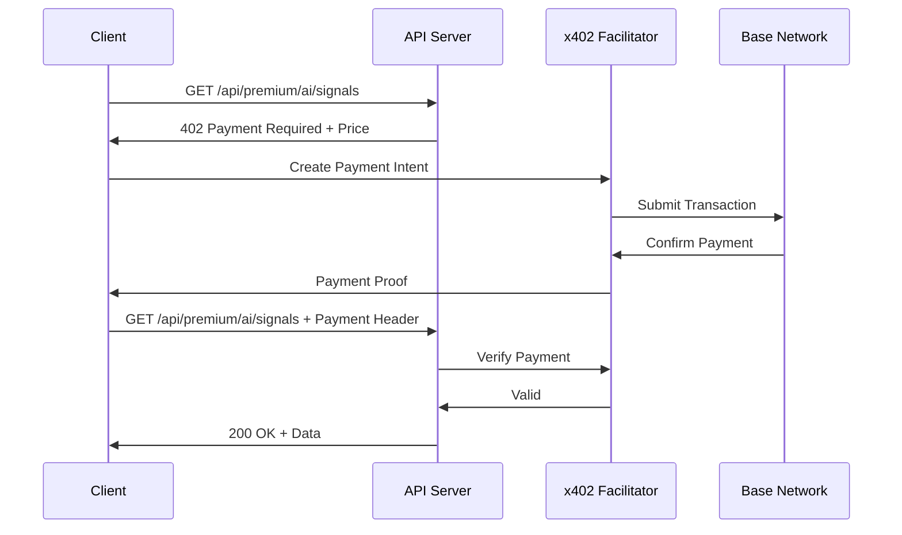

# x402 Pay-Per-Request API

Enable cryptocurrency micropayments for premium API access using the **x402 protocol** by Coinbase. Pay only for what you use with USDC on Base.

## Overview

x402 is an open payment protocol that enables HTTP-native micropayments. Instead of subscriptions, you pay per API request using cryptocurrency.

```
┌──────────────────────────────────────────────────────────────┐
│  Client Request → x402 Payment Check → API Response         │
│                                                              │
│  1. Request premium endpoint                                 │
│  2. Server returns 402 Payment Required + payment details    │
│  3. Client pays with USDC (Base network)                     │
│  4. Server verifies payment and returns data                 │
│  5. Transaction settles on-chain                             │
└──────────────────────────────────────────────────────────────┘
```

## Quick Start

### Using the SDK

```typescript
import { x402Client } from '@x402/client';

const client = x402Client({
  baseURL: 'https://cryptocurrency.cv',
  wallet: yourWalletClient, // viem wallet
});

// Make a premium request - payment handled automatically
const signals = await client.get('/api/premium/ai/signals?coin=bitcoin');
```

### Using cURL with Payment Header

```bash
# 1. First request returns 402 with payment details
curl -i https://cryptocurrency.cv/api/premium/ai/signals?coin=bitcoin

# Response:
# HTTP/2 402 Payment Required
# X-Payment-Required: {"price":"0.05","network":"base","asset":"USDC",...}

# 2. Pay and include payment proof in header
curl -H "X-Payment: <payment_proof>" \
  https://cryptocurrency.cv/api/premium/ai/signals?coin=bitcoin
```

## Pricing Tiers

### Free Tier (No Payment Required)

All core endpoints are completely free:

| Endpoint | Description |
|----------|-------------|
| `/api/news` | Latest crypto news |
| `/api/search` | Search articles |
| `/api/bitcoin` | Bitcoin news |
| `/api/defi` | DeFi news |
| `/api/breaking` | Breaking news |
| `/api/sources` | List all sources |
| `/api/trending` | Trending topics |
| `/api/fear-greed` | Fear & Greed Index |
| `/api/market/coins` | Top 100 coins |

### Pay-Per-Request (v1 API)

Basic premium endpoints with micro-pricing:

| Endpoint | Price | Description |
|----------|-------|-------------|
| `/api/v1/coins` | $0.001 | Extended coin list |
| `/api/v1/coin` | $0.002 | Detailed coin data |
| `/api/v1/defi` | $0.002 | DeFi protocol data |
| `/api/v1/defi/yields` | $0.003 | DeFi yield rates |
| `/api/v1/ohlcv` | $0.003 | OHLCV candle data |
| `/api/v1/historical` | $0.005 | Historical prices |
| `/api/v1/correlation` | $0.005 | Asset correlations |
| `/api/v1/whale-alerts` | $0.005 | Whale transactions |
| `/api/v1/export` | $0.01 | Data exports |

### Premium API Endpoints

High-value AI and analytics endpoints:

#### AI-Powered Analysis

| Endpoint | Price | Description |
|----------|-------|-------------|
| `/api/premium/ai/summary` | $0.01 | AI market summary |
| `/api/premium/ai/explain` | $0.01 | AI explanations |
| `/api/premium/ai/sentiment` | $0.02 | Sentiment analysis |
| `/api/premium/ai/compare` | $0.03 | AI coin comparison |
| `/api/premium/ai/signals` | $0.05 | Buy/sell signals |
| `/api/premium/ai/analyze` | $0.05 | Deep market analysis |

#### Whale & Smart Money

| Endpoint | Price | Description |
|----------|-------|-------------|
| `/api/premium/smart-money` | $0.05 | Institutional flows |
| `/api/premium/whales/transactions` | $0.05 | Whale movements |
| `/api/premium/whales/alerts` | $0.05 | Real-time alerts |
| `/api/premium/wallets/analyze` | $0.10 | Wallet deep dive |

#### Screener & Signals

| Endpoint | Price | Description |
|----------|-------|-------------|
| `/api/premium/screener/advanced` | $0.02 | Advanced screener |
| `/api/premium/momentum` | $0.02 | Momentum analysis |
| `/api/premium/breakouts` | $0.03 | Breakout detection |
| `/api/premium/undervalued` | $0.03 | Undervalued coins |

#### Data & Exports

| Endpoint | Price | Description |
|----------|-------|-------------|
| `/api/premium/market/coins` | $0.001 | 500+ coins data |
| `/api/premium/market/history` | $0.005 | 5-year history |
| `/api/premium/correlations` | $0.03 | Correlation matrix |
| `/api/premium/history/full` | $0.05 | Complete history |
| `/api/premium/backtest` | $0.10 | Strategy backtest |
| `/api/premium/export/portfolio` | $0.10 | Portfolio export |
| `/api/premium/export/full` | $0.15 | Full database |

## Payment Networks

Payments are accepted on:

| Network | Asset | Status |
|---------|-------|--------|
| **Base** | USDC | ✅ Live |
| **Ethereum** | USDC | ✅ Live |
| **Solana** | USDC | 🔜 Coming |

## Integration Guide

### JavaScript/TypeScript

```typescript
import { createWalletClient, http } from 'viem';
import { base } from 'viem/chains';
import { privateKeyToAccount } from 'viem/accounts';
import { x402Client } from '@x402/client';

// Setup wallet
const account = privateKeyToAccount(process.env.PRIVATE_KEY);
const wallet = createWalletClient({
  account,
  chain: base,
  transport: http(),
});

// Create x402 client
const api = x402Client({
  baseURL: 'https://cryptocurrency.cv',
  wallet,
});

// Make premium requests
async function getAISignals(coin: string) {
  const response = await api.get(`/api/premium/ai/signals?coin=${coin}`);
  return response.data;
}

// Signals cost $0.05 per request
const btcSignals = await getAISignals('bitcoin');
console.log(btcSignals);
// { signal: 'BUY', confidence: 0.85, indicators: [...] }
```

### Python

```python
from x402 import X402Client
from eth_account import Account

# Setup wallet
account = Account.from_key(os.environ['PRIVATE_KEY'])

# Create client
client = X402Client(
    base_url='https://cryptocurrency.cv',
    wallet=account,
    network='base'
)

# Make premium request
signals = client.get('/api/premium/ai/signals', params={'coin': 'bitcoin'})
print(signals)
```

### Alternative: API Keys

Don't want to deal with crypto payments? Use traditional API keys:

```bash
# Get an API key from the dashboard
curl -H "X-API-Key: your_api_key" \
  https://cryptocurrency.cv/api/premium/ai/signals?coin=bitcoin
```

API keys are available through monthly subscriptions. See [Premium Plans](./PREMIUM.md) for pricing.

## How It Works

### Payment Flow



### Payment Verification

The server verifies payments using the x402 facilitator:

1. **Signature Check** - Validates payment proof signature
2. **Amount Check** - Confirms correct amount paid
3. **Expiry Check** - Ensures payment hasn't expired
4. **Replay Prevention** - Prevents double-spending

## Bazaar Discovery

This API is listed on the [x402 Bazaar](https://bazaar.x402.org) for automatic discovery by AI agents and applications.

```bash
# Discovery endpoint
curl https://cryptocurrency.cv/.well-known/x402.json
```

Response:
```json
{
  "name": "Free Crypto News API",
  "description": "Real-time crypto news and AI analysis",
  "pricing": {
    "model": "pay-per-request",
    "currency": "USDC",
    "network": "base"
  },
  "endpoints": [
    {
      "path": "/api/premium/ai/signals",
      "price": "0.05",
      "description": "AI-generated trading signals"
    }
  ]
}
```

## Error Handling

### 402 Payment Required

Returned when payment is needed:

```json
{
  "error": "Payment Required",
  "code": "PAYMENT_REQUIRED",
  "payment": {
    "price": "0.05",
    "currency": "USDC",
    "network": "base",
    "recipient": "0x...",
    "facilitator": "https://facilitator.x402.org"
  }
}
```

### Payment Errors

| Code | Description |
|------|-------------|
| `INSUFFICIENT_FUNDS` | Wallet balance too low |
| `PAYMENT_EXPIRED` | Payment proof expired |
| `INVALID_SIGNATURE` | Invalid payment signature |
| `ALREADY_USED` | Payment proof already used |

## Rate Limits

Even with payment, rate limits apply to prevent abuse:

| Category | Limit |
|----------|-------|
| AI Endpoints | 30-60/min |
| Whale Data | 30-60/min |
| Screener | 60/min |
| Market Data | 100/min |
| Exports | 5-20/min |

## Security

- All payments use cryptographic signatures
- No credit cards or personal data stored
- Payments are non-custodial (your wallet → our wallet)
- On-chain verification ensures transparency

## Resources

- [x402 Protocol Documentation](https://docs.x402.org)
- [Coinbase x402 GitHub](https://github.com/coinbase/x402)
- [Base Network](https://base.org)
- [USDC on Base](https://www.circle.com/en/usdc)

---

## Related Documentation

- [Premium Plans](./PREMIUM.md) - Subscription options
- [API Reference](./API.md) - All endpoints
- [SDKs](./sdks/index.md) - Client libraries
