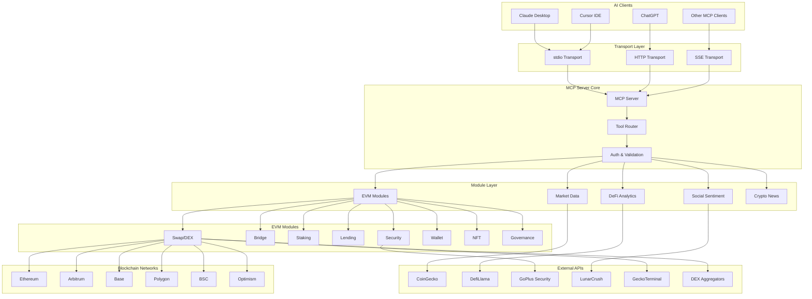
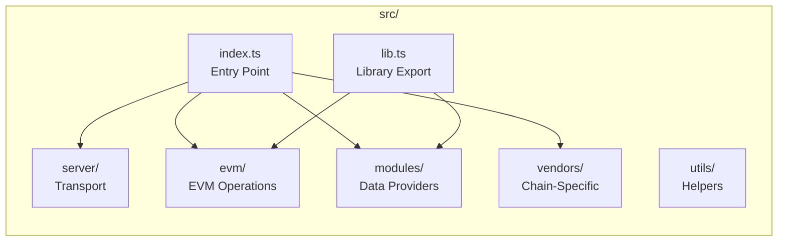
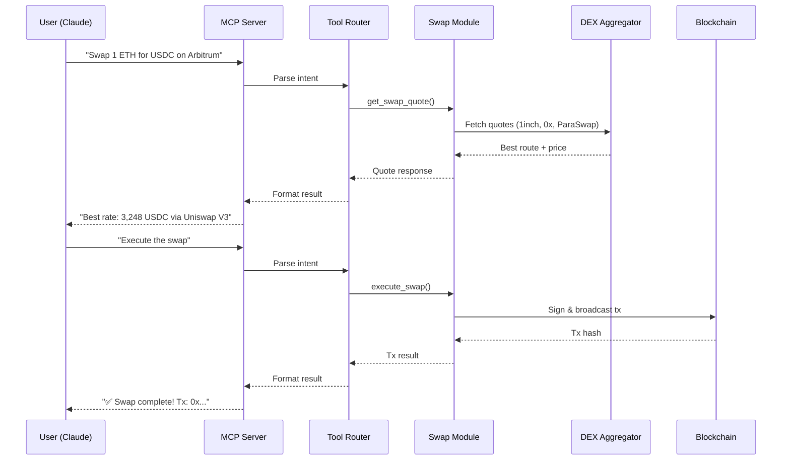
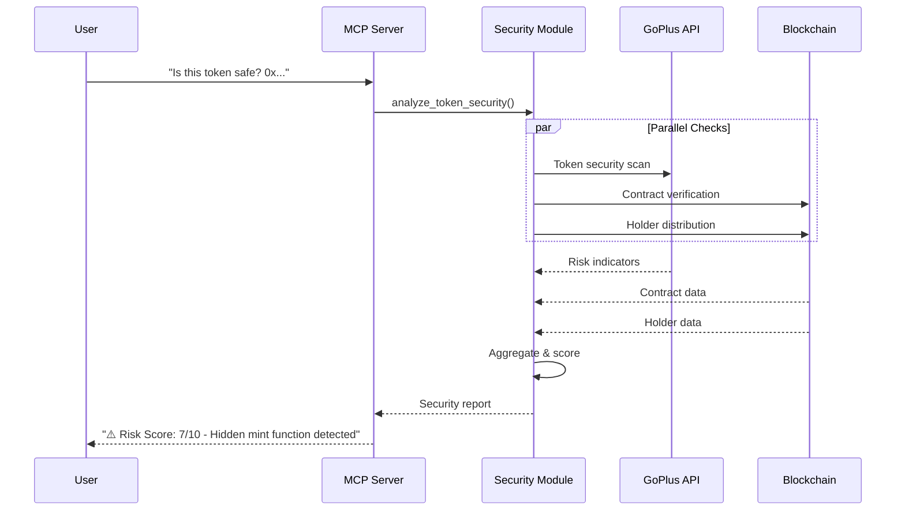
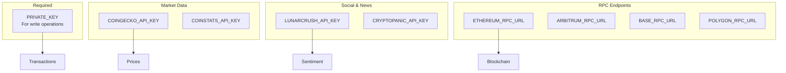
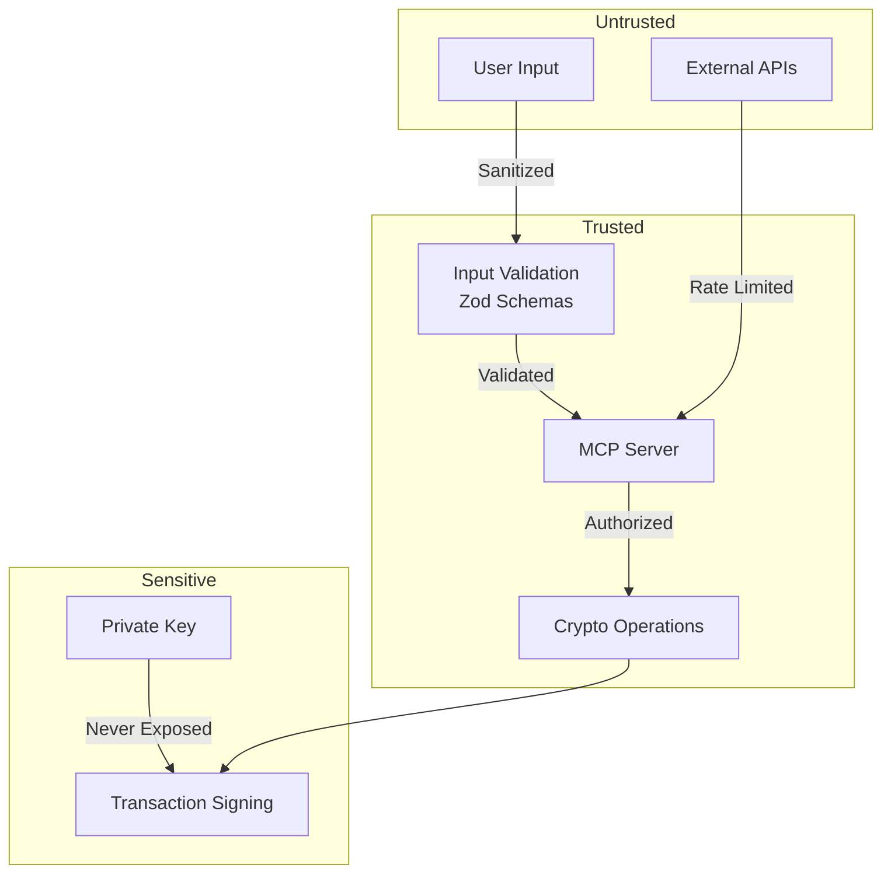

<!-- universal-crypto-mcp | @nichxbt | 0.14.9.3 -->

# Architecture

<!-- Maintained by universal-crypto-mcp | ID: n1ch-0las-4e49-4348-786274000000 -->

Understanding how Universal Crypto MCP is structured and how components interact.

---

## System Overview



---

## Component Details

### Transport Layer

| Transport | Protocol | Use Case | Port |
|-----------|----------|----------|------|
| **stdio** | Standard I/O | Claude Desktop, Cursor | N/A |
| **HTTP** | HTTP/1.1 | ChatGPT Developer Mode | 3001 |
| **SSE** | Server-Sent Events | Legacy clients, streaming | 3001 |

### Module Architecture



### EVM Module Structure

```
src/evm/modules/
├── blocks/        # Block queries
├── bridge/        # Cross-chain bridges
├── contracts/     # Contract interactions
├── deployment/    # Contract deployment
├── domains/       # ENS & domains
├── events/        # Event logs
├── gas/           # Gas estimation
├── governance/    # DAO voting
├── lending/       # Aave, Compound
├── mev/           # Flashbots, MEV protection
├── multicall/     # Batch calls
├── network/       # Chain info
├── nft/           # NFT operations
├── portfolio/     # Wallet tracking
├── price-feeds/   # Oracle prices
├── security/      # GoPlus, honeypot detection
├── signatures/    # Message signing
├── staking/       # Lido, LP staking
├── swap/          # DEX swaps
├── tokens/        # ERC-20 operations
├── transactions/  # Tx management
└── wallet/        # Wallet operations
```

---

## Data Flow

### Swap Request Flow



### Security Check Flow



---

## Configuration

### Environment Variables



---

## Security Model

### Trust Boundaries



### Key Security Features

1. **Input Validation**: All inputs validated with Zod schemas
2. **Private Key Isolation**: Never logged or exposed
3. **Rate Limiting**: Automatic for external API calls
4. **Transaction Simulation**: Preview before execution
5. **MEV Protection**: Flashbots integration available

---

## Extending the Server

### Adding a New Module

```typescript
// src/modules/my-module/tools.ts
import { McpServer } from "@modelcontextprotocol/sdk/server/mcp.js"
import { z } from "zod"

export function registerMyModuleTools(server: McpServer) {
  server.tool(
    "my_tool_name",
    "Description of what this tool does",
    {
      param1: z.string().describe("Parameter description"),
      param2: z.number().optional().describe("Optional param")
    },
    async ({ param1, param2 }) => {
      // Implementation
      return {
        content: [{ type: "text", text: "Result" }]
      }
    }
  )
}
```

### Adding a New Chain

```typescript
// src/evm/chains.ts
export const CHAINS = {
  // ... existing chains
  
  mychain: {
    id: 12345,
    name: "My Chain",
    rpcUrl: "https://rpc.mychain.com",
    explorer: "https://explorer.mychain.com",
    nativeCurrency: {
      name: "MYC",
      symbol: "MYC",
      decimals: 18
    }
  }
}
```

---

## Performance Considerations

| Operation | Typical Latency | Notes |
|-----------|-----------------|-------|
| Price query | 100-300ms | Cached for 30s |
| Swap quote | 500-1500ms | Multiple aggregator calls |
| Transaction | 2-30s | Depends on chain & gas |
| Security scan | 1-3s | Multiple API calls |
| Portfolio | 2-5s | Multi-chain queries |

### Optimization Tips

1. **Use caching**: Price data cached automatically
2. **Batch requests**: Use multicall for multiple reads
3. **Choose fast chains**: L2s (Arbitrum, Base) are faster
4. **Set gas appropriately**: Don't overpay, don't underpay


<!-- EOF: @nichxbt | ucm:0.14.9.3 -->
<!-- https://github.com/nirholas/universal-crypto-mcp -->