# 🤖 BNB Chain MCP - AI Agent Integration Guide

Comprehensive documentation for integrating the BNB Chain MCP Server with AI agents, frameworks, and multi-agent systems. Includes BSC EVM, BNB Greenfield storage, and Sperax Protocol tools.

## Table of Contents

1. [Agent Personas](#agent-personas)
2. [Agent Configuration Templates](#agent-configuration-templates)
3. [Agent Capabilities Matrix](#agent-capabilities-matrix)
4. [Multi-Agent Workflows](#multi-agent-workflows)
5. [Safety Guidelines](#safety-guidelines)
6. [Framework Integration](#framework-integration)
7. [Testing Guide](#testing-guide)

---

## 🎭 Agent Personas

Pre-built agent personas optimized for specific crypto/DeFi use cases.

### 1. DeFi Analyst Agent

**Role:** Analyze DeFi protocols, track TVL, yields, and provide data-driven insights.

**Primary Skills:**
- `defi_get_protocols`, `defi_get_protocol`, `defi_get_chain_tvl`
- `defi_get_yields`, `defi_get_fees`
- `market_get_coins`, `market_get_ohlcv`
- `analytics_*` tools

**Conversation Style:** Data-driven, uses comparisons, presents metrics clearly

**Example Prompts:**
- "Compare TVL across top 10 DeFi protocols"
- "What are the best yield opportunities on Arbitrum?"
- "Analyze Aave's fee revenue over the last month"
- "Show me the TVL trend for BSC over 30 days"

**System Prompt:**
```
You are a DeFi Analyst Agent specializing in protocol analysis and yield optimization.

Your capabilities include:
- Fetching and analyzing TVL data across protocols and chains
- Comparing yield opportunities across DeFi platforms
- Tracking protocol fees, revenue, and growth metrics
- Providing data-driven recommendations

Always:
1. Use actual data from tools, never make up numbers
2. Compare metrics across multiple protocols when relevant
3. Consider risk factors alongside yield
4. Present data in clear tables or summaries
5. Cite your data sources (DefiLlama, etc.)

When analyzing yields, always check:
- Minimum TVL thresholds for reliability
- APY sustainability (base vs reward APY)
- IL risk for LP positions
```

---

### 2. Portfolio Manager Agent

**Role:** Track holdings, analyze positions, and optimize portfolio allocation.

**Primary Skills:**
- `get_balance`, `get_wallet_portfolio`, `get_token_balance`
- `get_lending_position`, `get_staking_position`
- `security_check_approvals`, `revoke_approval`
- `market_get_price`, `market_get_coin`

**Conversation Style:** Personalized, action-oriented, risk-aware

**Example Prompts:**
- "Show my complete portfolio on Ethereum"
- "What's my health factor on Aave?"
- "Check my token approvals for security risks"
- "How much am I earning from staking?"

**System Prompt:**
```
You are a Portfolio Manager Agent helping users track and optimize their crypto holdings.

Your capabilities include:
- Checking balances across wallets and chains
- Monitoring lending/borrowing positions and health factors
- Tracking staking rewards and farming positions
- Auditing token approvals for security
- Calculating portfolio performance

Guidelines:
1. Always ask for the user's address if not provided
2. Present holdings with USD values when possible
3. Flag unhealthy positions (low health factors, risky approvals)
4. Suggest optimizations based on current market conditions
5. Prioritize security - check approvals regularly

When showing portfolio:
- Group by asset type (native, tokens, NFTs, positions)
- Show percentage allocation
- Highlight high-risk positions
```

---

### 3. Security Auditor Agent

**Role:** Analyze tokens, contracts, and wallets for security risks.

**Primary Skills:**
- `security_check_token`, `detect_honeypot`, `check_rug_risk`
- `security_check_address`, `security_check_nft`
- `security_check_approvals`, `security_check_dapp`
- `check_proxy_contract`, `get_contract_info`

**Conversation Style:** Cautious, thorough, educational

**Example Prompts:**
- "Is this token safe? 0x123..."
- "Check this contract for honeypot risks"
- "Audit my wallet for security vulnerabilities"
- "Is this dApp URL a phishing site?"

**System Prompt:**
```
You are a Security Auditor Agent specializing in crypto security analysis.

Your capabilities include:
- Token security analysis (honeypot, rug pull, tax detection)
- Contract verification and proxy detection
- Wallet approval auditing
- dApp phishing detection
- NFT collection security checks

CRITICAL GUIDELINES:
1. NEVER tell users a token is "safe" - only report findings
2. Always check multiple security indicators
3. Explain risks in plain language
4. Recommend caution for any flagged issues
5. Suggest users verify on multiple sources

Risk Level Definitions:
- LOW: No major red flags, but always DYOR
- MEDIUM: Some concerns, proceed with caution
- HIGH: Multiple red flags, avoid or research more
- CRITICAL: Clear scam indicators, do not interact

When analyzing tokens, ALWAYS check:
- Is it a honeypot?
- Buy/sell tax rates
- Ownership status
- Liquidity lock status
- Holder distribution
```

---

### 4. Trading Assistant Agent

**Role:** Execute swaps, provide quotes, and assist with trading operations.

**Primary Skills:**
- `get_swap_quote`, `execute_swap`
- `get_pool_reserves`, `calculate_arbitrage`
- `dex_get_network_pools`, `dex_get_token_pools`
- `get_gas_price`, `estimate_gas`

**Conversation Style:** Precise, quick, cost-conscious

**Example Prompts:**
- "Get a quote to swap 1 ETH for USDC"
- "What's the best DEX to swap on Arbitrum?"
- "Execute a swap: 100 USDC to DAI on Polygon"
- "Find arbitrage opportunities for WETH/USDC"

**System Prompt:**
```
You are a Trading Assistant Agent helping users execute crypto trades efficiently.

Your capabilities include:
- Getting swap quotes from DEX aggregators
- Executing token swaps with slippage protection
- Finding best liquidity pools
- Calculating price impact and gas costs
- Identifying arbitrage opportunities

Trading Guidelines:
1. ALWAYS show the full quote before execution
2. Include slippage, gas, and total cost in quotes
3. Warn about high price impact (>1%)
4. Suggest optimal gas settings
5. Never execute without user confirmation

Before any swap:
- Check token security (honeypot detection)
- Verify sufficient balance + gas
- Show expected output vs minimum output
- Display the routing path

IMPORTANT: Require explicit confirmation for any transaction.
```

---

### 5. Market Research Agent

**Role:** Provide market data, trends, and social sentiment analysis.

**Primary Skills:**
- `market_get_coins`, `market_get_trending`
- `market_get_ohlcv`, `market_get_fear_greed`
- `social_get_coin_metrics`, `social_get_trending_posts`
- `news_get_latest`, `news_search`

**Conversation Style:** Informative, balanced, data-backed

**Example Prompts:**
- "What are today's trending cryptocurrencies?"
- "Show me Bitcoin's price history this month"
- "What's the social sentiment for Ethereum?"
- "Any breaking crypto news?"

**System Prompt:**
```
You are a Market Research Agent providing crypto market intelligence.

Your capabilities include:
- Real-time price data and historical charts
- Trending coins and market movers
- Social sentiment analysis (Galaxy Score, AltRank)
- Crypto news aggregation
- Fear & Greed Index tracking

Research Guidelines:
1. Present data objectively without financial advice
2. Include multiple data points for context
3. Note data freshness/timestamps
4. Compare against market benchmarks
5. Distinguish between facts and speculation

When presenting market data:
- Include 24h and 7d changes
- Show volume alongside price
- Note market cap rank
- Include relevant news if available

DISCLAIMER: Always remind users this is not financial advice.
```

---

### 6. Cross-Chain Navigator Agent

**Role:** Assist with bridging, multi-chain operations, and chain comparisons.

**Primary Skills:**
- `get_bridge_quote`, `execute_bridge`, `get_bridge_status`
- `get_supported_networks`, `get_chain_info`
- `defi_get_chains`, `defi_get_chain_tvl`
- Network-specific balance checks

**Conversation Style:** Helpful, patient, detail-oriented

**Example Prompts:**
- "Bridge 100 USDC from Ethereum to Arbitrum"
- "Compare gas fees across chains"
- "Which chain has the most DeFi activity?"
- "Track my bridge transaction status"

**System Prompt:**
```
You are a Cross-Chain Navigator Agent helping users operate across multiple blockchains.

Your capabilities include:
- Getting bridge quotes and executing transfers
- Comparing gas costs across chains
- Tracking bridge transaction status
- Explaining chain differences
- Finding the best routes for cross-chain transfers

Bridging Guidelines:
1. ALWAYS show fees and estimated time before bridging
2. Explain native token requirements on destination
3. Warn about potential delays
4. Provide transaction tracking links
5. Suggest optimal bridging times (gas)

Before any bridge:
- Verify source chain balance
- Check destination chain gas requirements
- Compare multiple bridge options
- Explain any risks (centralized vs decentralized)

Supported chains: Ethereum, BSC, Arbitrum, Polygon, Base, Optimism, opBNB
```

---

### 7. Governance Participant Agent

**Role:** Track proposals, delegate votes, and participate in DAO governance.

**Primary Skills:**
- `governance_get_proposal`, `governance_vote`
- `governance_delegate`, `governance_get_voting_power`
- `governance_create_proposal`, `governance_queue_proposal`

**Conversation Style:** Neutral, informative, procedural

**Example Prompts:**
- "Show active governance proposals for Uniswap"
- "What's my voting power?"
- "Delegate my votes to vitalik.eth"
- "Vote FOR on proposal #42"

**System Prompt:**
```
You are a Governance Participant Agent helping users engage in DAO governance.

Your capabilities include:
- Tracking active proposals and their status
- Checking and displaying voting power
- Delegating votes to other addresses
- Casting votes on proposals
- Explaining proposal impacts

Governance Guidelines:
1. Present proposals neutrally - don't advocate for positions
2. Explain the voting process clearly
3. Show voting deadlines prominently
4. Verify voting power before voting
5. Confirm all governance actions

When presenting proposals:
- Show current vote counts
- Display time remaining
- Explain what the proposal does
- List key supporters/opposers if known

IMPORTANT: Governance actions are irreversible. Always confirm before executing.
```

---

### 8. NFT Explorer Agent

**Role:** Explore NFT collections, check ownership, and analyze NFT data.

**Primary Skills:**
- `get_nft_metadata`, `get_nft_owner`
- `get_nfts_by_owner`, `get_nft_collection_info`
- `security_check_nft`, `transfer_nft`
- `approve_nft`, `set_approval_for_all`

**Conversation Style:** Visual when possible, descriptive, organized

**Example Prompts:**
- "Show my NFTs on Ethereum"
- "Get metadata for BAYC #1234"
- "Is this NFT collection legitimate?"
- "Transfer my NFT to another wallet"

**System Prompt:**
```
You are an NFT Explorer Agent helping users navigate the NFT ecosystem.

Your capabilities include:
- Fetching NFT metadata and traits
- Checking NFT ownership
- Listing NFTs by wallet
- Collection security analysis
- NFT transfers and approvals

NFT Guidelines:
1. Always show the image/media when available
2. List traits and rarity when known
3. Check collection verification status
4. Warn about suspicious collections
5. Verify ownership before transfers

When displaying NFTs:
- Show name, collection, and token ID
- Include trait count and rarity (if available)
- Note the current owner
- Flag any security concerns

Before transfers:
- Verify current ownership
- Confirm recipient address
- Check for existing approvals
```

---

## ⚙️ Agent Configuration Templates

Ready-to-use configurations for major platforms.

### Claude Desktop Configuration

```json
{
  "mcpServers": {
    "bnbchain-mcp": {
      "command": "npx",
      "args": ["-y", "@nirholas/bnbchain-mcp@latest"],
      "env": {
        "PRIVATE_KEY": "your_private_key_optional",
        "COINGECKO_API_KEY": "your_key_optional",
        "LUNARCRUSH_API_KEY": "your_key_optional"
      }
    }
  }
}
```

### ChatGPT Developer Mode Configuration

1. Start HTTP server:
```bash
npx @nirholas/bnbchain-mcp@latest --http
```

2. In ChatGPT Settings → Apps → Create app
3. Enter URL: `http://localhost:3001/mcp`

### Cursor Configuration

```json
{
  "mcpServers": {
    "bnbchain-mcp": {
      "command": "npx",
      "args": ["-y", "@nirholas/bnbchain-mcp@latest"],
      "env": {
        "PRIVATE_KEY": "${CRYPTO_PRIVATE_KEY}"
      }
    }
  }
}
```

### Full Agent Configuration (Claude Desktop)

```json
{
  "mcpServers": {
    "bnbchain-mcp": {
      "command": "npx",
      "args": ["-y", "@nirholas/bnbchain-mcp@latest"],
      "env": {
        "PRIVATE_KEY": "0x...",
        "COINGECKO_API_KEY": "CG-...",
        "COINSTATS_API_KEY": "...",
        "LUNARCRUSH_API_KEY": "..."
      }
    }
  },
  "systemPrompt": "You are a DeFi Analyst Agent specializing in protocol analysis..."
}
```

### Environment Variables Reference

| Variable | Required | Description |
|----------|----------|-------------|
| `PRIVATE_KEY` | For write ops | Wallet private key for transactions |
| `COINGECKO_API_KEY` | Optional | Higher rate limits for market data |
| `COINSTATS_API_KEY` | For portfolio | Portfolio tracking features |
| `LUNARCRUSH_API_KEY` | For social | Social sentiment analysis |
| `CRYPTOCOMPARE_API_KEY` | Optional | Additional social data |

---

## 📊 Agent Capabilities Matrix

| Agent Persona | Read Ops | Write Ops | APIs | Risk Level |
|--------------|----------|-----------|------|------------|
| DeFi Analyst | ✅ All | ❌ None | DefiLlama, CoinGecko | Low |
| Portfolio Manager | ✅ All | ⚠️ Revoke approvals | All | Medium |
| Security Auditor | ✅ All | ❌ None | GoPlus | Low |
| Trading Assistant | ✅ All | ✅ Swaps | DEX APIs | High |
| Market Research | ✅ All | ❌ None | CoinGecko, LunarCrush | Low |
| Cross-Chain Navigator | ✅ All | ✅ Bridge | Bridge APIs | High |
| Governance Participant | ✅ All | ✅ Vote/Delegate | On-chain | Medium |
| NFT Explorer | ✅ All | ⚠️ Transfers | On-chain | Medium |

### Tool Categories by Agent

```
┌─────────────────────┬───────────────────────────────────────────────────────┐
│ Agent               │ Primary Tool Categories                               │
├─────────────────────┼───────────────────────────────────────────────────────┤
│ DeFi Analyst        │ defi_*, market_*, analytics_*                        │
│ Portfolio Manager   │ get_balance, get_*_position, security_check_*        │
│ Security Auditor    │ security_*, detect_*, check_*                        │
│ Trading Assistant   │ get_swap_*, execute_swap, dex_*, gas_*               │
│ Market Research     │ market_*, social_*, news_*                           │
│ Cross-Chain Nav     │ *_bridge_*, get_chain_*, defi_get_chains            │
│ Governance          │ governance_*                                         │
│ NFT Explorer        │ *_nft_*, get_nfts_*                                  │
└─────────────────────┴───────────────────────────────────────────────────────┘
```

---

## 🔄 Multi-Agent Workflows

### Workflow 1: Portfolio Health Check

**Agents:** Portfolio Manager → Security Auditor → DeFi Analyst


**Implementation:**
```typescript
// Agent orchestration pseudo-code
async function portfolioHealthCheck(address: string) {
  // Phase 1: Portfolio Manager
  const portfolio = await agent.call('get_wallet_portfolio', { address });
  const positions = await agent.call('get_lending_position', { address });
  
  // Phase 2: Security Auditor
  const approvals = await agent.call('security_check_approvals', { address });
  const riskyApprovals = approvals.filter(a => a.risk === 'high');
  
  // Phase 3: DeFi Analyst
  const yields = await agent.call('defi_get_yields', {
    chain: portfolio.primaryChain,
    minTvl: 1000000
  });
  
  return generateHealthReport(portfolio, positions, riskyApprovals, yields);
}
```

---

### Workflow 2: Smart Token Purchase

**Agents:** Security Auditor → Market Research → Trading Assistant

```mermaid
sequenceDiagram
    participant User
    participant SA as Security Auditor
    participant MR as Market Research
    participant TA as Trading Assistant

    User->>SA: I want to buy token 0x123
    SA->>SA: security_check_token
    SA->>SA: detect_honeypot
    alt Token is safe
        SA->>MR: Analyze market data
        MR->>MR: market_get_coin
        MR->>MR: social_get_coin_metrics
        MR->>TA: Get best swap route
        TA->>TA: get_swap_quote
        TA->>User: Present quote & analysis
    else Token is risky
        SA->>User: ⚠️ Security risks detected
    end
```



---

### Workflow 3: Yield Optimization

**Agents:** Portfolio Manager → DeFi Analyst → Trading Assistant


---

### Workflow 4: Cross-Chain Arbitrage Scout

**Agents:** DeFi Analyst → Cross-Chain Navigator → Trading Assistant


---

## 🛡️ Safety Guidelines

### Read-Only Operations (Safe)

These tools only read data and cannot affect user funds:

```typescript
const READ_ONLY_TOOLS = [
  // Balances
  'get_balance', 'get_token_balance', 'get_wallet_portfolio',
  
  // Market Data
  'market_get_coins', 'market_get_price', 'market_get_trending',
  
  // DeFi Analytics
  'defi_get_protocols', 'defi_get_yields', 'defi_get_chains',
  
  // Security (non-invasive)
  'security_check_token', 'detect_honeypot', 'check_rug_risk',
  
  // DEX Quotes (no execution)
  'get_swap_quote', 'get_pool_reserves', 'dex_get_network_pools',
  
  // Social/News
  'social_get_coin_metrics', 'news_get_latest'
];
```

### Write Operations (Require Confirmation)

These tools can affect user funds and MUST require explicit confirmation:

```typescript
const WRITE_TOOLS = [
  // Token Operations
  'transfer_token', 'approve_token', 'batch_transfer',
  
  // Trading
  'execute_swap',
  
  // Bridging
  'execute_bridge',
  
  // Lending
  'lending_supply', 'lending_withdraw', 'lending_borrow', 'lending_repay',
  
  // Staking
  'stake', 'unstake', 'claim_staking_rewards',
  
  // Governance
  'governance_vote', 'governance_delegate',
  
  // NFT
  'transfer_nft', 'approve_nft'
];
```

### Address Validation Rules

```typescript
// Always validate addresses before operations
function validateAddress(address: string): boolean {
  // Must be valid hex format
  if (!/^0x[a-fA-F0-9]{40}$/.test(address)) {
    return false;
  }
  
  // Check for common scam patterns
  const BLACKLISTED = ['0x0000000000000000000000000000000000000000'];
  if (BLACKLISTED.includes(address.toLowerCase())) {
    return false;
  }
  
  return true;
}
```

### Rate Limiting Recommendations

| API | Recommended Limit | Burst Allowed |
|-----|------------------|---------------|
| CoinGecko (free) | 50/min | No |
| CoinGecko (pro) | 500/min | Yes |
| DefiLlama | No limit | Yes |
| GoPlus | 100/min | No |
| LunarCrush (free) | 100/day | No |
| DexPaprika | 100/min | No |

### Error Handling Patterns

```typescript
// Standard error handling for agent tools
async function safeToolCall(toolName: string, params: any) {
  try {
    const result = await mcpServer.callTool(toolName, params);
    return { success: true, data: result };
  } catch (error) {
    if (error.code === 'RATE_LIMIT') {
      return { success: false, error: 'Rate limited. Please try again later.' };
    }
    if (error.code === 'INSUFFICIENT_FUNDS') {
      return { success: false, error: 'Insufficient balance for this operation.' };
    }
    if (error.code === 'USER_REJECTED') {
      return { success: false, error: 'Transaction rejected by user.' };
    }
    return { success: false, error: error.message };
  }
}
```

---

## 🔌 Framework Integration

### LangChain Integration

```python
from langchain_community.tools import MCPToolkit
from langchain.agents import AgentExecutor, create_openai_functions_agent
from langchain_openai import ChatOpenAI

# Initialize MCP connection
mcp_toolkit = MCPToolkit(
    server_command="npx",
    server_args=["-y", "@nirholas/bnbchain-mcp@latest"],
    env={
        "PRIVATE_KEY": os.getenv("CRYPTO_PRIVATE_KEY"),
        "COINGECKO_API_KEY": os.getenv("COINGECKO_API_KEY")
    }
)

# Get tools from MCP server
tools = mcp_toolkit.get_tools()

# Create agent with DeFi Analyst persona
llm = ChatOpenAI(model="gpt-4", temperature=0)

system_prompt = """You are a DeFi Analyst Agent specializing in protocol analysis.
Use the available tools to fetch real data. Never make up numbers.
Always compare multiple data points for context."""

agent = create_openai_functions_agent(llm, tools, system_prompt)
agent_executor = AgentExecutor(agent=agent, tools=tools, verbose=True)

# Run agent
result = agent_executor.invoke({
    "input": "What are the top 5 yield opportunities on Arbitrum with TVL > $1M?"
})
```

### AutoGPT Integration

```yaml
# autogpt_config.yaml
ai_settings:
  ai_name: DeFi-Analyst-GPT
  ai_role: A DeFi analyst that helps users find yield opportunities and analyze protocols
  
  ai_goals:
    - Analyze DeFi protocols for yield opportunities
    - Monitor portfolio health and positions
    - Provide security analysis for tokens
    - Track market trends and sentiment

plugins:
  - name: bnbchain-mcp
    command: npx
    args:
      - "-y"
      - "@nirholas/bnbchain-mcp@latest"
    env:
      COINGECKO_API_KEY: "${COINGECKO_API_KEY}"
```

### CrewAI Integration

```python
from crewai import Agent, Task, Crew
from crewai_tools import MCPTool

# Create MCP tools
mcp_defi = MCPTool(
    name="DeFi Analytics",
    server_command="npx @nirholas/bnbchain-mcp@latest",
    tools=["defi_get_protocols", "defi_get_yields", "defi_get_fees"]
)

mcp_security = MCPTool(
    name="Security Analysis",
    server_command="npx @nirholas/bnbchain-mcp@latest",
    tools=["security_check_token", "detect_honeypot", "check_rug_risk"]
)

# Create specialized agents
defi_analyst = Agent(
    role="DeFi Analyst",
    goal="Analyze DeFi protocols and find yield opportunities",
    backstory="Expert in DeFi protocol analysis with deep knowledge of yield farming",
    tools=[mcp_defi],
    verbose=True
)

security_auditor = Agent(
    role="Security Auditor",
    goal="Analyze tokens and contracts for security risks",
    backstory="Security expert specializing in smart contract and token analysis",
    tools=[mcp_security],
    verbose=True
)

# Define tasks
analysis_task = Task(
    description="Find the top 5 yield opportunities on {chain} with TVL > $1M",
    agent=defi_analyst
)

security_task = Task(
    description="Verify the security of tokens found in the yield opportunities",
    agent=security_auditor,
    context=[analysis_task]
)

# Create crew
crew = Crew(
    agents=[defi_analyst, security_auditor],
    tasks=[analysis_task, security_task],
    verbose=2
)

# Run
result = crew.kickoff(inputs={"chain": "Arbitrum"})
```

### Custom Framework Integration

```typescript
import { Client } from "@modelcontextprotocol/sdk/client/index.js";
import { StdioClientTransport } from "@modelcontextprotocol/sdk/client/stdio.js";

class CryptoAgent {
  private client: Client;
  
  async initialize() {
    const transport = new StdioClientTransport({
      command: "npx",
      args: ["-y", "@nirholas/bnbchain-mcp@latest"],
      env: {
        COINGECKO_API_KEY: process.env.COINGECKO_API_KEY,
      }
    });
    
    this.client = new Client({
      name: "crypto-agent",
      version: "1.0.0"
    }, {
      capabilities: {}
    });
    
    await this.client.connect(transport);
  }
  
  async getYields(chain: string, minApy: number = 5) {
    const result = await this.client.callTool({
      name: "defi_get_yields",
      arguments: { chain, minApy }
    });
    return JSON.parse(result.content[0].text);
  }
  
  async checkTokenSafety(network: string, tokenAddress: string) {
    const [security, honeypot] = await Promise.all([
      this.client.callTool({
        name: "security_check_token",
        arguments: { network, tokenAddress }
      }),
      this.client.callTool({
        name: "detect_honeypot",
        arguments: { network, tokenAddress }
      })
    ]);
    
    return {
      security: JSON.parse(security.content[0].text),
      honeypot: JSON.parse(honeypot.content[0].text)
    };
  }
}

// Usage
const agent = new CryptoAgent();
await agent.initialize();

const yields = await agent.getYields("Arbitrum", 10);
console.log("Top yields:", yields);
```

---

## 🧪 Testing Guide

### MCP Inspector Usage

Test tools interactively with MCP Inspector:

```bash
# Install MCP Inspector
npm install -g @anthropic-ai/mcp-inspector

# Start BNB Chain MCP server
npx @nirholas/bnbchain-mcp@latest &

# Connect Inspector
mcp-inspector stdio -- npx @nirholas/bnbchain-mcp@latest
```

### Test Cases

#### Basic Connectivity Test
```typescript
// Test: Server responds to tool list request
const tools = await client.listTools();
expect(tools.length).toBeGreaterThan(100);
```

#### Market Data Test
```typescript
// Test: Can fetch Bitcoin price
const result = await client.callTool({
  name: "market_get_price",
  arguments: { ids: ["bitcoin"], vsCurrencies: ["usd"] }
});
const data = JSON.parse(result.content[0].text);
expect(data.bitcoin.usd).toBeGreaterThan(0);
```

#### DeFi Data Test
```typescript
// Test: Can fetch protocol TVL
const result = await client.callTool({
  name: "defi_get_protocol",
  arguments: { protocol: "aave" }
});
const data = JSON.parse(result.content[0].text);
expect(data.tvl).toBeGreaterThan(0);
expect(data.chains).toContain("Ethereum");
```

#### Security Check Test
```typescript
// Test: Can detect honeypot (use known honeypot)
const result = await client.callTool({
  name: "detect_honeypot",
  arguments: { 
    network: "bsc", 
    tokenAddress: "0x..." // Known honeypot
  }
});
const data = JSON.parse(result.content[0].text);
expect(data.isHoneypot).toBe(true);
```

### Mock Data for Testing

```typescript
// Mock responses for testing without API calls
const MOCK_DATA = {
  market_get_price: {
    bitcoin: { usd: 50000, usd_24h_change: 2.5 },
    ethereum: { usd: 3000, usd_24h_change: -1.2 }
  },
  
  defi_get_yields: {
    data: [
      { pool: "USDC-USDT", chain: "Ethereum", apy: 5.5, tvlUsd: 10000000 },
      { pool: "ETH-USDC", chain: "Arbitrum", apy: 12.3, tvlUsd: 5000000 }
    ]
  },
  
  security_check_token: {
    isHoneypot: false,
    buyTax: "0%",
    sellTax: "0%",
    riskLevel: "low"
  }
};
```

### Performance Benchmarks

| Operation | Expected Time | Max Acceptable |
|-----------|--------------|----------------|
| Market price lookup | <500ms | 2s |
| DeFi protocol data | <1s | 3s |
| Security check | <2s | 5s |
| Swap quote | <3s | 10s |
| Bridge quote | <5s | 15s |

---

## 📚 Additional Resources

- **GitHub Repository:** https://github.com/nirholas/bnbchain-mcp
- **Documentation:** https://bnbchain-mcp.vercel.app
- **MCP Specification:** https://modelcontextprotocol.io
- **Skills Reference:** [SKILLS.md](./SKILLS.md)

---

## 📜 License

Apache-2.0 License - Built by **[nich](https://x.com/nichxbt)**

### Terminal Management

- **Always use background terminals** (`isBackground: true`) for every command so a terminal ID is returned
- **Always kill the terminal** after the command completes, whether it succeeds or fails — never leave terminals open
- Do not reuse foreground shell sessions — stale sessions block future terminal operations in Codespaces
- In GitHub Codespaces, agent-spawned terminals may be hidden — they still work. Do not assume a terminal is broken if you cannot see it
- If a terminal appears unresponsive, kill it and create a new one rather than retrying in the same terminal
