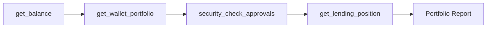
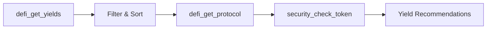
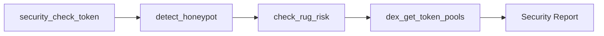
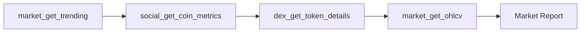
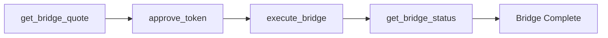
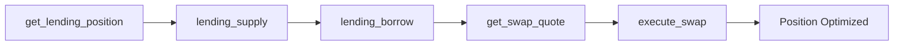

# 🎯 BNB Chain MCP Skills Manifest

A comprehensive Model Context Protocol server for the **BNB Chain ecosystem** - BSC EVM, BNB Greenfield storage, and Sperax Protocol (USDs stablecoin).

## 📊 Skill Overview

| Category | Skills | Description |
|----------|--------|-------------|
| [Network & Chain](#network--chain-operations) | 12 | Chain info, status, finality |
| [Blocks](#block-operations) | 8 | Block queries, analysis |
| [Transactions](#transaction-operations) | 10 | Send, track, simulate txs |
| [Wallet](#wallet-operations) | 15 | Balances, signing, HD wallets |
| [Tokens (ERC20)](#token-operations-erc20) | 12 | Transfers, approvals, permits |
| [NFTs (ERC721/1155)](#nft-operations) | 14 | Metadata, transfers, marketplace |
| [DEX/Swap](#dex--swap-operations) | 15 | Quotes, swaps, liquidity |
| [Bridge](#cross-chain-bridge) | 8 | Cross-chain transfers |
| [Lending](#lending--borrowing) | 12 | Supply, borrow, health |
| [Staking](#staking-operations) | 10 | Stake, liquid staking, farms |
| [Security](#security-analysis) | 15 | Honeypot, rug detection |
| [Price Feeds](#price--oracle-feeds) | 10 | Chainlink, aggregated prices |
| [Market Data](#market-data) | 20 | CoinGecko, CoinStats |
| [DeFi Analytics](#defi-analytics) | 18 | DefiLlama TVL, yields |
| [DEX Analytics](#dex-analytics) | 16 | Pools, OHLCV, trades |
| [Social Sentiment](#social-sentiment) | 12 | LunarCrush, trending |
| [Governance](#governance) | 10 | Proposals, voting |
| [Gas](#gas-utilities) | 6 | Prices, EIP-1559 |
| [Signatures](#signatures--encoding) | 8 | EIP-712, verification |
| [ENS/Domains](#ens--domains) | 8 | Resolution, registration |
| [Events](#events--logs) | 6 | Historical, filtering |
| [Deployment](#contract-deployment) | 6 | Deploy, verify, upgrade |
| [MEV Protection](#mev-protection) | 6 | Flashbots, private txs |
| [News](#crypto-news) | 7 | Aggregated news feeds |

---

## 🔗 Network & Chain Operations

### `get_chain_info`
**Complexity:** ⭐ (1/5)

Get comprehensive chain information for any supported network.

**Input Schema:**
```typescript
{
  network: string // Network identifier (e.g., "bsc", "ethereum", "arbitrum")
}
```

**Output Schema:**
```typescript
{
  network: string,
  chainId: number,
  blockNumber: string,
  rpcUrl: string
}
```

**Example Usage:**
```
Get the current block number and chain ID for BNB Smart Chain
```

**Related Skills:** `get_supported_networks`, `estimate_block_time`

---

### `get_supported_networks`
**Complexity:** ⭐ (1/5)

List all supported blockchain networks.

**Input Schema:** None

**Output Schema:**
```typescript
{
  supportedNetworks: string[]
}
```

**Example Usage:**
```
What blockchain networks are supported?
```

---

### `estimate_block_time`
**Complexity:** ⭐⭐ (2/5)

Estimate average block time by analyzing recent blocks.

**Input Schema:**
```typescript
{
  network: string,
  sampleSize?: number // 5-100, default 20
}
```

**Output Schema:**
```typescript
{
  averageBlockTimeSeconds: number,
  blocksPerMinute: number,
  blocksPerHour: number,
  blocksPerDay: number
}
```

---

### `get_finality_status`
**Complexity:** ⭐⭐ (2/5)

Check the finality status of a block (pending, confirmed, finalized).

**Input Schema:**
```typescript
{
  network: string,
  blockNumber?: string
}
```

**Output Schema:**
```typescript
{
  finalityStatus: "pending" | "included" | "confirmed" | "highly_confirmed" | "safe" | "finalized",
  confirmations: number
}
```

---

### `get_gas_oracle`
**Complexity:** ⭐⭐ (2/5)

Get gas price oracle data including EIP-1559 suggestions.

**Input Schema:**
```typescript
{
  network: string
}
```

**Related Skills:** `estimate_gas`, `get_gas_price`

---

## 📦 Block Operations

### `get_block`
**Complexity:** ⭐ (1/5)

Get block data by number or hash.

**Input Schema:**
```typescript
{
  network: string,
  blockNumber?: string,
  blockHash?: string
}
```

**Output Schema:**
```typescript
{
  number: string,
  hash: string,
  timestamp: number,
  transactions: string[],
  gasUsed: string,
  gasLimit: string
}
```

---

### `get_block_transactions`
**Complexity:** ⭐⭐ (2/5)

Get all transactions in a specific block.

**Input Schema:**
```typescript
{
  network: string,
  blockNumber: string
}
```

---

### `get_block_range`
**Complexity:** ⭐⭐ (2/5)

Get blocks within a specified range.

**Input Schema:**
```typescript
{
  network: string,
  fromBlock: string,
  toBlock: string
}
```

---

## 💸 Transaction Operations

### `send_transaction`
**Complexity:** ⭐⭐⭐⭐ (4/5)

Send a transaction on any supported network.

**Input Schema:**
```typescript
{
  network: string,
  to: string,
  value?: string,
  data?: string,
  gasLimit?: string,
  privateKey: string
}
```

**Output Schema:**
```typescript
{
  hash: string,
  from: string,
  to: string,
  value: string
}
```

**Example Usage:**
```
Send 0.1 BNB to 0x742d35Cc6634C0532925a3b844Bc9e7595f... on BSC
```

**Related Skills:** `estimate_gas`, `get_transaction_receipt`

---

### `get_transaction`
**Complexity:** ⭐ (1/5)

Get transaction details by hash.

**Input Schema:**
```typescript
{
  network: string,
  hash: string
}
```

---

### `get_transaction_receipt`
**Complexity:** ⭐ (1/5)

Get the receipt of a mined transaction.

**Input Schema:**
```typescript
{
  network: string,
  hash: string
}
```

---

### `simulate_transaction`
**Complexity:** ⭐⭐⭐ (3/5)

Simulate a transaction without broadcasting.

**Input Schema:**
```typescript
{
  network: string,
  from: string,
  to: string,
  value?: string,
  data?: string
}
```

---

### `decode_transaction`
**Complexity:** ⭐⭐ (2/5)

Decode transaction input data using ABI.

**Input Schema:**
```typescript
{
  network: string,
  hash: string,
  abi?: object[]
}
```

---

### `speed_up_transaction`
**Complexity:** ⭐⭐⭐ (3/5)

Replace a pending transaction with higher gas.

**Input Schema:**
```typescript
{
  network: string,
  hash: string,
  gasPriceMultiplier?: number,
  privateKey: string
}
```

---

### `cancel_transaction`
**Complexity:** ⭐⭐⭐ (3/5)

Cancel a pending transaction.

**Input Schema:**
```typescript
{
  network: string,
  nonce: number,
  privateKey: string
}
```

---

## 👛 Wallet Operations

### `get_balance`
**Complexity:** ⭐ (1/5)

Get native token balance for an address.

**Input Schema:**
```typescript
{
  network: string,
  address: string
}
```

**Output Schema:**
```typescript
{
  address: string,
  balance: string,
  balanceFormatted: string,
  symbol: string
}
```

**Example Usage:**
```
What is the BNB balance of 0x742d35Cc6634C0532925a3b844Bc...?
```

---

### `create_wallet`
**Complexity:** ⭐ (1/5)

Generate a new wallet (address + private key).

**Input Schema:** None

**Output Schema:**
```typescript
{
  address: string,
  privateKey: string
}
```

---

### `generate_mnemonic`
**Complexity:** ⭐ (1/5)

Generate a BIP-39 mnemonic phrase.

**Input Schema:**
```typescript
{
  strength?: 12 | 24 // Word count
}
```

---

### `derive_addresses`
**Complexity:** ⭐⭐ (2/5)

Derive multiple addresses from a mnemonic (HD wallet).

**Input Schema:**
```typescript
{
  mnemonic: string,
  count?: number,
  path?: string
}
```

---

### `sign_message`
**Complexity:** ⭐⭐ (2/5)

Sign a message with a private key.

**Input Schema:**
```typescript
{
  message: string,
  privateKey: string
}
```

**Related Skills:** `verify_signature`

---

### `verify_signature`
**Complexity:** ⭐⭐ (2/5)

Verify a signed message and recover the signer.

**Input Schema:**
```typescript
{
  message: string,
  signature: string
}
```

---

### `get_token_approvals`
**Complexity:** ⭐⭐ (2/5)

Get all token approvals for an address (security audit).

**Input Schema:**
```typescript
{
  network: string,
  address: string
}
```

**Related Skills:** `revoke_approval`, `security_check_approvals`

---

### `revoke_approval`
**Complexity:** ⭐⭐⭐ (3/5)

Revoke a token spending approval.

**Input Schema:**
```typescript
{
  network: string,
  tokenAddress: string,
  spenderAddress: string,
  privateKey: string
}
```

---

### `get_wallet_portfolio`
**Complexity:** ⭐⭐ (2/5)

Get complete portfolio across all tokens.

**Input Schema:**
```typescript
{
  network: string,
  address: string
}
```

---

## 🪙 Token Operations (ERC20)

### `get_token_info`
**Complexity:** ⭐ (1/5)

Get token metadata (name, symbol, decimals, supply).

**Input Schema:**
```typescript
{
  network: string,
  tokenAddress: string
}
```

**Output Schema:**
```typescript
{
  name: string,
  symbol: string,
  decimals: number,
  totalSupply: string
}
```

---

### `get_token_balance`
**Complexity:** ⭐ (1/5)

Get ERC20 token balance for an address.

**Input Schema:**
```typescript
{
  network: string,
  tokenAddress: string,
  walletAddress: string
}
```

---

### `transfer_token`
**Complexity:** ⭐⭐⭐ (3/5)

Transfer ERC20 tokens.

**Input Schema:**
```typescript
{
  network: string,
  tokenAddress: string,
  to: string,
  amount: string,
  privateKey: string
}
```

---

### `approve_token`
**Complexity:** ⭐⭐⭐ (3/5)

Approve token spending for a spender.

**Input Schema:**
```typescript
{
  network: string,
  tokenAddress: string,
  spender: string,
  amount: string,
  privateKey: string
}
```

---

### `get_allowance`
**Complexity:** ⭐ (1/5)

Check token allowance for a spender.

**Input Schema:**
```typescript
{
  network: string,
  tokenAddress: string,
  owner: string,
  spender: string
}
```

---

### `permit_token`
**Complexity:** ⭐⭐⭐ (3/5)

Gasless approval using EIP-2612 permit.

**Input Schema:**
```typescript
{
  network: string,
  tokenAddress: string,
  spender: string,
  amount: string,
  deadline: number,
  privateKey: string
}
```

---

### `batch_transfer`
**Complexity:** ⭐⭐⭐⭐ (4/5)

Transfer tokens to multiple addresses in one transaction.

**Input Schema:**
```typescript
{
  network: string,
  tokenAddress: string,
  recipients: { address: string, amount: string }[],
  privateKey: string
}
```

---

### `wrap_native`
**Complexity:** ⭐⭐ (2/5)

Wrap native tokens (ETH → WETH, BNB → WBNB).

**Input Schema:**
```typescript
{
  network: string,
  amount: string,
  privateKey: string
}
```

---

### `unwrap_native`
**Complexity:** ⭐⭐ (2/5)

Unwrap wrapped native tokens.

**Input Schema:**
```typescript
{
  network: string,
  amount: string,
  privateKey: string
}
```

---

## 🖼️ NFT Operations

### `get_nft_metadata`
**Complexity:** ⭐ (1/5)

Get NFT metadata including traits and image.

**Input Schema:**
```typescript
{
  network: string,
  contractAddress: string,
  tokenId: string
}
```

**Output Schema:**
```typescript
{
  name: string,
  description: string,
  image: string,
  attributes: { trait_type: string, value: string }[]
}
```

---

### `get_nft_owner`
**Complexity:** ⭐ (1/5)

Get the current owner of an NFT.

**Input Schema:**
```typescript
{
  network: string,
  contractAddress: string,
  tokenId: string
}
```

---

### `get_nfts_by_owner`
**Complexity:** ⭐⭐ (2/5)

Get all NFTs owned by an address.

**Input Schema:**
```typescript
{
  network: string,
  ownerAddress: string,
  contractAddress?: string
}
```

---

### `transfer_nft`
**Complexity:** ⭐⭐⭐ (3/5)

Transfer an NFT to another address.

**Input Schema:**
```typescript
{
  network: string,
  contractAddress: string,
  tokenId: string,
  to: string,
  privateKey: string
}
```

---

### `approve_nft`
**Complexity:** ⭐⭐⭐ (3/5)

Approve an address to transfer a specific NFT.

**Input Schema:**
```typescript
{
  network: string,
  contractAddress: string,
  tokenId: string,
  spender: string,
  privateKey: string
}
```

---

### `set_approval_for_all`
**Complexity:** ⭐⭐⭐ (3/5)

Approve an operator for all NFTs in a collection.

**Input Schema:**
```typescript
{
  network: string,
  contractAddress: string,
  operator: string,
  approved: boolean,
  privateKey: string
}
```

---

### `get_nft_collection_info`
**Complexity:** ⭐⭐ (2/5)

Get collection metadata (name, supply, etc.).

**Input Schema:**
```typescript
{
  network: string,
  contractAddress: string
}
```

---

### `batch_transfer_nfts`
**Complexity:** ⭐⭐⭐⭐ (4/5)

Transfer multiple NFTs in one transaction.

**Input Schema:**
```typescript
{
  network: string,
  transfers: { contractAddress: string, tokenId: string, to: string }[],
  privateKey: string
}
```

---

## 🔄 DEX & Swap Operations

### `get_swap_quote`
**Complexity:** ⭐⭐ (2/5)

Get a swap quote from DEX aggregators (1inch, 0x, ParaSwap).

**Input Schema:**
```typescript
{
  network: string,
  tokenIn: string,
  tokenOut: string,
  amountIn: string,
  slippage?: number
}
```

**Output Schema:**
```typescript
{
  amountOut: string,
  priceImpact: string,
  route: string[],
  gasEstimate: string
}
```

**Example Usage:**
```
Get a quote to swap 1 BNB for USDT on BSC
```

**Related Skills:** `execute_swap`, `get_price_impact`

---

### `execute_swap`
**Complexity:** ⭐⭐⭐⭐ (4/5)

Execute a token swap through a DEX.

**Input Schema:**
```typescript
{
  network: string,
  tokenIn: string,
  tokenOut: string,
  amountIn: string,
  minAmountOut: string,
  privateKey: string
}
```

---

### `get_pool_reserves`
**Complexity:** ⭐⭐ (2/5)

Get liquidity pool reserves.

**Input Schema:**
```typescript
{
  network: string,
  poolAddress: string
}
```

---

### `add_liquidity`
**Complexity:** ⭐⭐⭐⭐ (4/5)

Add liquidity to a DEX pool.

**Input Schema:**
```typescript
{
  network: string,
  tokenA: string,
  tokenB: string,
  amountA: string,
  amountB: string,
  slippage?: number,
  privateKey: string
}
```

---

### `remove_liquidity`
**Complexity:** ⭐⭐⭐⭐ (4/5)

Remove liquidity from a DEX pool.

**Input Schema:**
```typescript
{
  network: string,
  poolAddress: string,
  lpAmount: string,
  minAmountA?: string,
  minAmountB?: string,
  privateKey: string
}
```

---

### `calculate_arbitrage`
**Complexity:** ⭐⭐⭐⭐ (4/5)

Find arbitrage opportunities across DEXes.

**Input Schema:**
```typescript
{
  network: string,
  tokenA: string,
  tokenB: string,
  amountIn: string
}
```

---

## 🌉 Cross-Chain Bridge

### `get_bridge_quote`
**Complexity:** ⭐⭐⭐ (3/5)

Get a quote for cross-chain token transfer.

**Input Schema:**
```typescript
{
  fromNetwork: string,
  toNetwork: string,
  token: string,
  amount: string
}
```

**Output Schema:**
```typescript
{
  estimatedOutput: string,
  bridgeFee: string,
  estimatedTime: string,
  bridge: string
}
```

**Example Usage:**
```
How much will I receive bridging 100 USDC from Ethereum to Arbitrum?
```

---

### `execute_bridge`
**Complexity:** ⭐⭐⭐⭐⭐ (5/5)

Execute a cross-chain bridge transfer.

**Input Schema:**
```typescript
{
  fromNetwork: string,
  toNetwork: string,
  token: string,
  amount: string,
  recipient?: string,
  privateKey: string
}
```

---

### `get_bridge_status`
**Complexity:** ⭐⭐ (2/5)

Track the status of a bridge transaction.

**Input Schema:**
```typescript
{
  bridgeId: string,
  txHash: string
}
```

---

### `get_supported_bridges`
**Complexity:** ⭐ (1/5)

List supported bridges and their routes.

**Input Schema:**
```typescript
{
  fromNetwork?: string,
  toNetwork?: string
}
```

---

## 🏦 Lending & Borrowing

### `lending_supply`
**Complexity:** ⭐⭐⭐ (3/5)

Supply assets to a lending protocol (Aave, Compound).

**Input Schema:**
```typescript
{
  network: string,
  protocol: "aave" | "compound",
  asset: string,
  amount: string,
  privateKey: string
}
```

---

### `lending_withdraw`
**Complexity:** ⭐⭐⭐ (3/5)

Withdraw supplied assets from lending protocol.

**Input Schema:**
```typescript
{
  network: string,
  protocol: "aave" | "compound",
  asset: string,
  amount: string,
  privateKey: string
}
```

---

### `lending_borrow`
**Complexity:** ⭐⭐⭐⭐ (4/5)

Borrow assets from a lending protocol.

**Input Schema:**
```typescript
{
  network: string,
  protocol: "aave" | "compound",
  asset: string,
  amount: string,
  privateKey: string
}
```

---

### `lending_repay`
**Complexity:** ⭐⭐⭐ (3/5)

Repay borrowed assets.

**Input Schema:**
```typescript
{
  network: string,
  protocol: "aave" | "compound",
  asset: string,
  amount: string,
  privateKey: string
}
```

---

### `get_lending_position`
**Complexity:** ⭐⭐ (2/5)

Get user's lending/borrowing position.

**Input Schema:**
```typescript
{
  network: string,
  protocol: "aave" | "compound",
  address: string
}
```

**Output Schema:**
```typescript
{
  supplied: { asset: string, amount: string, apy: string }[],
  borrowed: { asset: string, amount: string, apy: string }[],
  healthFactor: string,
  liquidationThreshold: string
}
```

---

### `get_lending_rates`
**Complexity:** ⭐⭐ (2/5)

Get current supply/borrow APYs for assets.

**Input Schema:**
```typescript
{
  network: string,
  protocol: "aave" | "compound",
  asset?: string
}
```

---

### `get_liquidatable_positions`
**Complexity:** ⭐⭐⭐ (3/5)

Find positions eligible for liquidation.

**Input Schema:**
```typescript
{
  network: string,
  protocol: "aave" | "compound"
}
```

---

### `flash_loan`
**Complexity:** ⭐⭐⭐⭐⭐ (5/5)

Execute a flash loan.

**Input Schema:**
```typescript
{
  network: string,
  protocol: "aave" | "balancer",
  assets: string[],
  amounts: string[],
  callbackData: string,
  privateKey: string
}
```

---

## 🥩 Staking Operations

### `stake`
**Complexity:** ⭐⭐⭐ (3/5)

Stake tokens in a staking contract.

**Input Schema:**
```typescript
{
  network: string,
  stakingContract: string,
  amount: string,
  privateKey: string
}
```

---

### `unstake`
**Complexity:** ⭐⭐⭐ (3/5)

Unstake/withdraw staked tokens.

**Input Schema:**
```typescript
{
  network: string,
  stakingContract: string,
  amount: string,
  privateKey: string
}
```

---

### `claim_staking_rewards`
**Complexity:** ⭐⭐ (2/5)

Claim pending staking rewards.

**Input Schema:**
```typescript
{
  network: string,
  stakingContract: string,
  privateKey: string
}
```

---

### `get_staking_position`
**Complexity:** ⭐⭐ (2/5)

Get user's staking position and pending rewards.

**Input Schema:**
```typescript
{
  network: string,
  stakingContract: string,
  address: string
}
```

---

### `liquid_stake`
**Complexity:** ⭐⭐⭐ (3/5)

Stake for liquid staking tokens (stETH, rETH).

**Input Schema:**
```typescript
{
  network: string,
  protocol: "lido" | "rocketpool",
  amount: string,
  privateKey: string
}
```

---

### `get_liquid_staking_rate`
**Complexity:** ⭐ (1/5)

Get exchange rate for liquid staking tokens.

**Input Schema:**
```typescript
{
  network: string,
  protocol: "lido" | "rocketpool"
}
```

---

### `farm_stake_lp`
**Complexity:** ⭐⭐⭐ (3/5)

Stake LP tokens in a yield farm.

**Input Schema:**
```typescript
{
  network: string,
  farmContract: string,
  lpToken: string,
  amount: string,
  privateKey: string
}
```

---

### `get_farm_apy`
**Complexity:** ⭐⭐ (2/5)

Get APY for a yield farming pool.

**Input Schema:**
```typescript
{
  network: string,
  farmContract: string,
  poolId: number
}
```

---

## 🔒 Security Analysis

### `security_check_token`
**Complexity:** ⭐⭐ (2/5)

Comprehensive token security analysis using GoPlus.

**Input Schema:**
```typescript
{
  network: string,
  tokenAddress: string
}
```

**Output Schema:**
```typescript
{
  isHoneypot: boolean,
  isMintable: boolean,
  isPausable: boolean,
  hasHiddenOwner: boolean,
  buyTax: string,
  sellTax: string,
  holderCount: number,
  liquidityLocked: boolean,
  riskLevel: "low" | "medium" | "high" | "critical"
}
```

**Example Usage:**
```
Is this token safe? Check 0x123... on BSC for rug pull risks
```

**Related Skills:** `detect_honeypot`, `check_rug_risk`

---

### `detect_honeypot`
**Complexity:** ⭐⭐ (2/5)

Specifically detect honeypot tokens.

**Input Schema:**
```typescript
{
  network: string,
  tokenAddress: string
}
```

---

### `check_rug_risk`
**Complexity:** ⭐⭐⭐ (3/5)

Analyze rug pull risk factors.

**Input Schema:**
```typescript
{
  network: string,
  tokenAddress: string
}
```

---

### `security_check_address`
**Complexity:** ⭐⭐ (2/5)

Check if an address is flagged (scam, phishing, etc.).

**Input Schema:**
```typescript
{
  network: string,
  address: string
}
```

---

### `security_check_nft`
**Complexity:** ⭐⭐ (2/5)

NFT collection security analysis.

**Input Schema:**
```typescript
{
  network: string,
  contractAddress: string
}
```

---

### `security_check_approvals`
**Complexity:** ⭐⭐ (2/5)

Audit token approvals for security risks.

**Input Schema:**
```typescript
{
  network: string,
  address: string
}
```

---

### `security_check_dapp`
**Complexity:** ⭐⭐⭐ (3/5)

Check if a dApp URL is a known phishing site.

**Input Schema:**
```typescript
{
  url: string
}
```

---

### `decode_signature`
**Complexity:** ⭐⭐⭐ (3/5)

Decode and analyze a signature request.

**Input Schema:**
```typescript
{
  signature: string
}
```

---

### `get_contract_info`
**Complexity:** ⭐⭐ (2/5)

Get contract verification and metadata.

**Input Schema:**
```typescript
{
  network: string,
  address: string
}
```

---

### `check_proxy_contract`
**Complexity:** ⭐⭐ (2/5)

Detect if contract is a proxy and get implementation.

**Input Schema:**
```typescript
{
  network: string,
  address: string
}
```

---

## 💰 Price & Oracle Feeds

### `get_chainlink_price`
**Complexity:** ⭐ (1/5)

Get price from Chainlink oracle.

**Input Schema:**
```typescript
{
  network: string,
  priceFeed: string // e.g., "ETH/USD"
}
```

**Output Schema:**
```typescript
{
  price: string,
  decimals: number,
  updatedAt: number,
  roundId: string
}
```

---

### `get_twap_price`
**Complexity:** ⭐⭐⭐ (3/5)

Get time-weighted average price from DEX.

**Input Schema:**
```typescript
{
  network: string,
  tokenA: string,
  tokenB: string,
  period: number // seconds
}
```

---

### `get_aggregated_price`
**Complexity:** ⭐⭐ (2/5)

Get price aggregated from multiple sources.

**Input Schema:**
```typescript
{
  network: string,
  token: string
}
```

---

## 📊 Market Data

### `market_get_coins`
**Complexity:** ⭐ (1/5)

Get cryptocurrency prices and market data.

**Input Schema:**
```typescript
{
  name?: string,
  symbol?: string,
  page?: number,
  limit?: number,
  categories?: string,
  sortBy?: string
}
```

**Output Schema:**
```typescript
{
  coins: {
    name: string,
    symbol: string,
    price: number,
    marketCap: number,
    volume24h: number,
    change24h: number,
    change7d: number
  }[]
}
```

**Example Usage:**
```
Get the top 10 cryptocurrencies by market cap
```

---

### `market_get_coin`
**Complexity:** ⭐ (1/5)

Get detailed data for a specific coin.

**Input Schema:**
```typescript
{
  coinId: string // CoinGecko ID
}
```

---

### `market_get_price`
**Complexity:** ⭐ (1/5)

Get current price for specific coins.

**Input Schema:**
```typescript
{
  ids: string[], // CoinGecko IDs
  vsCurrencies: string[] // e.g., ["usd", "btc"]
}
```

---

### `market_get_historical`
**Complexity:** ⭐⭐ (2/5)

Get historical price data.

**Input Schema:**
```typescript
{
  coinId: string,
  days: number,
  interval?: "minutely" | "hourly" | "daily"
}
```

---

### `market_get_ohlcv`
**Complexity:** ⭐⭐ (2/5)

Get OHLCV candlestick data.

**Input Schema:**
```typescript
{
  coinId: string,
  vsCurrency: string,
  days: number
}
```

---

### `market_get_trending`
**Complexity:** ⭐ (1/5)

Get trending coins.

**Input Schema:** None

---

### `market_get_fear_greed`
**Complexity:** ⭐ (1/5)

Get Fear & Greed Index.

**Input Schema:**
```typescript
{
  limit?: number
}
```

---

### `market_get_categories`
**Complexity:** ⭐ (1/5)

Get market data by category.

**Input Schema:**
```typescript
{
  order?: string
}
```

---

### `market_get_exchanges`
**Complexity:** ⭐ (1/5)

Get exchange data.

**Input Schema:**
```typescript
{
  page?: number,
  perPage?: number
}
```

---

### `market_get_derivatives`
**Complexity:** ⭐ (1/5)

Get derivatives market data.

**Input Schema:** None

---

## 📈 DeFi Analytics

### `defi_get_protocols`
**Complexity:** ⭐ (1/5)

Get all DeFi protocols with TVL data.

**Input Schema:** None

**Output Schema:**
```typescript
{
  protocols: {
    name: string,
    tvl: number,
    chains: string[],
    category: string,
    change_1d: number,
    change_7d: number
  }[]
}
```

**Example Usage:**
```
What are the top DeFi protocols by TVL?
```

---

### `defi_get_protocol`
**Complexity:** ⭐⭐ (2/5)

Get detailed protocol data including chain breakdown.

**Input Schema:**
```typescript
{
  protocol: string // slug, e.g., "aave", "uniswap"
}
```

---

### `defi_get_chains`
**Complexity:** ⭐ (1/5)

Get TVL for all chains.

**Input Schema:** None

---

### `defi_get_chain_tvl`
**Complexity:** ⭐⭐ (2/5)

Get historical TVL for a specific chain.

**Input Schema:**
```typescript
{
  chain: string // e.g., "Ethereum", "BSC"
}
```

---

### `defi_get_yields`
**Complexity:** ⭐⭐ (2/5)

Get yield/APY data for DeFi pools.

**Input Schema:**
```typescript
{
  chain?: string,
  project?: string,
  minTvl?: number,
  minApy?: number
}
```

---

### `defi_get_fees`
**Complexity:** ⭐⭐ (2/5)

Get protocol fees and revenue.

**Input Schema:**
```typescript
{
  protocol: string
}
```

---

### `defi_get_stablecoins`
**Complexity:** ⭐ (1/5)

Get stablecoin data and market caps.

**Input Schema:** None

---

### `defi_get_bridges`
**Complexity:** ⭐ (1/5)

Get bridge volume data.

**Input Schema:** None

---

### `defi_get_liquidations`
**Complexity:** ⭐⭐ (2/5)

Get recent liquidation data.

**Input Schema:**
```typescript
{
  protocol?: string
}
```

---

### `defi_get_hacks`
**Complexity:** ⭐ (1/5)

Get historical DeFi hacks/exploits.

**Input Schema:** None

---

## 📉 DEX Analytics

### `dex_get_networks`
**Complexity:** ⭐ (1/5)

Get all supported DEX networks. **Call this first!**

**Input Schema:** None

---

### `dex_get_network_pools`
**Complexity:** ⭐⭐ (2/5)

Get top liquidity pools on a network.

**Input Schema:**
```typescript
{
  network: string,
  orderBy?: "volume_usd" | "price_usd" | "transactions",
  limit?: number
}
```

**Example Usage:**
```
Show me the top pools by volume on Ethereum
```

---

### `dex_get_pool_details`
**Complexity:** ⭐⭐ (2/5)

Get detailed pool information.

**Input Schema:**
```typescript
{
  network: string,
  poolAddress: string
}
```

---

### `dex_get_pool_ohlcv`
**Complexity:** ⭐⭐ (2/5)

Get historical OHLCV data for a pool.

**Input Schema:**
```typescript
{
  network: string,
  poolAddress: string,
  start: string,
  end?: string,
  interval?: string
}
```

---

### `dex_get_pool_trades`
**Complexity:** ⭐⭐ (2/5)

Get recent trades for a pool.

**Input Schema:**
```typescript
{
  network: string,
  poolAddress: string,
  limit?: number
}
```

---

### `dex_get_token_pools`
**Complexity:** ⭐⭐ (2/5)

Find pools containing a specific token.

**Input Schema:**
```typescript
{
  network: string,
  tokenAddress: string
}
```

---

### `dex_get_token_details`
**Complexity:** ⭐⭐ (2/5)

Get token trading data from DEXes.

**Input Schema:**
```typescript
{
  network: string,
  tokenAddress: string
}
```

---

### `dex_search_pools`
**Complexity:** ⭐⭐ (2/5)

Search pools across networks.

**Input Schema:**
```typescript
{
  query: string // token symbol or address
}
```

---

### `dex_get_trending_pools`
**Complexity:** ⭐ (1/5)

Get trending/hot pools.

**Input Schema:**
```typescript
{
  network?: string
}
```

---

### `dex_get_new_pools`
**Complexity:** ⭐ (1/5)

Get recently created pools.

**Input Schema:**
```typescript
{
  network: string
}
```

---

## 💬 Social Sentiment

### `social_get_coin_metrics`
**Complexity:** ⭐⭐ (2/5)

Get social metrics for a cryptocurrency.

**Input Schema:**
```typescript
{
  symbol: string // e.g., "BTC", "ETH"
}
```

**Output Schema:**
```typescript
{
  galaxyScore: number,
  altRank: number,
  socialVolume: number,
  sentiment: number,
  twitterFollowers: number
}
```

**Example Usage:**
```
What's the social sentiment for Bitcoin?
```

---

### `social_get_coins_list`
**Complexity:** ⭐ (1/5)

Get social metrics for top coins.

**Input Schema:**
```typescript
{
  sort?: "galaxy_score" | "alt_rank" | "social_volume",
  limit?: number
}
```

---

### `social_get_feed`
**Complexity:** ⭐ (1/5)

Get social feed (Twitter, Reddit posts).

**Input Schema:**
```typescript
{
  symbol?: string,
  source?: "twitter" | "reddit" | "news" | "all",
  limit?: number
}
```

---

### `social_get_trending_posts`
**Complexity:** ⭐ (1/5)

Get viral/trending crypto posts.

**Input Schema:**
```typescript
{
  type?: "rising" | "hot" | "top",
  limit?: number
}
```

---

### `social_get_influencers`
**Complexity:** ⭐⭐ (2/5)

Get top crypto influencers.

**Input Schema:**
```typescript
{
  symbol?: string,
  sort?: "followers" | "engagement" | "influence_score",
  limit?: number
}
```

---

### `social_get_trending_topics`
**Complexity:** ⭐ (1/5)

Get trending crypto topics/hashtags.

**Input Schema:** None

---

## 🗳️ Governance

### `governance_create_proposal`
**Complexity:** ⭐⭐⭐⭐ (4/5)

Create an on-chain governance proposal.

**Input Schema:**
```typescript
{
  network: string,
  governorAddress: string,
  targets: string[],
  values: string[],
  calldatas: string[],
  description: string,
  privateKey: string
}
```

---

### `governance_vote`
**Complexity:** ⭐⭐⭐ (3/5)

Vote on a governance proposal.

**Input Schema:**
```typescript
{
  network: string,
  governorAddress: string,
  proposalId: string,
  support: 0 | 1 | 2, // Against, For, Abstain
  privateKey: string
}
```

---

### `governance_delegate`
**Complexity:** ⭐⭐⭐ (3/5)

Delegate voting power.

**Input Schema:**
```typescript
{
  network: string,
  tokenAddress: string,
  delegatee: string,
  privateKey: string
}
```

---

### `governance_get_proposal`
**Complexity:** ⭐⭐ (2/5)

Get proposal details and current votes.

**Input Schema:**
```typescript
{
  network: string,
  governorAddress: string,
  proposalId: string
}
```

---

### `governance_get_voting_power`
**Complexity:** ⭐ (1/5)

Get voting power for an address.

**Input Schema:**
```typescript
{
  network: string,
  tokenAddress: string,
  address: string
}
```

---

### `governance_queue_proposal`
**Complexity:** ⭐⭐⭐ (3/5)

Queue a passed proposal for execution.

**Input Schema:**
```typescript
{
  network: string,
  governorAddress: string,
  proposalId: string,
  privateKey: string
}
```

---

### `governance_execute_proposal`
**Complexity:** ⭐⭐⭐ (3/5)

Execute a queued proposal.

**Input Schema:**
```typescript
{
  network: string,
  governorAddress: string,
  proposalId: string,
  privateKey: string
}
```

---

## ⛽ Gas Utilities

### `get_gas_price`
**Complexity:** ⭐ (1/5)

Get current gas prices.

**Input Schema:**
```typescript
{
  network: string
}
```

---

### `get_eip1559_fees`
**Complexity:** ⭐⭐ (2/5)

Get EIP-1559 fee suggestions.

**Input Schema:**
```typescript
{
  network: string
}
```

**Output Schema:**
```typescript
{
  baseFee: string,
  maxPriorityFee: {
    slow: string,
    average: string,
    fast: string
  },
  maxFee: {
    slow: string,
    average: string,
    fast: string
  }
}
```

---

### `estimate_gas`
**Complexity:** ⭐⭐ (2/5)

Estimate gas for a transaction.

**Input Schema:**
```typescript
{
  network: string,
  from: string,
  to: string,
  value?: string,
  data?: string
}
```

---

### `get_gas_history`
**Complexity:** ⭐⭐ (2/5)

Get historical gas prices.

**Input Schema:**
```typescript
{
  network: string,
  blockCount: number
}
```

---

## ✍️ Signatures & Encoding

### `sign_typed_data`
**Complexity:** ⭐⭐⭐ (3/5)

Sign EIP-712 typed data.

**Input Schema:**
```typescript
{
  domain: object,
  types: object,
  message: object,
  privateKey: string
}
```

---

### `abi_encode`
**Complexity:** ⭐⭐ (2/5)

ABI encode function call data.

**Input Schema:**
```typescript
{
  functionSignature: string,
  args: any[]
}
```

---

### `abi_decode`
**Complexity:** ⭐⭐ (2/5)

Decode ABI-encoded data.

**Input Schema:**
```typescript
{
  types: string[],
  data: string
}
```

---

### `keccak256`
**Complexity:** ⭐ (1/5)

Compute keccak256 hash.

**Input Schema:**
```typescript
{
  data: string
}
```

---

## 🆔 ENS & Domains

### `ens_resolve`
**Complexity:** ⭐ (1/5)

Resolve ENS name to address.

**Input Schema:**
```typescript
{
  name: string // e.g., "vitalik.eth"
}
```

---

### `ens_reverse_resolve`
**Complexity:** ⭐ (1/5)

Resolve address to ENS name.

**Input Schema:**
```typescript
{
  address: string
}
```

---

### `ens_register`
**Complexity:** ⭐⭐⭐⭐ (4/5)

Register an ENS domain.

**Input Schema:**
```typescript
{
  name: string,
  duration: number, // years
  privateKey: string
}
```

---

### `ens_set_records`
**Complexity:** ⭐⭐⭐ (3/5)

Set ENS records (text, address, content).

**Input Schema:**
```typescript
{
  name: string,
  records: { key: string, value: string }[],
  privateKey: string
}
```

---

### `ens_transfer`
**Complexity:** ⭐⭐⭐ (3/5)

Transfer ENS domain ownership.

**Input Schema:**
```typescript
{
  name: string,
  to: string,
  privateKey: string
}
```

---

### `ens_renew`
**Complexity:** ⭐⭐⭐ (3/5)

Renew ENS domain registration.

**Input Schema:**
```typescript
{
  name: string,
  duration: number, // years
  privateKey: string
}
```

---

## 📢 Events & Logs

### `get_events`
**Complexity:** ⭐⭐ (2/5)

Get historical contract events.

**Input Schema:**
```typescript
{
  network: string,
  address: string,
  eventSignature?: string,
  fromBlock: number,
  toBlock: number
}
```

---

### `decode_logs`
**Complexity:** ⭐⭐ (2/5)

Decode event logs using ABI.

**Input Schema:**
```typescript
{
  logs: object[],
  abi: object[]
}
```

---

### `filter_events`
**Complexity:** ⭐⭐ (2/5)

Filter events by topic.

**Input Schema:**
```typescript
{
  network: string,
  topics: string[],
  fromBlock: number,
  toBlock: number
}
```

---

## 🚀 Contract Deployment

### `deploy_contract`
**Complexity:** ⭐⭐⭐⭐ (4/5)

Deploy a smart contract.

**Input Schema:**
```typescript
{
  network: string,
  bytecode: string,
  abi: object[],
  constructorArgs?: any[],
  privateKey: string
}
```

---

### `deploy_create2`
**Complexity:** ⭐⭐⭐⭐⭐ (5/5)

Deploy with CREATE2 for deterministic addresses.

**Input Schema:**
```typescript
{
  network: string,
  bytecode: string,
  salt: string,
  privateKey: string
}
```

---

### `deploy_proxy`
**Complexity:** ⭐⭐⭐⭐⭐ (5/5)

Deploy an upgradeable proxy contract.

**Input Schema:**
```typescript
{
  network: string,
  implementationAddress: string,
  initData: string,
  privateKey: string
}
```

---

### `upgrade_proxy`
**Complexity:** ⭐⭐⭐⭐⭐ (5/5)

Upgrade a proxy to new implementation.

**Input Schema:**
```typescript
{
  network: string,
  proxyAddress: string,
  newImplementation: string,
  privateKey: string
}
```

---

### `verify_contract`
**Complexity:** ⭐⭐⭐ (3/5)

Verify contract source on block explorer.

**Input Schema:**
```typescript
{
  network: string,
  address: string,
  sourceCode: string,
  compilerVersion: string,
  constructorArgs?: string
}
```

---

## 🛡️ MEV Protection

### `send_private_transaction`
**Complexity:** ⭐⭐⭐⭐ (4/5)

Send transaction via Flashbots Protect.

**Input Schema:**
```typescript
{
  network: string,
  to: string,
  value?: string,
  data?: string,
  privateKey: string
}
```

---

### `submit_bundle`
**Complexity:** ⭐⭐⭐⭐⭐ (5/5)

Submit a transaction bundle to Flashbots.

**Input Schema:**
```typescript
{
  network: string,
  transactions: string[], // signed txs
  targetBlock: number
}
```

---

### `simulate_bundle`
**Complexity:** ⭐⭐⭐ (3/5)

Simulate a bundle execution.

**Input Schema:**
```typescript
{
  network: string,
  transactions: string[],
  blockNumber: number
}
```

---

## 📰 Crypto News

### `news_get_latest`
**Complexity:** ⭐ (1/5)

Get latest crypto news from 7 sources.

**Input Schema:**
```typescript
{
  limit?: number,
  source?: string
}
```

---

### `news_search`
**Complexity:** ⭐ (1/5)

Search crypto news by keywords.

**Input Schema:**
```typescript
{
  keywords: string,
  limit?: number
}
```

---

### `news_get_defi`
**Complexity:** ⭐ (1/5)

Get DeFi-specific news.

**Input Schema:**
```typescript
{
  limit?: number
}
```

---

### `news_get_breaking`
**Complexity:** ⭐ (1/5)

Get breaking/urgent news.

**Input Schema:**
```typescript
{
  limit?: number
}
```

---

## 🔗 Skill Chains

### Portfolio Health Check Chain
**Skills:** `get_balance` → `get_wallet_portfolio` → `security_check_approvals` → `get_lending_position`



### Find Best Yield Chain
**Skills:** `defi_get_yields` → `defi_get_protocol` → `get_lending_rates` → `security_check_token`



### Token Security Audit Chain
**Skills:** `security_check_token` → `detect_honeypot` → `check_rug_risk` → `dex_get_token_pools`



### Market Analysis Chain
**Skills:** `market_get_trending` → `social_get_coin_metrics` → `dex_get_token_details` → `market_get_ohlcv`



### Cross-Chain Bridge Chain
**Skills:** `get_bridge_quote` → `approve_token` → `execute_bridge` → `get_bridge_status`



### DeFi Position Management Chain
**Skills:** `get_lending_position` → `lending_supply` → `lending_borrow` → `get_swap_quote` → `execute_swap`



---

## 📋 Data Sources

| Provider | Type | API Key | Rate Limit |
|----------|------|---------|------------|
| CoinGecko | Market Data | Optional | 50/min (free) |
| CoinStats | Portfolio | Required | Varies |
| DefiLlama | DeFi Analytics | No | Unlimited |
| LunarCrush | Social | Required | 100/day (free) |
| GoPlus | Security | No | 100/min |
| GeckoTerminal | DEX Data | No | 30/min |
| DexPaprika | DEX Analytics | No | 100/min |

---

## 🏷️ Tags

`blockchain` `defi` `web3` `bnb-chain` `bsc` `opbnb` `greenfield` `sperax` `usds` `arbitrum` `polygon` `trading` `analytics` `security` `nft` `cross-chain` `lending` `staking` `governance` `market-data` `social-sentiment` `mev-protection` `portfolio`

---

## 📜 License

Apache-2.0 License - Built by **[nich](https://x.com/nichxbt)**
