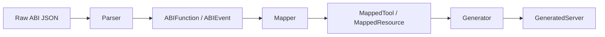

# Core API

The `core` module contains the foundational data structures and configuration used throughout UCAI. These models serve as contracts between modules, ensuring type safety and consistency.

## Module: `abi_to_mcp.core.models`

### Data Flow



---

## Enums

### StateMutability

Represents Solidity function state mutability.

```python
from abi_to_mcp.core.models import StateMutability

# Values
StateMutability.PURE        # Pure computation, no state read
StateMutability.VIEW        # Reads state, no modification
StateMutability.NONPAYABLE  # Modifies state, no ETH
StateMutability.PAYABLE     # Modifies state, accepts ETH
```

#### Properties

| Property | Type | Description |
|----------|------|-------------|
| `is_read_only` | `bool` | True for PURE and VIEW |
| `requires_gas` | `bool` | True for NONPAYABLE and PAYABLE |

### ToolType

MCP tool type based on function behavior.

```python
from abi_to_mcp.core.models import ToolType

ToolType.READ           # Pure/view functions - no gas required
ToolType.WRITE          # Nonpayable functions - requires gas
ToolType.WRITE_PAYABLE  # Payable functions - requires gas + ETH
```

---

## ABI Models (Parser Output)

These classes represent parsed ABI entries.

### ABIParameter

A function or event parameter from the ABI.

```python
from abi_to_mcp.core.models import ABIParameter

param = ABIParameter(
    name="amount",
    type="uint256",
    indexed=False,
    components=None,
    internal_type="uint256"
)
```

#### Attributes

| Attribute | Type | Description |
|-----------|------|-------------|
| `name` | `str` | Parameter name (may be empty) |
| `type` | `str` | Solidity type string |
| `indexed` | `bool` | Whether indexed (events only) |
| `components` | `List[ABIParameter]` | Nested params for tuples |
| `internal_type` | `Optional[str]` | Compiler type hint |

#### Class Methods

##### `from_dict(data: Dict) -> ABIParameter`

Create from ABI JSON dictionary.

```python
param = ABIParameter.from_dict({
    "name": "to",
    "type": "address",
    "indexed": True
})
```

---

### ABIFunction

A parsed contract function.

```python
from abi_to_mcp.core.models import ABIFunction, StateMutability

func = ABIFunction(
    name="transfer",
    inputs=[...],
    outputs=[...],
    state_mutability=StateMutability.NONPAYABLE,
    selector="0xa9059cbb"
)
```

#### Attributes

| Attribute | Type | Description |
|-----------|------|-------------|
| `name` | `str` | Function name |
| `inputs` | `List[ABIParameter]` | Input parameters |
| `outputs` | `List[ABIParameter]` | Output parameters |
| `state_mutability` | `StateMutability` | State mutability |
| `selector` | `Optional[str]` | 4-byte function selector |

#### Properties

| Property | Type | Description |
|----------|------|-------------|
| `is_read_only` | `bool` | True if view/pure |
| `is_payable` | `bool` | True if accepts ETH |
| `requires_gas` | `bool` | True if modifies state |
| `tool_type` | `ToolType` | MCP tool classification |

#### Example

```python
func = ABIFunction.from_dict({
    "type": "function",
    "name": "balanceOf",
    "inputs": [{"name": "account", "type": "address"}],
    "outputs": [{"name": "", "type": "uint256"}],
    "stateMutability": "view"
})

print(func.is_read_only)  # True
print(func.tool_type)     # ToolType.READ
```

---

### ABIEvent

A parsed contract event.

```python
from abi_to_mcp.core.models import ABIEvent

event = ABIEvent(
    name="Transfer",
    inputs=[...],
    anonymous=False
)
```

#### Attributes

| Attribute | Type | Description |
|-----------|------|-------------|
| `name` | `str` | Event name |
| `inputs` | `List[ABIParameter]` | Event parameters |
| `anonymous` | `bool` | Whether anonymous event |

#### Properties

| Property | Type | Description |
|----------|------|-------------|
| `indexed_inputs` | `List[ABIParameter]` | Only indexed params (topics) |
| `data_inputs` | `List[ABIParameter]` | Only non-indexed params (data) |

---

### ABIError

A parsed custom error.

```python
from abi_to_mcp.core.models import ABIError

error = ABIError(
    name="InsufficientBalance",
    inputs=[...]
)
```

---

### ParsedABI

Complete parsed ABI - the main output of the parser module.

```python
from abi_to_mcp.core.models import ParsedABI

parsed = ParsedABI(
    functions=[...],
    events=[...],
    errors=[...],
    raw_abi=[...],
    detected_standard="ERC20"
)
```

#### Attributes

| Attribute | Type | Description |
|-----------|------|-------------|
| `functions` | `List[ABIFunction]` | All parsed functions |
| `events` | `List[ABIEvent]` | All parsed events |
| `errors` | `List[ABIError]` | All custom errors |
| `raw_abi` | `List[Dict]` | Original ABI JSON |
| `detected_standard` | `Optional[str]` | ERC standard if detected |
| `has_constructor` | `bool` | Has constructor |
| `has_fallback` | `bool` | Has fallback function |
| `has_receive` | `bool` | Has receive function |

#### Properties

| Property | Type | Description |
|----------|------|-------------|
| `read_functions` | `List[ABIFunction]` | All read-only functions |
| `write_functions` | `List[ABIFunction]` | All state-modifying functions |

---

## Mapper Models (Mapper Output)

These classes represent MCP-compatible tool and resource definitions.

### ToolParameter

A parameter in an MCP tool definition.

```python
from abi_to_mcp.core.models import ToolParameter

param = ToolParameter(
    name="recipient",
    original_name="to",
    solidity_type="address",
    json_schema={"type": "string", "pattern": "^0x[a-fA-F0-9]{40}$"},
    python_type="str",
    description="Recipient address",
    required=True
)
```

#### Attributes

| Attribute | Type | Description |
|-----------|------|-------------|
| `name` | `str` | Parameter name (snake_case) |
| `original_name` | `str` | Original Solidity name |
| `solidity_type` | `str` | Original Solidity type |
| `json_schema` | `Dict` | JSON Schema for parameter |
| `python_type` | `str` | Python type hint string |
| `description` | `str` | Human-readable description |
| `required` | `bool` | Whether required |

---

### MappedTool

A function mapped to an MCP tool definition.

```python
from abi_to_mcp.core.models import MappedTool

tool = MappedTool(
    name="transfer",
    original_name="transfer",
    description="Transfer tokens to recipient",
    tool_type="write",
    parameters=[...],
    return_schema={...},
    return_description="Returns success boolean",
    python_signature="def transfer(recipient: str, amount: str) -> bool:"
)
```

#### Properties

| Property | Type | Description |
|----------|------|-------------|
| `required_params` | `List[str]` | Names of required parameters |
| `is_read_only` | `bool` | True if read-only tool |
| `is_payable` | `bool` | True if accepts ETH |

---

### MappedResource

An event mapped to an MCP resource definition.

```python
from abi_to_mcp.core.models import MappedResource

resource = MappedResource(
    name="transfer_events",
    original_name="Transfer",
    description="Token transfer events",
    uri_template="contract://events/transfer",
    fields=[...],
    function_name="get_transfer_events"
)
```

---

### GeneratedFile

A generated file in the output.

```python
from abi_to_mcp.core.models import GeneratedFile

file = GeneratedFile(
    path="server.py",
    content="...",
    is_executable=False
)
```

---

### GeneratedServer

Complete generated MCP server package - final output.

```python
from abi_to_mcp.core.models import GeneratedServer

server = GeneratedServer(
    files=[...],
    tool_count=15,
    resource_count=3,
    read_tools=["balance_of", "allowance"],
    write_tools=["transfer", "approve"],
    events=["Transfer", "Approval"],
    server_name="USDC Token",
    contract_address="0xA0b86991...",
    network="mainnet"
)
```

#### Methods

##### `get_file(path: str) -> Optional[GeneratedFile]`

Get a specific file by path.

---

### FetchResult

Result from fetching an ABI.

```python
from abi_to_mcp.core.models import FetchResult

result = FetchResult(
    abi=[...],
    source="etherscan",
    source_location="0xA0b86991...",
    contract_name="FiatTokenV2_1",
    is_proxy=True,
    implementation_address="0x..."
)
```

---

## Module: `abi_to_mcp.core.config`

Configuration management for all UCAI components.

### NetworkConfig

Configuration for a specific network.

```python
from abi_to_mcp.core.config import NetworkConfig

config = NetworkConfig(
    chain_id=1,
    name="Ethereum Mainnet",
    rpc="https://eth.llamarpc.com",
    explorer="https://etherscan.io",
    etherscan_api="https://api.etherscan.io/api",
    currency_symbol="ETH",
    is_testnet=False
)
```

---

### GeneratorConfig

Configuration for MCP server generation.

```python
from abi_to_mcp.core.config import GeneratorConfig

config = GeneratorConfig(
    output_dir=Path("./my-server"),
    overwrite=False,
    read_only=False,
    include_events=True,
    simulation_default=True,
    server_name="My Token"
)
```

#### Key Attributes

| Attribute | Default | Description |
|-----------|---------|-------------|
| `output_dir` | `./mcp-server` | Output directory |
| `read_only` | `False` | Only generate read tools |
| `include_events` | `True` | Generate event resources |
| `simulation_default` | `True` | Default simulation mode |
| `generate_tests` | `False` | Generate test files |

---

### FetcherConfig

Configuration for ABI fetching.

```python
from abi_to_mcp.core.config import FetcherConfig

config = FetcherConfig(
    timeout=30.0,
    max_retries=3,
    detect_proxy=True
)
```

API keys are automatically loaded from environment variables:

- `ETHERSCAN_API_KEY`
- `POLYGONSCAN_API_KEY`
- `ARBISCAN_API_KEY`
- `OPTIMISM_API_KEY`
- `BASESCAN_API_KEY`
- `BSCSCAN_API_KEY`

---

### RuntimeConfig

Configuration for runtime execution.

```python
from abi_to_mcp.core.config import RuntimeConfig

config = RuntimeConfig(
    rpc_url="https://eth.llamarpc.com",
    network="mainnet",
    gas_limit_multiplier=1.2,
    simulation_required=True
)
```

---

### AppConfig

Top-level application configuration combining all configs.

```python
from abi_to_mcp.core.config import AppConfig, get_default_config

# Get default config (auto-loads from config files)
config = get_default_config()

# Or create manually
config = AppConfig(
    generator=GeneratorConfig(...),
    fetcher=FetcherConfig(...),
    runtime=RuntimeConfig(...),
    log_level="INFO"
)
```

#### Loading from Files

UCAI automatically searches for config files:

1. `./abi-to-mcp.toml`
2. `./abi-to-mcp.json`
3. `~/.config/abi-to-mcp/config.toml`
4. `~/.config/abi-to-mcp/config.json`

```python
config = AppConfig.load_from_file(Path("./custom-config.toml"))
```

---

## Module: `abi_to_mcp.core.constants`

Network configurations and type mappings.

### NETWORKS

Dictionary of supported EVM networks.

```python
from abi_to_mcp.core.constants import NETWORKS

# Available networks
networks = list(NETWORKS.keys())
# ['mainnet', 'sepolia', 'polygon', 'arbitrum', 'optimism', 'base', 'bsc', 'avalanche', 'fantom']

# Get network config
mainnet = NETWORKS["mainnet"]
print(mainnet["chain_id"])  # 1
print(mainnet["explorer"])  # https://etherscan.io
```

### ERC_STANDARDS

Signatures for detecting ERC standards.

```python
from abi_to_mcp.core.constants import ERC_STANDARDS

# ERC20 required functions
erc20 = ERC_STANDARDS["ERC20"]
print(erc20["functions"])  # ['name', 'symbol', 'decimals', 'totalSupply', ...]
```

---

## Module: `abi_to_mcp.core.exceptions`

Custom exception classes for error handling.

### Exception Hierarchy

```
ABIToMCPError (base)
├── FetcherError
│   ├── ABINotFoundError
│   ├── ContractNotVerifiedError
│   ├── NetworkError
│   └── RateLimitError
├── ABIParseError
├── ABIValidationError
├── MappingError
├── GeneratorError
└── RuntimeError
    ├── TransactionError
    ├── SimulationError
    └── GasEstimationError
```

### Usage

```python
from abi_to_mcp.core.exceptions import (
    ABIToMCPError,
    ABINotFoundError,
    ContractNotVerifiedError,
)

try:
    result = fetcher.fetch(address, network)
except ContractNotVerifiedError as e:
    print(f"Contract {e.address} not verified on {e.network}")
except ABINotFoundError as e:
    print(f"ABI not found: {e.source}")
except ABIToMCPError as e:
    print(f"Error: {e.message}")
    print(f"Details: {e.details}")
```

### Common Exceptions

| Exception | When Raised |
|-----------|-------------|
| `ABINotFoundError` | ABI source doesn't exist |
| `ContractNotVerifiedError` | Contract not verified on explorer |
| `NetworkError` | Network/HTTP errors |
| `RateLimitError` | API rate limit exceeded |
| `ABIParseError` | Invalid ABI structure |
| `ABIValidationError` | Invalid ABI entries |
| `MappingError` | Type mapping failed |
| `GeneratorError` | Code generation failed |
| `TransactionError` | Transaction failed |
| `SimulationError` | Simulation failed |
---

## Auto-Generated API Reference

The following sections are automatically generated from source code docstrings using mkdocstrings.

### Models Module

::: abi_to_mcp.core.models
    options:
      show_root_heading: true
      show_source: false
      members_order: source
      heading_level: 4
      show_if_no_docstring: false

### Config Module

::: abi_to_mcp.core.config
    options:
      show_root_heading: true
      show_source: false
      members_order: source
      heading_level: 4
      show_if_no_docstring: false

### Exceptions Module

::: abi_to_mcp.core.exceptions
    options:
      show_root_heading: true
      show_source: false
      members_order: source
      heading_level: 4
      show_if_no_docstring: false

### Constants Module

::: abi_to_mcp.core.constants
    options:
      show_root_heading: true
      show_source: false
      members_order: source
      heading_level: 4
      show_if_no_docstring: false