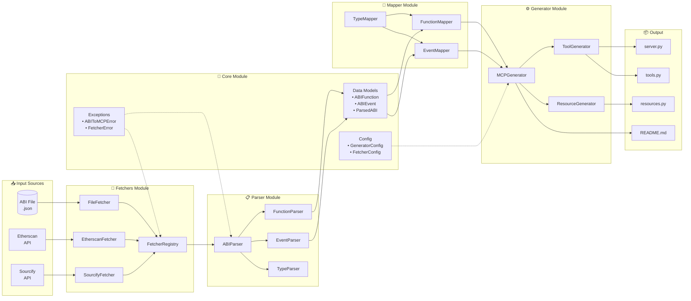
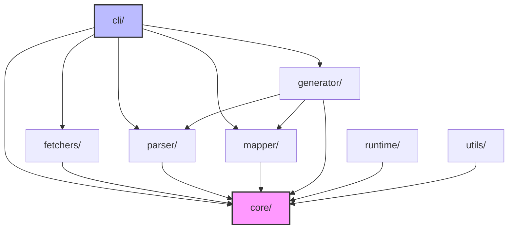

# API Reference

This section provides detailed documentation for using abi-to-mcp as a Python library.

## Overview

abi-to-mcp can be used programmatically for:

- Custom ABI processing pipelines
- Integration into build tools
- Dynamic server generation
- Testing and validation

## Architecture Diagram

The following diagram shows how data flows through the different modules:



## Module Dependencies



## Module Structure

```
abi_to_mcp/
├── core/        # Data models, config, exceptions
├── parser/      # ABI parsing
├── fetchers/    # ABI retrieval
├── mapper/      # Type mapping
├── generator/   # Code generation
├── runtime/     # Execution utilities
├── cli/         # Command-line interface
└── utils/       # Helper utilities
```


## Quick Reference

<div class="grid cards" markdown>

-   :material-file-document:{ .lg .middle } __Parser__

    ---

    Parse ABI JSON into structured Python objects.

    [:octicons-arrow-right-24: Parser API](parser.md)

-   :material-download:{ .lg .middle } __Fetchers__

    ---

    Retrieve ABIs from files, Etherscan, or Sourcify.

    [:octicons-arrow-right-24: Fetchers API](fetchers.md)

-   :material-swap-horizontal:{ .lg .middle } __Mapper__

    ---

    Convert Solidity types to JSON Schema.

    [:octicons-arrow-right-24: Mapper API](mapper.md)

-   :material-code-braces:{ .lg .middle } __Generator__

    ---

    Generate MCP server code from parsed ABIs.

    [:octicons-arrow-right-24: Generator API](generator.md)

-   :material-play:{ .lg .middle } __Runtime__

    ---

    Web3 client and transaction utilities.

    [:octicons-arrow-right-24: Runtime API](runtime.md)

-   :material-database:{ .lg .middle } __Core__

    ---

    Data models, configuration, and exceptions.

    [:octicons-arrow-right-24: Core API](core.md)

-   :material-wrench:{ .lg .middle } __Utilities__

    ---

    Validation, formatting, and logging helpers.

    [:octicons-arrow-right-24: Utilities API](utils.md)

-   :material-console:{ .lg .middle } __CLI Internals__

    ---

    Command-line interface architecture.

    [:octicons-arrow-right-24: CLI Internals](cli.md)

</div>

## Basic Usage

```python
from abi_to_mcp.parser import ABIParser
from abi_to_mcp.mapper import TypeMapper, FunctionMapper
from abi_to_mcp.generator import MCPGenerator

# Parse ABI
parser = ABIParser()
parsed = parser.parse(abi_json)

# Map to MCP tools
type_mapper = TypeMapper()
func_mapper = FunctionMapper(type_mapper)
tools = [func_mapper.map_function(f) for f in parsed.functions]

# Generate server
generator = MCPGenerator()
server = generator.generate(
    parsed=parsed,
    tools=tools,
    contract_address="0x...",
    network="mainnet"
)

# Write files
for file in server.files:
    Path(file.path).write_text(file.content)
```

## Installation for Development

```bash
pip install abi-to-mcp[dev]
```

This includes type stubs and development dependencies.
