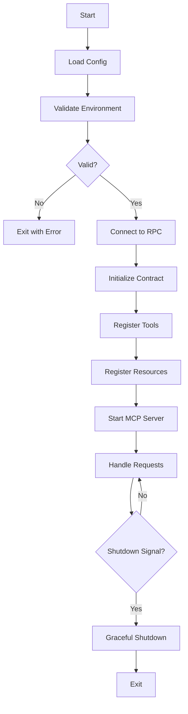

# abi-to-mcp serve

Run a generated MCP server directly from the command line.

## Synopsis

```bash
abi-to-mcp serve DIRECTORY [OPTIONS]
```

## Description

The `serve` command starts a generated MCP server. While you can run servers directly with `python server.py`, this command provides additional features:

- Automatic dependency checking
- Environment validation
- Debug logging options
- Graceful shutdown handling

## Arguments

### DIRECTORY

Path to the generated server directory.

```bash
abi-to-mcp serve ./my-mcp-server
```

## Options

### `--port`, `-p`

Port for HTTP mode (not used in stdio mode).

| Default | `8080` |
|---------|--------|
| Type | Integer |

### `--mode`, `-m`

Server communication mode.

| Default | `stdio` |
|---------|---------|
| Choices | `stdio`, `http` |

- **stdio**: Standard input/output (for Claude Desktop)
- **http**: HTTP server (for development/testing)

### `--debug`, `-d`

Enable debug logging.

| Default | `False` |
|---------|---------|

### `--env-file`

Path to environment file.

| Default | `.env` in server directory |
|---------|---------------------------|

## Examples

### Basic Usage

```bash
# Run in stdio mode (default, for Claude Desktop)
abi-to-mcp serve ./usdc-mcp
```

### Development Mode

```bash
# Run with HTTP interface for testing
abi-to-mcp serve ./usdc-mcp --mode http --port 8080 --debug
```

Then test with curl:

```bash
curl http://localhost:8080/tools
curl -X POST http://localhost:8080/tool/balance_of \
  -H "Content-Type: application/json" \
  -d '{"account": "0xd8dA6BF26964aF9D7eEd9e03E53415D37aA96045"}'
```

### Custom Environment

```bash
# Use a specific .env file
abi-to-mcp serve ./usdc-mcp --env-file ./production.env
```

### Debug Mode

```bash
# Enable verbose logging
abi-to-mcp serve ./usdc-mcp --debug
```

Output includes:

```
[DEBUG] Loading configuration from ./usdc-mcp/config.py
[DEBUG] Connecting to RPC: https://eth.llamarpc.com
[DEBUG] Contract address: 0xA0b86991c6218b36c1d19D4a2e9Eb0cE3606eB48
[DEBUG] Loaded 13 tools, 2 resources
[INFO] MCP server started (stdio mode)
[DEBUG] Received request: balance_of
[DEBUG] Calling contract.functions.balanceOf(0x...)
[DEBUG] Result: 2547320000
```

## Environment Variables

The server reads these from the environment or `.env` file:

| Variable | Required | Description |
|----------|----------|-------------|
| `RPC_URL` | Yes | Web3 RPC endpoint |
| `CONTRACT_ADDRESS` | No | Override contract address |
| `PRIVATE_KEY` | No | For write operations |
| `MAX_GAS_PRICE_GWEI` | No | Gas price limit |

## Server Lifecycle



## Signals

The server handles:

- **SIGINT** (Ctrl+C): Graceful shutdown
- **SIGTERM**: Graceful shutdown

Pending requests are completed before shutdown.

## Health Checks

In HTTP mode, the server provides:

```bash
# Health check
curl http://localhost:8080/health
# {"status": "healthy", "rpc_connected": true}

# List tools
curl http://localhost:8080/tools
# [{"name": "balance_of", ...}, ...]

# List resources
curl http://localhost:8080/resources
# [{"uri": "events://transfer", ...}, ...]
```

## Integration with Claude Desktop

For Claude Desktop, use stdio mode (default):

```json
{
  "mcpServers": {
    "my-contract": {
      "command": "abi-to-mcp",
      "args": ["serve", "/path/to/my-mcp-server"],
      "env": {
        "RPC_URL": "https://eth.llamarpc.com"
      }
    }
  }
}
```

Or run the server directly:

```json
{
  "mcpServers": {
    "my-contract": {
      "command": "python",
      "args": ["/path/to/my-mcp-server/server.py"],
      "env": {
        "RPC_URL": "https://eth.llamarpc.com"
      }
    }
  }
}
```

## Troubleshooting

### "RPC_URL not set"

Set the environment variable:

```bash
export RPC_URL=https://eth.llamarpc.com
abi-to-mcp serve ./my-server
```

Or create a `.env` file in the server directory.

### "Connection refused"

Check that:

1. RPC URL is correct and accessible
2. No firewall blocking the connection
3. RPC provider is operational

### "Module not found"

Install dependencies:

```bash
cd ./my-mcp-server
pip install -r requirements.txt
```

### Server Hangs

In debug mode, check for:

- RPC connection issues
- Contract address validity
- Network congestion

## Exit Codes

| Code | Meaning |
|------|---------|
| 0 | Normal shutdown |
| 1 | Configuration error |
| 2 | Connection error |
| 3 | Runtime error |

## See Also

- [Claude Desktop Guide](../guides/claude-desktop.md) - Full integration guide
- [First Server](../getting-started/first-server.md) - Understanding generated servers
- [Safety Features](../concepts/safety.md) - Server safety features
