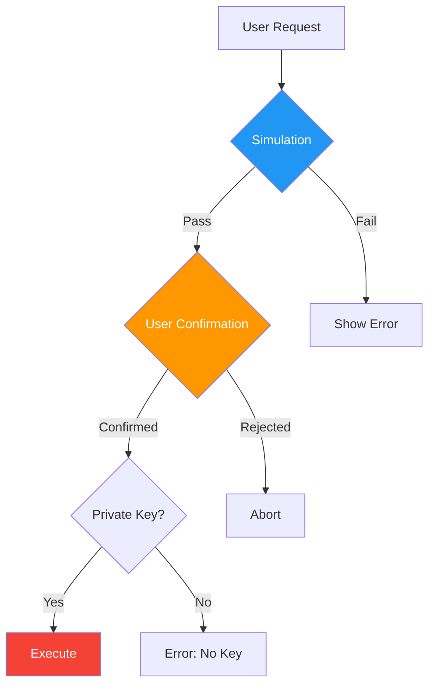

# Safety Features

abi-to-mcp is designed with safety as a primary concern. This page describes all the built-in protections.

## Safety Philosophy

> **Principle**: No transaction should execute without explicit user intent.

Smart contract interactions are irreversible. Once a transaction is confirmed, it cannot be undone. abi-to-mcp provides multiple layers of protection:



## Layer 1: Simulation by Default

All write operations simulate before executing:

```python
@mcp.tool()
async def transfer(
    to: str,
    amount: str,
    simulate: bool = True  # Default: simulation only
) -> dict:
    """Transfer tokens."""
    if simulate:
        return await simulate_transaction(...)
    else:
        return await execute_transaction(...)
```

### What Simulation Shows

```json
{
  "success": true,
  "would_succeed": true,
  "gas_estimate": 65000,
  "gas_price_gwei": 25.5,
  "estimated_cost_eth": "0.0016575",
  "estimated_cost_usd": "$3.15",
  "result": true
}
```

### Simulation Catches

- ✅ Insufficient balance
- ✅ Insufficient allowance
- ✅ Contract reverts
- ✅ Invalid parameters
- ✅ Access control failures

### Enabling Execution

Must explicitly set `simulate=False`:

```python
# This WILL execute
result = await transfer(
    to="0x...",
    amount="1000000000000000000",
    simulate=False  # Explicit opt-in required
)
```

## Layer 2: Read-Only Mode

Generate servers that cannot write:

```bash
abi-to-mcp generate ./abi.json --read-only
```

This completely excludes:
- All `nonpayable` functions
- All `payable` functions
- No private key handling code

Perfect for:
- Exploration and research
- Public-facing servers
- Analytics dashboards

## Layer 3: No Embedded Keys

Private keys are **never** stored in generated code:

```python
# config.py - generated
PRIVATE_KEY = os.environ.get("PRIVATE_KEY")  # From environment only
```

This means:
- No keys in source control
- No keys in generated files
- Keys only loaded at runtime
- Missing key = graceful error

### Missing Key Behavior

```python
if not PRIVATE_KEY:
    return {
        "error": "PRIVATE_KEY not configured",
        "message": "Write operations require a private key. "
                   "Set the PRIVATE_KEY environment variable."
    }
```

## Layer 4: Transaction Validation

Before any transaction:

### Address Validation
```python
# Validates checksum and format
Web3.to_checksum_address(address)  # Raises if invalid
```

### Amount Validation
```python
# Ensures positive integer
amount = int(amount_str)
if amount < 0:
    raise ValueError("Amount cannot be negative")
```

### Gas Validation
```python
# Prevents runaway gas costs
if gas_estimate > MAX_GAS_LIMIT:
    raise ValueError(f"Gas estimate {gas_estimate} exceeds limit")
```

## Layer 5: Network Confirmation

Always confirms the network before writing:

```python
# Verify chain ID matches expected
chain_id = await w3.eth.chain_id
if chain_id != EXPECTED_CHAIN_ID:
    raise NetworkMismatchError(
        f"Expected chain {EXPECTED_CHAIN_ID}, got {chain_id}"
    )
```

## Safety Configuration

### Environment Variables

| Variable | Purpose | Default |
|----------|---------|---------|
| `PRIVATE_KEY` | Transaction signing | None (disabled) |
| `SIMULATION_DEFAULT` | Default simulation mode | `true` |
| `READ_ONLY_MODE` | Disable all writes | `false` |
| `MAX_GAS_LIMIT` | Maximum gas per tx | `500000` |
| `REQUIRE_CONFIRMATION` | Require explicit confirm | `true` |

### Generation Options

```bash
# Maximum safety
abi-to-mcp generate ./abi.json \
    --read-only \
    --no-events

# Standard safety (simulation default)
abi-to-mcp generate ./abi.json \
    --simulate

# Reduced safety (not recommended)
abi-to-mcp generate ./abi.json \
    --no-simulate
```

## Best Practices

### For AI Assistants

!!! tip "Always Explain Risks"
    When a user asks to execute a transaction:
    
    1. Explain what the transaction will do
    2. Show the estimated gas cost
    3. Confirm the user wants to proceed
    4. Execute with `simulate=False` only after confirmation

### For Developers

!!! warning "Never Disable Simulation Globally"
    Always keep `simulate=True` as the default. Let users explicitly opt-in to execution.

### For Production

!!! danger "Dedicated Wallets"
    Never use a wallet containing significant funds. Create a dedicated wallet for MCP interactions with only the funds needed for operations.

## Error Handling

All errors are caught and returned safely:

```python
try:
    result = await execute_transaction(...)
except InsufficientFundsError as e:
    return {"error": "insufficient_funds", "message": str(e)}
except ContractRevertError as e:
    return {"error": "contract_revert", "message": str(e)}
except Exception as e:
    return {"error": "unknown", "message": str(e)}
```

## Audit Trail

All operations are logged:

```python
logger.info(f"Simulating transfer: to={to}, amount={amount}")
logger.warning(f"Executing transfer: to={to}, amount={amount}")
logger.info(f"Transaction submitted: {tx_hash}")
```

## Security Considerations

### What abi-to-mcp Does NOT Protect Against

- **Social engineering** - User tricked into confirming bad transaction
- **Malicious contracts** - ABI doesn't reveal malicious code
- **Private key theft** - If environment is compromised
- **Phishing addresses** - Similar-looking addresses

### What You Should Do

1. **Verify contracts** - Only use verified contracts
2. **Check addresses** - Double-check recipient addresses
3. **Start small** - Test with small amounts first
4. **Use hardware wallets** - For significant funds
5. **Monitor transactions** - Watch for unexpected activity

## Related

- [Tool Types](tool-types.md) - Read vs write operations
- [CLI Reference](../cli/generate.md) - Safety-related options
- [Guides](../guides/claude-desktop.md) - Safe Claude integration
