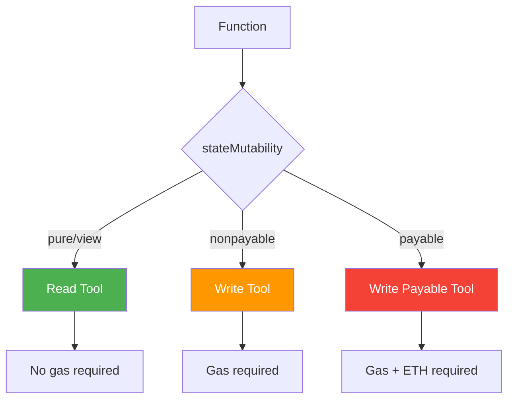

# Tool Types

abi-to-mcp generates different types of tools based on the function's state mutability. Understanding these types is crucial for safe smart contract interaction.

## Overview



## Read Tools

Functions with `pure` or `view` state mutability become read tools.

### Characteristics

| Property | Value |
|----------|-------|
| Gas Required | No |
| Transaction | No |
| Private Key | No |
| Modifies State | No |
| Returns Data | Yes |

### Example

**Solidity:**
```solidity
function balanceOf(address account) external view returns (uint256);
```

**Generated Tool:**
```python
@mcp.tool()
async def balance_of(account: str) -> str:
    """
    Get the token balance for an account.
    
    This is a read-only operation that does not require gas.
    
    Args:
        account: The address to check balance for (0x...)
    
    Returns:
        The token balance as a string (wei)
    """
    result = await contract.functions.balanceOf(
        Web3.to_checksum_address(account)
    ).call()
    return str(result)
```

### Common Read Functions

| Function | Purpose |
|----------|---------|
| `balanceOf(address)` | Get token balance |
| `totalSupply()` | Get total supply |
| `name()` | Get token name |
| `symbol()` | Get token symbol |
| `decimals()` | Get token decimals |
| `allowance(owner, spender)` | Get spending approval |
| `ownerOf(tokenId)` | Get NFT owner |

## Write Tools

Functions with `nonpayable` state mutability become write tools.

### Characteristics

| Property | Value |
|----------|-------|
| Gas Required | Yes |
| Transaction | Yes |
| Private Key | Yes |
| Modifies State | Yes |
| Returns | Transaction hash |

### Safety Features

Write tools include built-in safety:

1. **Simulation by Default** - Transactions are simulated before execution
2. **Explicit Opt-In** - Must set `simulate=False` to execute
3. **Gas Estimation** - Shows estimated gas cost before execution

### Example

**Solidity:**
```solidity
function transfer(address to, uint256 amount) external returns (bool);
```

**Generated Tool:**
```python
@mcp.tool()
async def transfer(
    to: str,
    amount: str,
    simulate: bool = True
) -> dict:
    """
    Transfer tokens to another address.
    
    ⚠️ This operation modifies blockchain state and requires gas.
    
    Args:
        to: Recipient address (0x...)
        amount: Amount to transfer (in wei, as string)
        simulate: If True (default), only simulate the transaction
    
    Returns:
        If simulate=True: Simulation result with gas estimate
        If simulate=False: Transaction hash and receipt
    """
    if simulate:
        return await simulate_transaction(
            contract.functions.transfer(
                Web3.to_checksum_address(to),
                int(amount)
            )
        )
    else:
        return await execute_transaction(
            contract.functions.transfer(
                Web3.to_checksum_address(to),
                int(amount)
            )
        )
```

### Common Write Functions

| Function | Purpose |
|----------|---------|
| `transfer(to, amount)` | Transfer tokens |
| `approve(spender, amount)` | Approve spending |
| `transferFrom(from, to, amount)` | Transfer on behalf |
| `mint(to, amount)` | Create new tokens |
| `burn(amount)` | Destroy tokens |

## Write Payable Tools

Functions with `payable` state mutability become write payable tools.

### Characteristics

| Property | Value |
|----------|-------|
| Gas Required | Yes |
| Transaction | Yes |
| Private Key | Yes |
| Modifies State | Yes |
| ETH Value | Yes |
| Returns | Transaction hash |

### Additional Parameter

Payable tools include an additional `value` parameter:

```python
@mcp.tool()
async def deposit(
    value: str,  # ETH to send (in wei)
    simulate: bool = True
) -> dict:
    """
    Deposit ETH into the contract.
    
    ⚠️ This operation sends ETH and modifies blockchain state.
    
    Args:
        value: Amount of ETH to send (in wei, as string)
        simulate: If True (default), only simulate the transaction
    """
    ...
```

### Example

**Solidity:**
```solidity
function swap(
    address tokenIn,
    address tokenOut,
    uint256 amountIn
) external payable returns (uint256 amountOut);
```

**Generated Tool:**
```python
@mcp.tool()
async def swap(
    token_in: str,
    token_out: str,
    amount_in: str,
    value: str = "0",  # ETH to send
    simulate: bool = True
) -> dict:
    """
    Swap tokens on the DEX.
    
    ⚠️ This operation may require sending ETH for gas and/or swap value.
    """
    ...
```

## Read-Only Mode

When safety is paramount, you can generate read-only servers:

```bash
abi-to-mcp generate ./abi.json --read-only
```

This:
- Excludes all write tools
- Excludes all payable tools
- Only generates read tools
- No private key needed

## Identifying Tool Types in Output

When you run `abi-to-mcp inspect`, you can see the tool types:

```
$ abi-to-mcp inspect ./erc20.json

📋 Contract Analysis
═══════════════════════════════════════════════════════════════

📖 Read Operations (9 functions)
  • name() → string
  • symbol() → string
  • decimals() → uint8
  • totalSupply() → uint256
  • balanceOf(address) → uint256
  • allowance(address,address) → uint256
  • owner() → address
  • paused() → bool
  • nonces(address) → uint256

✍️ Write Operations (5 functions)
  • transfer(address,uint256) → bool
  • approve(address,uint256) → bool
  • transferFrom(address,address,uint256) → bool
  • increaseAllowance(address,uint256) → bool
  • decreaseAllowance(address,uint256) → bool

💰 Payable Operations (0 functions)
  (none)
```

## Best Practices

### For AI Assistants

1. **Always simulate first** - Never skip simulation for write operations
2. **Explain gas costs** - Tell users the estimated cost before executing
3. **Confirm large transfers** - Double-check amounts with users
4. **Check balances first** - Verify sufficient funds before writing

### For Developers

1. **Use read-only for exploration** - When just querying data
2. **Test with simulation** - Verify transactions work before executing
3. **Set appropriate gas limits** - Don't overpay for transactions
4. **Monitor pending transactions** - Track transaction status

## Related

- [Safety Features](safety.md) - More on simulation and protection
- [Events](events.md) - Tracking what write operations do
- [CLI Reference](../cli/generate.md) - Generation options
