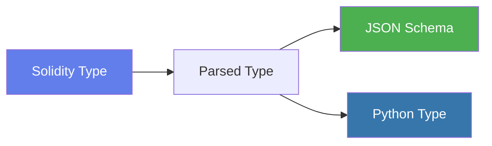

# Type Mapping

Understanding how Solidity types are converted to JSON Schema is essential for working with generated MCP servers.

## Overview

abi-to-mcp performs a multi-step type conversion:



## Complete Type Mapping Reference

### Numeric Types

| Solidity Type | JSON Schema | Python Type | Notes |
|--------------|-------------|-------------|-------|
| `uint8` - `uint256` | `{"type": "string", "pattern": "^[0-9]+$"}` | `str` | String to preserve precision |
| `int8` - `int256` | `{"type": "string", "pattern": "^-?[0-9]+$"}` | `str` | String to preserve precision |

!!! info "Why Strings for Numbers?"
    JavaScript's `Number` type cannot safely represent values larger than 2^53. Since uint256 can be up to 2^256, we use strings to preserve precision across all systems.

### Address Types

| Solidity Type | JSON Schema | Python Type |
|--------------|-------------|-------------|
| `address` | `{"type": "string", "pattern": "^0x[a-fA-F0-9]{40}$"}` | `str` |

The pattern ensures:
- Starts with `0x`
- Exactly 40 hexadecimal characters
- Case-insensitive (checksummed addresses work)

### Boolean Type

| Solidity Type | JSON Schema | Python Type |
|--------------|-------------|-------------|
| `bool` | `{"type": "boolean"}` | `bool` |

### Bytes Types

| Solidity Type | JSON Schema | Python Type | Notes |
|--------------|-------------|-------------|-------|
| `bytes` | `{"type": "string", "pattern": "^0x[a-fA-F0-9]*$"}` | `str` | Dynamic length |
| `bytes1` - `bytes32` | `{"type": "string", "pattern": "^0x[a-fA-F0-9]{N}$"}` | `str` | Fixed length (N = bytes * 2) |

### String Type

| Solidity Type | JSON Schema | Python Type |
|--------------|-------------|-------------|
| `string` | `{"type": "string"}` | `str` |

### Array Types

| Solidity Type | JSON Schema | Python Type |
|--------------|-------------|-------------|
| `T[]` | `{"type": "array", "items": {...}}` | `List[T]` |
| `T[N]` | `{"type": "array", "items": {...}, "minItems": N, "maxItems": N}` | `List[T]` |

**Example: Dynamic Array**
```json
// uint256[]
{
  "type": "array",
  "items": {
    "type": "string",
    "pattern": "^[0-9]+$"
  }
}
```

**Example: Fixed Array**
```json
// address[3]
{
  "type": "array",
  "items": {
    "type": "string",
    "pattern": "^0x[a-fA-F0-9]{40}$"
  },
  "minItems": 3,
  "maxItems": 3
}
```

### Tuple Types (Structs)

Solidity structs are represented as tuples in the ABI:

```json
// struct Order { address maker; uint256 amount; }
{
  "type": "object",
  "properties": {
    "maker": {
      "type": "string",
      "pattern": "^0x[a-fA-F0-9]{40}$"
    },
    "amount": {
      "type": "string",
      "pattern": "^[0-9]+$"
    }
  },
  "required": ["maker", "amount"]
}
```

## Type Parsing

The type parser handles complex nested types:

```python
# Simple types
"uint256"     → BaseType("uint256")
"address"     → BaseType("address")

# Arrays
"uint256[]"   → ArrayType(BaseType("uint256"), None)
"address[5]"  → ArrayType(BaseType("address"), 5)

# Nested arrays
"uint256[][]" → ArrayType(ArrayType(BaseType("uint256"), None), None)

# Tuples (with components from ABI)
"tuple"       → TupleType([...components...])
```

## Handling Edge Cases

### Empty Arrays

Empty arrays are valid for dynamic array types:

```json
{
  "type": "array",
  "items": {"type": "string"}
}
// Valid: [], ["a"], ["a", "b"]
```

### Nested Tuples

Deeply nested structures are fully supported:

```python
# struct Pool { Token tokenA; Token tokenB; uint24 fee; }
# struct Token { address addr; uint8 decimals; }

{
  "type": "object",
  "properties": {
    "tokenA": {
      "type": "object",
      "properties": {
        "addr": {"type": "string", "pattern": "^0x[a-fA-F0-9]{40}$"},
        "decimals": {"type": "string", "pattern": "^[0-9]+$"}
      }
    },
    "tokenB": {...},
    "fee": {"type": "string", "pattern": "^[0-9]+$"}
  }
}
```

### Reserved Python Keywords

When Solidity parameter names conflict with Python keywords, they're automatically escaped:

| Solidity Name | Python Name |
|--------------|-------------|
| `from` | `from_` |
| `class` | `class_` |
| `import` | `import_` |
| `type` | `type_` |

## Custom Type Extensions

The type mapper can be extended for custom types:

```python
from abi_to_mcp.mapper import TypeMapper

class CustomTypeMapper(TypeMapper):
    def to_json_schema(self, parsed_type) -> dict:
        # Handle custom type
        if parsed_type.base_type == "myCustomType":
            return {"type": "string", "format": "custom"}
        
        # Fall back to default
        return super().to_json_schema(parsed_type)
```

## Validation Examples

### Valid Inputs

```python
# address
"0xA0b86991c6218b36c1d19D4a2e9Eb0cE3606eB48"  ✓

# uint256
"1000000000000000000"  ✓  # 1 ETH in wei

# bytes32
"0x0000000000000000000000000000000000000000000000000000000000000001"  ✓

# address[]
["0xA0b86991c6218b36c1d19D4a2e9Eb0cE3606eB48", "0x..."]  ✓
```

### Invalid Inputs

```python
# address - wrong length
"0xA0b86991c6218b36c1d19D4a2e9Eb0cE3606eB4"  ✗

# uint256 - negative not allowed
"-1"  ✗

# uint256 - must be string
1000000000000000000  ✗

# bytes32 - wrong length
"0x01"  ✗
```

## Related

- [Tool Types](tool-types.md) - How functions use these types
- [API Reference](../api/mapper.md) - TypeMapper API documentation
- [Reference Tables](../reference/type-table.md) - Complete type reference
