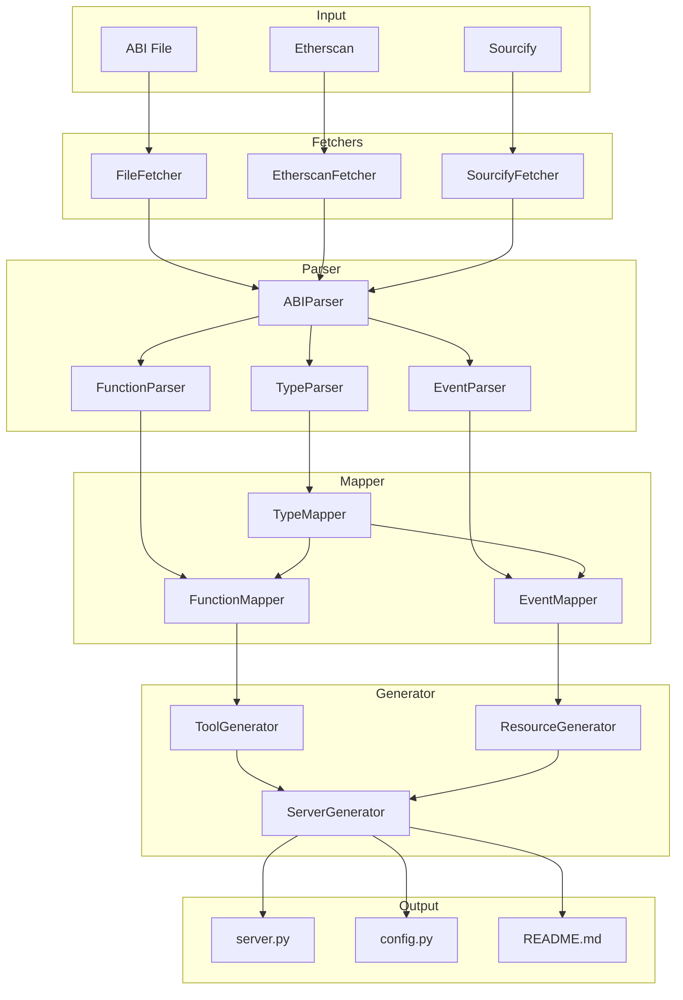
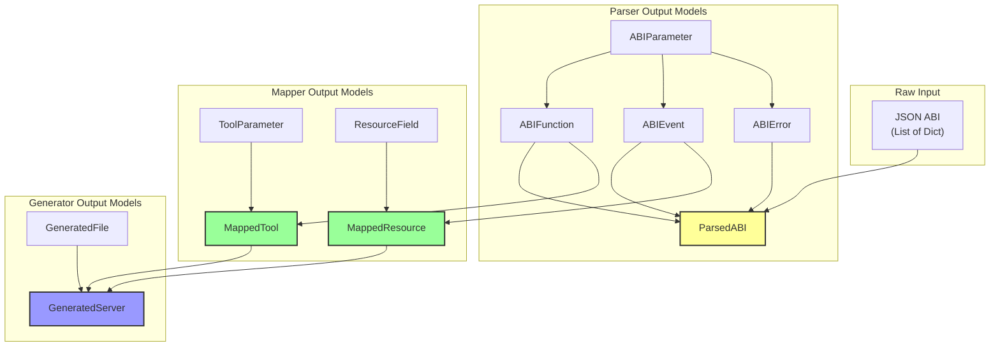
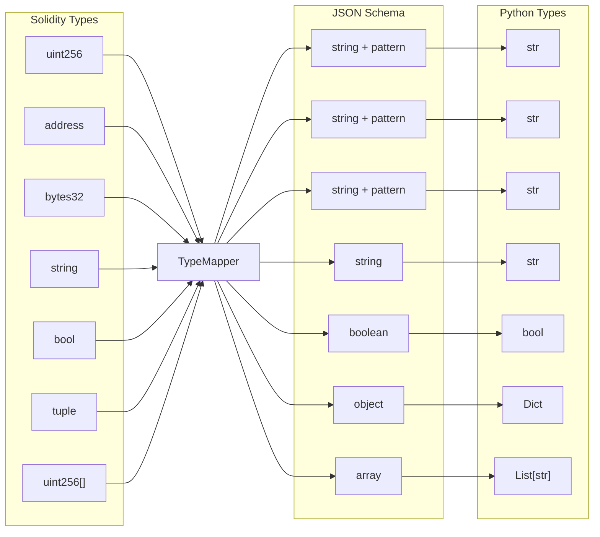
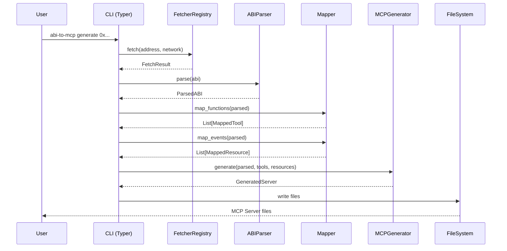

# Architecture

This page explains the architecture and design of abi-to-mcp.

## High-Level Overview



## Data Model Flow

This diagram shows how data models transform as they move through the pipeline:



## Type Mapping Pipeline

Solidity types are converted to JSON Schema and Python types:



## CLI Command Architecture



## Module Responsibilities

### Core (`core/`)

Central definitions used across the project:

| File | Purpose |
|------|---------|
| `config.py` | Configuration loading and validation |
| `constants.py` | Network definitions, ERC signatures |
| `exceptions.py` | Custom exception classes |
| `models.py` | Data classes (ABIFunction, etc.) |

### Fetchers (`fetchers/`)

Retrieve ABIs from various sources:

| File | Purpose |
|------|---------|
| `base.py` | ABIFetcher abstract base class |
| `file.py` | Load from local JSON files |
| `etherscan.py` | Fetch from Etherscan API |
| `sourcify.py` | Fetch from Sourcify |
| `registry.py` | Auto-detect and route to fetcher |

**Design Pattern:** Strategy pattern - each fetcher implements `ABIFetcher` interface.

### Parser (`parser/`)

Parse raw ABI JSON into structured objects:

| File | Purpose |
|------|---------|
| `abi_parser.py` | Main parser orchestrator |
| `function_parser.py` | Parse function entries |
| `event_parser.py` | Parse event entries |
| `error_parser.py` | Parse error entries |
| `type_parser.py` | Parse Solidity type strings |

**Design Pattern:** Composite - ABIParser delegates to specialized parsers.

### Mapper (`mapper/`)

Convert parsed objects to MCP-compatible definitions:

| File | Purpose |
|------|---------|
| `type_mapper.py` | Solidity → JSON Schema |
| `function_mapper.py` | ABIFunction → MappedTool |
| `event_mapper.py` | ABIEvent → MappedResource |
| `schema_builder.py` | Build complete schemas |

**Design Pattern:** Builder - incrementally construct schemas.

### Generator (`generator/`)

Generate Python code for MCP servers:

| File | Purpose |
|------|---------|
| `mcp_generator.py` | Main generation orchestrator |
| `tool_generator.py` | Generate tool code |
| `resource_generator.py` | Generate resource code |
| `server_generator.py` | Generate complete server |
| `templates/` | Jinja2 templates |

**Design Pattern:** Template Method - templates define structure, generators fill content.

### Runtime (`runtime/`)

Utilities for running generated servers:

| File | Purpose |
|------|---------|
| `web3_client.py` | Web3 connection management |
| `transaction.py` | Transaction building |
| `simulator.py` | Transaction simulation |
| `signer.py` | Transaction signing |
| `gas.py` | Gas estimation |

### CLI (`cli/`)

Command-line interface:

| File | Purpose |
|------|---------|
| `main.py` | Typer app and main entry |
| `commands/generate.py` | Generate command |
| `commands/inspect.py` | Inspect command |
| `commands/validate.py` | Validate command |
| `commands/serve.py` | Serve command |
| `utils.py` | CLI utilities |

**Design Pattern:** Command - each command is a separate function.

## Data Flow

### 1. Fetching

```python
registry = create_default_registry()
result = await registry.fetch("0x...")  # FetchResult
```

The registry:
1. Identifies source type (file, address)
2. Selects appropriate fetcher
3. Handles retries and fallbacks
4. Returns `FetchResult` with ABI and metadata

### 2. Parsing

```python
parser = ABIParser()
parsed = parser.parse(result.abi)  # ParsedABI
```

The parser:
1. Iterates over ABI entries
2. Routes to specialized parser by type
3. Builds structured objects
4. Detects ERC standards
5. Returns `ParsedABI`

### 3. Mapping

```python
type_mapper = TypeMapper()
func_mapper = FunctionMapper(type_mapper)

tools = [func_mapper.map_function(f) for f in parsed.functions]
```

The mapper:
1. Converts each function to MappedTool
2. Generates JSON Schema for parameters
3. Creates descriptions
4. Handles name conversion (camelCase → snake_case)

### 4. Generation

```python
generator = MCPGenerator()
server = generator.generate(parsed, tools, resources, ...)
```

The generator:
1. Renders Jinja2 templates
2. Combines tools and resources
3. Generates config and docs
4. Returns `GeneratedServer` with all files

## Key Design Decisions

### 1. Strings for Large Numbers

All numeric types use JSON strings to preserve precision:

```python
# uint256 as string, not int
{"type": "string", "pattern": "^[0-9]+$"}
```

**Rationale:** JavaScript's Number.MAX_SAFE_INTEGER is 2^53, but uint256 can be 2^256.

### 2. Simulation by Default

Write operations simulate before executing:

```python
async def transfer(to, amount, simulate=True):
    if simulate:
        return await simulate_transaction(...)
```

**Rationale:** Blockchain transactions are irreversible. Simulation prevents accidents.

### 3. No Embedded Keys

Private keys are only read from environment:

```python
PRIVATE_KEY = os.environ.get("PRIVATE_KEY")
```

**Rationale:** Never store secrets in generated code.

### 4. Jinja2 Templates

Code generation uses templates, not string concatenation:

```jinja
@mcp.tool()
async def {{ tool.name }}({{ tool.signature }}):
    """{{ tool.description }}"""
    ...
```

**Rationale:** Templates are easier to read, maintain, and customize.

### 5. Async by Default

All I/O operations are async:

```python
async def fetch(self, source: str) -> FetchResult:
    ...
```

**Rationale:** MCP servers are async, and blockchain calls can be slow.

## Extension Points

### Custom Fetchers

```python
class MyFetcher(ABIFetcher):
    async def fetch(self, source, **kwargs):
        ...
    
    def can_handle(self, source):
        ...

registry.register(MyFetcher())
```

### Custom Type Mapping

```python
class MyTypeMapper(TypeMapper):
    def to_json_schema(self, parsed_type):
        if my_custom_condition:
            return my_custom_schema
        return super().to_json_schema(parsed_type)
```

### Custom Templates

```python
config = GeneratorConfig(
    template_dir=Path("./my-templates")
)
generator = MCPGenerator(config)
```

## Testing Strategy

| Layer | Test Type | Location |
|-------|-----------|----------|
| Parser | Unit | `tests/unit/test_parser/` |
| Mapper | Unit | `tests/unit/test_mapper/` |
| Fetchers | Unit (mocked) | `tests/unit/test_fetchers/` |
| Generator | Unit + Snapshot | `tests/unit/test_generator/` |
| CLI | Integration | `tests/integration/` |
| End-to-End | Integration | `tests/integration/` |

See [Testing](testing.md) for more details.
