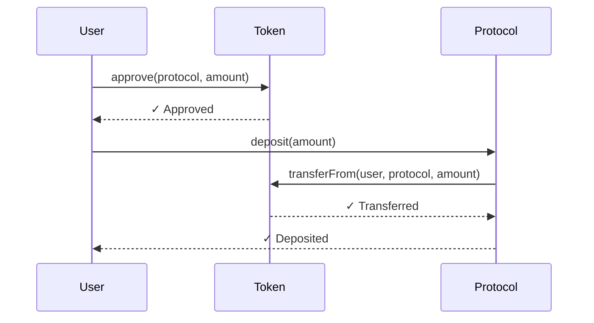

# DeFi Protocol Guide

This guide covers creating MCP servers for complex DeFi protocols like Uniswap, Aave, and Compound. These protocols have:

- Multiple contracts
- Complex parameters (structs, arrays)
- Payable functions
- Time-sensitive operations

## Prerequisites

- abi-to-mcp installed
- Good understanding of [Core Concepts](../concepts/index.md)
- RPC endpoint with archive access (recommended)

## Example: Uniswap V3 Router

Uniswap's SwapRouter is one of the most used DeFi contracts:

| Property | Value |
|----------|-------|
| Contract | SwapRouter |
| Address | `0xE592427A0AEce92De3Edee1F18E0157C05861564` |
| Network | Ethereum Mainnet |

### Generate the Server

```bash
abi-to-mcp generate 0xE592427A0AEce92De3Edee1F18E0157C05861564 \
    --network mainnet \
    --output ./uniswap-router \
    --name "Uniswap V3 Router"
```

### Key Functions

| Function | Purpose | Parameters |
|----------|---------|------------|
| `exactInputSingle` | Swap exact input for output | `ExactInputSingleParams` struct |
| `exactOutputSingle` | Swap for exact output | `ExactOutputSingleParams` struct |
| `exactInput` | Multi-hop exact input | Encoded path |
| `exactOutput` | Multi-hop exact output | Encoded path |

### Struct Parameters

Uniswap uses complex struct parameters:

```python
# ExactInputSingleParams
{
    "tokenIn": "0xC02aaA39b223FE8D0A0e5C4F27eAD9083C756Cc2",  # WETH
    "tokenOut": "0xA0b86991c6218b36c1d19D4a2e9Eb0cE3606eB48", # USDC
    "fee": "3000",        # 0.3% fee tier
    "recipient": "0x...",  # Your address
    "deadline": "1699999999",  # Unix timestamp
    "amountIn": "1000000000000000000",  # 1 WETH
    "amountOutMinimum": "1800000000",    # Min 1800 USDC
    "sqrtPriceLimitX96": "0"  # No price limit
}
```

### Fee Tiers

Uniswap V3 has multiple fee tiers:

| Fee | Value | Best For |
|-----|-------|----------|
| 0.01% | `100` | Stable pairs (USDC/USDT) |
| 0.05% | `500` | Stable pairs |
| 0.3% | `3000` | Most pairs |
| 1% | `10000` | Exotic pairs |

## Example: Aave V3 Pool

Aave's lending pool enables deposits, borrows, and repayments:

| Property | Value |
|----------|-------|
| Contract | Pool |
| Address | `0x87870Bca3F3fD6335C3F4ce8392D69350B4fA4E2` |
| Network | Ethereum Mainnet |

### Generate the Server

```bash
abi-to-mcp generate 0x87870Bca3F3fD6335C3F4ce8392D69350B4fA4E2 \
    --network mainnet \
    --output ./aave-pool \
    --name "Aave V3 Pool"
```

### Key Functions

| Function | Type | Purpose |
|----------|------|---------|
| `supply` | Write | Deposit assets |
| `withdraw` | Write | Withdraw assets |
| `borrow` | Write | Borrow assets |
| `repay` | Write | Repay debt |
| `getUserAccountData` | Read | Get user health factor |
| `getReserveData` | Read | Get asset info |

### Reading User Data

```python
# Get user's account summary
data = await get_user_account_data(user="0x...")

# Returns:
{
    "totalCollateralBase": "10000000000",    # In base currency (USD, 8 decimals)
    "totalDebtBase": "5000000000",
    "availableBorrowsBase": "2500000000",
    "currentLiquidationThreshold": "8250",   # 82.5%
    "ltv": "8000",                           # 80%
    "healthFactor": "1650000000000000000"    # 1.65
}
```

!!! warning "Health Factor"
    If `healthFactor` falls below `1000000000000000000` (1.0), the position can be liquidated!

## Working with Multiple Contracts

DeFi protocols often require multiple contracts:

### Uniswap Complete Setup

```bash
# Router for swaps
abi-to-mcp generate 0xE592427A0AEce92De3Edee1F18E0157C05861564 \
    -o ./uniswap/router -n mainnet

# Quoter for quotes (read-only)
abi-to-mcp generate 0xb27308f9F90D607463bb33eA1BeBb41C27CE5AB6 \
    -o ./uniswap/quoter -n mainnet --read-only

# Factory for pool lookups
abi-to-mcp generate 0x1F98431c8aD98523631AE4a59f267346ea31F984 \
    -o ./uniswap/factory -n mainnet --read-only
```

### Combined Server

You can combine multiple contracts into one server by editing the generated code:

```python
# server.py
from uniswap.router.server import router_tools
from uniswap.quoter.server import quoter_tools
from uniswap.factory.server import factory_tools

# Register all tools
for tool in router_tools + quoter_tools + factory_tools:
    mcp.register_tool(tool)
```

## Token Approvals

Most DeFi operations require token approvals first:



### Check Allowance

```python
# Check current allowance
allowance = await token_allowance(
    owner="0x...",
    spender="0x...protocol..."
)

if int(allowance) < amount_needed:
    # Need to approve first
    await token_approve(
        spender="0x...protocol...",
        amount="115792089237316195423570985008687907853269984665640564039457584007913129639935",  # Max uint256
        simulate=True
    )
```

!!! tip "Max Approval"
    Many users approve the maximum uint256 value to avoid repeated approvals. This is convenient but less secure.

## Handling Deadlines

Time-sensitive DeFi operations include deadlines:

```python
import time

# Set deadline 20 minutes from now
deadline = str(int(time.time()) + 20 * 60)

result = await exact_input_single(
    params={
        "tokenIn": "0x...",
        "tokenOut": "0x...",
        "fee": "3000",
        "recipient": "0x...",
        "deadline": deadline,  # Important!
        "amountIn": "1000000000000000000",
        "amountOutMinimum": "0",
        "sqrtPriceLimitX96": "0"
    },
    simulate=True
)
```

!!! warning "Expired Deadlines"
    If the deadline passes before the transaction is mined, it will revert. Set reasonable deadlines based on network congestion.

## Slippage Protection

Always set minimum output amounts:

```python
# Get quote first
quote = await quote_exact_input_single(
    tokenIn="0x...",
    tokenOut="0x...",
    fee="3000",
    amountIn="1000000000000000000",
    sqrtPriceLimitX96="0"
)

# Calculate minimum with 0.5% slippage
amount_out = int(quote)
slippage = 0.005
amount_out_minimum = str(int(amount_out * (1 - slippage)))

# Execute swap with protection
result = await exact_input_single(
    params={
        # ...
        "amountOutMinimum": amount_out_minimum
    }
)
```

## Flash Loans

Some protocols support flash loans (borrow + repay in one transaction). These require custom contract interactions beyond basic MCP tools.

!!! note "Advanced Feature"
    Flash loans typically require writing custom smart contracts to execute the borrowed funds logic.

## Gas Optimization

DeFi transactions can be gas-intensive:

| Operation | Typical Gas |
|-----------|-------------|
| Token approval | 45,000 |
| Simple swap | 150,000 |
| Multi-hop swap | 250,000+ |
| Aave supply | 200,000 |
| Aave borrow | 300,000 |

Tips:
- Batch operations when possible
- Time transactions for low gas periods
- Use gas estimation before executing

```python
# Always simulate first to get gas estimate
result = await exact_input_single(params={...}, simulate=True)
print(f"Estimated gas: {result['gas_estimate']}")
print(f"Estimated cost: {result['estimated_cost_eth']} ETH")
```

## Common Errors

### "INSUFFICIENT_OUTPUT_AMOUNT"

Slippage too high or pool price moved. Solutions:
- Increase `amountOutMinimum` tolerance
- Use smaller trade sizes
- Try different fee tiers

### "EXPIRED"

Transaction wasn't mined before deadline:
- Increase deadline
- Increase gas price
- Check network congestion

### "STF" (Safe Transfer Failed)

Token transfer failed. Check:
- Sufficient balance
- Sufficient allowance
- Token isn't paused

### "UNPREDICTABLE_GAS_LIMIT"

Can't estimate gas (transaction would fail):
- Simulation will help identify the issue
- Check all parameters are valid
- Verify contract state

## Next Steps

- [Custom Networks](custom-network.md) - DeFi on L2s
- [Safety Features](../concepts/safety.md) - Protect your funds
- [Claude Desktop](claude-desktop.md) - Use with Claude

!!! example "Quick Start Example"
    A ready-to-use DeFi router example is available in [`examples/defi_protocol/`](https://github.com/nirholas/UCAI/tree/main/examples/defi_protocol).
