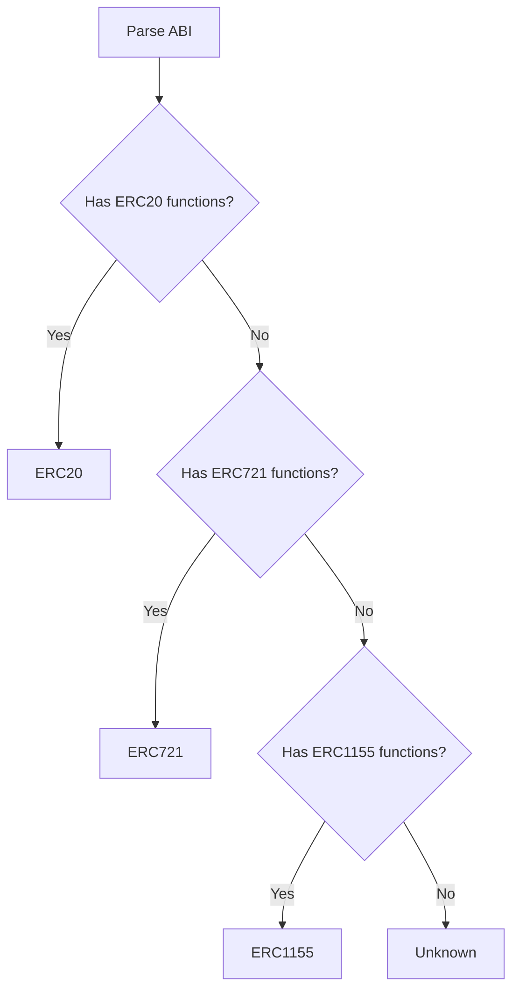

# ERC Standards

abi-to-mcp automatically detects common ERC token standards based on function signatures.

## Detection Logic

Standards are detected by checking for required function signatures:



## ERC20: Fungible Tokens

The most common token standard for fungible tokens like USDC, DAI, LINK.

### Required Functions

| Function | Signature | State |
|----------|-----------|-------|
| `name` | `name() → string` | view |
| `symbol` | `symbol() → string` | view |
| `decimals` | `decimals() → uint8` | view |
| `totalSupply` | `totalSupply() → uint256` | view |
| `balanceOf` | `balanceOf(address) → uint256` | view |
| `transfer` | `transfer(address,uint256) → bool` | nonpayable |
| `transferFrom` | `transferFrom(address,address,uint256) → bool` | nonpayable |
| `approve` | `approve(address,uint256) → bool` | nonpayable |
| `allowance` | `allowance(address,address) → uint256` | view |

### Required Events

| Event | Signature |
|-------|-----------|
| `Transfer` | `Transfer(address indexed, address indexed, uint256)` |
| `Approval` | `Approval(address indexed, address indexed, uint256)` |

### Common Extensions

| Extension | Functions |
|-----------|-----------|
| ERC20Permit | `permit`, `nonces`, `DOMAIN_SEPARATOR` |
| ERC20Burnable | `burn`, `burnFrom` |
| ERC20Mintable | `mint` |
| ERC20Pausable | `pause`, `unpause`, `paused` |

### Example Detection

```python
from abi_to_mcp.parser import ABIParser

parser = ABIParser()
parsed = parser.parse(usdc_abi)

assert parsed.detected_standard == "ERC20"
```

---

## ERC721: Non-Fungible Tokens

The standard for unique tokens like NFTs (BAYC, CryptoPunks, etc.).

### Required Functions

| Function | Signature | State |
|----------|-----------|-------|
| `balanceOf` | `balanceOf(address) → uint256` | view |
| `ownerOf` | `ownerOf(uint256) → address` | view |
| `safeTransferFrom` | `safeTransferFrom(address,address,uint256)` | nonpayable |
| `safeTransferFrom` | `safeTransferFrom(address,address,uint256,bytes)` | nonpayable |
| `transferFrom` | `transferFrom(address,address,uint256)` | nonpayable |
| `approve` | `approve(address,uint256)` | nonpayable |
| `setApprovalForAll` | `setApprovalForAll(address,bool)` | nonpayable |
| `getApproved` | `getApproved(uint256) → address` | view |
| `isApprovedForAll` | `isApprovedForAll(address,address) → bool` | view |

### Required Events

| Event | Signature |
|-------|-----------|
| `Transfer` | `Transfer(address indexed, address indexed, uint256 indexed)` |
| `Approval` | `Approval(address indexed, address indexed, uint256 indexed)` |
| `ApprovalForAll` | `ApprovalForAll(address indexed, address indexed, bool)` |

### Common Extensions

| Extension | Functions |
|-----------|-----------|
| ERC721Metadata | `name`, `symbol`, `tokenURI` |
| ERC721Enumerable | `totalSupply`, `tokenOfOwnerByIndex`, `tokenByIndex` |
| ERC721Burnable | `burn` |
| ERC721Royalty | `royaltyInfo` (ERC2981) |

### Detection Priority

ERC721 detection requires `ownerOf` (unique to NFTs) to distinguish from ERC20.

---

## ERC1155: Multi-Token

Supports both fungible and non-fungible tokens in a single contract.

### Required Functions

| Function | Signature | State |
|----------|-----------|-------|
| `balanceOf` | `balanceOf(address,uint256) → uint256` | view |
| `balanceOfBatch` | `balanceOfBatch(address[],uint256[]) → uint256[]` | view |
| `setApprovalForAll` | `setApprovalForAll(address,bool)` | nonpayable |
| `isApprovedForAll` | `isApprovedForAll(address,address) → bool` | view |
| `safeTransferFrom` | `safeTransferFrom(address,address,uint256,uint256,bytes)` | nonpayable |
| `safeBatchTransferFrom` | `safeBatchTransferFrom(address,address,uint256[],uint256[],bytes)` | nonpayable |

### Required Events

| Event | Signature |
|-------|-----------|
| `TransferSingle` | `TransferSingle(address indexed, address indexed, address indexed, uint256, uint256)` |
| `TransferBatch` | `TransferBatch(address indexed, address indexed, address indexed, uint256[], uint256[])` |
| `ApprovalForAll` | `ApprovalForAll(address indexed, address indexed, bool)` |
| `URI` | `URI(string, uint256 indexed)` |

### Common Extensions

| Extension | Functions |
|-----------|-----------|
| ERC1155MetadataURI | `uri` |
| ERC1155Supply | `totalSupply`, `exists` |
| ERC1155Burnable | `burn`, `burnBatch` |

### Detection Priority

ERC1155 is detected by `balanceOfBatch` (unique signature with two arrays).

---

## Other Standards

### ERC4626: Tokenized Vaults

Yield-bearing vaults (like Yearn or Aave).

| Function | Signature |
|----------|-----------|
| `asset` | `asset() → address` |
| `deposit` | `deposit(uint256,address) → uint256` |
| `withdraw` | `withdraw(uint256,address,address) → uint256` |
| `convertToShares` | `convertToShares(uint256) → uint256` |
| `convertToAssets` | `convertToAssets(uint256) → uint256` |

### ERC2612: Permit

Gasless approvals for ERC20 tokens.

| Function | Signature |
|----------|-----------|
| `permit` | `permit(address,address,uint256,uint256,uint8,bytes32,bytes32)` |
| `nonces` | `nonces(address) → uint256` |
| `DOMAIN_SEPARATOR` | `DOMAIN_SEPARATOR() → bytes32` |

### ERC2981: NFT Royalty

Royalty information for NFT marketplaces.

| Function | Signature |
|----------|-----------|
| `royaltyInfo` | `royaltyInfo(uint256,uint256) → (address,uint256)` |

---

## Detection in Practice

### Using in Code

```python
from abi_to_mcp.parser import ABIParser

parser = ABIParser()
parsed = parser.parse(abi)

if parsed.detected_standard == "ERC20":
    print("This is a fungible token")
elif parsed.detected_standard == "ERC721":
    print("This is an NFT collection")
elif parsed.detected_standard == "ERC1155":
    print("This is a multi-token contract")
else:
    print("Unknown or custom contract")
```

### CLI Output

```bash
$ abi-to-mcp inspect 0xA0b86991c6218b36c1d19D4a2e9Eb0cE3606eB48

📋 Contract Analysis
═══════════════════════════════════════════════════════════════

📊 Detected Standard: ERC20
   ✓ name
   ✓ symbol
   ✓ decimals
   ✓ totalSupply
   ✓ balanceOf
   ✓ transfer
   ✓ approve
   ✓ transferFrom
   ✓ allowance
```

---

## Standard Comparison

| Feature | ERC20 | ERC721 | ERC1155 |
|---------|-------|--------|---------|
| Fungible | ✓ | ✗ | ✓ |
| Non-Fungible | ✗ | ✓ | ✓ |
| Multiple IDs | ✗ | ✓ | ✓ |
| Batch Transfer | ✗ | ✗ | ✓ |
| Token URI | ✗ | ✓ | ✓ |
| Decimals | ✓ | ✗ | ✗ |

---

## Adding Custom Standards

Extend the parser to detect custom standards:

```python
from abi_to_mcp.parser import ABIParser

class CustomParser(ABIParser):
    def detect_standard(self, functions, events):
        # Check for custom standard
        func_names = {f.name for f in functions}
        
        if "myCustomFunction" in func_names:
            return "MyCustomStandard"
        
        # Fall back to default detection
        return super().detect_standard(functions, events)
```
