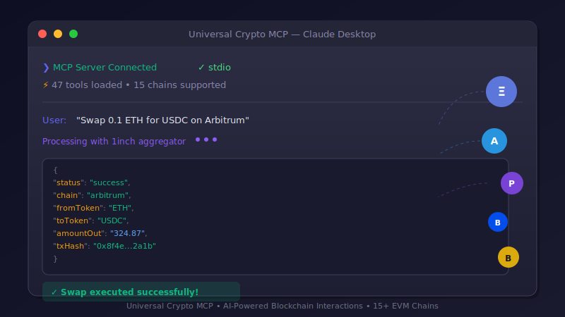

# 🤖💰 Universal Crypto MCP   

<p align="center">
<pre align="center">
██╗   ██╗███╗   ██╗██╗██╗   ██╗███████╗██████╗ ███████╗ █████╗ ██╗     
██║   ██║████╗  ██║██║██║   ██║██╔════╝██╔══██╗██╔════╝██╔══██╗██║     
██║   ██║██╔██╗ ██║██║██║   ██║█████╗  ██████╔╝███████╗███████║██║      
██║   ██║██║╚██╗██║██║╚██╗ ██╔╝██╔══╝  ██╔══██╗╚════██║██╔══██║██║     
╚██████╔╝██║ ╚████║██║ ╚████╔╝ ███████╗██║  ██║███████║██║  ██║███████╗
 ╚═════╝ ╚═╝  ╚═══╝╚═╝  ╚═══╝  ╚══════╝╚═╝  ╚═╝╚══════╝╚═╝  ╚═╝╚══════╝
           ██████╗██████╗ ██╗   ██╗██████╗ ████████╗ ██████╗            
          ██╔════╝██╔══██╗╚██╗ ██╔╝██╔══██╗╚══██╔══╝██╔═══██╗           
          ██║     ██████╔╝ ╚████╔╝ ██████╔╝   ██║   ██║   ██║           
          ██║     ██╔══██╗  ╚██╔╝  ██╔═══╝    ██║   ██║   ██║           
          ╚██████╗██║  ██║   ██║   ██║        ██║   ╚██████╔╝           
           ╚═════╝╚═╝  ╚═╝   ╚═╝   ╚═╝        ╚═╝    ╚═════╝            
                          ███╗   ███╗ ██████╗██████╗                     
                          ████╗ ████║██╔════╝██╔══██╗                    
                          ██╔████╔██║██║     ██████╔╝                    
                          ██║╚██╔╝██║██║     ██╔═══╝                     
                          ██║ ╚═╝ ██║╚██████╗██║                         
                          ╚═╝     ╚═╝ ╚═════╝╚═╝                         
</pre>
</p>

```bash
npx @nirholas/universal-crypto-mcp
```

<p align="center">
  
  
  
  
</p>

<p align="center">
  <a href="https://modelcontextprotocol.io"></a>
  <a href="https://www.typescriptlang.org/"></a>
  <a href="https://nodejs.org/"></a>
  <a href="LICENSE"></a>
</p>

<p align="center">
  <a href="https://github.com/nirholas/universal-crypto-mcp/stargazers"></a>
  <a href="https://github.com/nirholas/universal-crypto-mcp/issues"></a>
</p>

<p align="center">
  
</p>

## ✨ What's New: AI Service Marketplace

> **Monetize your AI services & discover the best APIs!** 💸

The **AI Service Marketplace** is a complete ecosystem for AI service discovery, monetization, and reputation management:

- 🏪 **Register your AI service** - Instant monetization with pay-per-use or subscriptions
- 🔍 **AI agents discover services** - Automatic discovery by category, price, and rating
- ⭐ **On-chain reputation** - Build trust with verified ratings and reviews
- 💳 **Flexible pricing** - Pay-per-use, subscriptions, free tiers
- 📊 **Analytics dashboard** - Track usage, revenue, and performance
- 🔒 **Secure payments** - Escrow, dispute resolution, automatic refunds

**[Learn more →](MARKETPLACE.md)** | **[View Tutorial →](docs/content/tutorials/marketplace-service.md)**

### x402 Payment Protocol

**AI agents can now pay for things on the internet!** 💸

```
User: "Get premium weather data for Tokyo"

Claude: 🔍 Checking x402 balance... $45.23 USDs
        💳 Paying $0.01 for premium API access...
        ✅ Payment confirmed! Here's your detailed forecast:
        
        🌤️ Tokyo Weather (7-day premium forecast)...
```

**AI agents can now:**
- 💸 **Pay for premium APIs** automatically
- 🏪 **Sell their own services** to other agents
- 🔄 **Trade with other AI agents** peer-to-peer
- ⛓️ **Work across EVM + Solana** chains

> ⭐ **If you find this useful, please star the repo!** It helps others discover this project.

---

A Universal Model Context Protocol server for all EVM-compatible networks + Solana.

Enable AI agents (Claude, ChatGPT, Cursor) to interact with any EVM blockchain through natural language.

## 🆚 Why Universal Crypto MCP?

| Feature | Universal Crypto MCP | Other MCP Servers |
|---------|---------------------|-------------------|
| **Tools** | 380+ tools | 10-50 tools |
| **Chains** | 20+ chains (EVM + multi-chain) | 1-3 chains |
| **DEX Support** | Multi-aggregator (1inch, 0x, ParaSwap) | Single DEX or none |
| **Security** | GoPlus, honeypot, rug pull detection | Basic or none |
| **DeFi** | Aave, Compound, Lido, Uniswap | Limited |
| **Market Data** | CoinGecko, DefiLlama, LunarCrush | Basic prices |
| **Bridges** | LayerZero, Stargate, Wormhole | None |
| **MEV Protection** | Flashbots integration | None |
| **Transport** | stdio, HTTP, SSE | Usually only stdio |
| **ChatGPT Support** | ✅ Native HTTP mode | ❌ Most don't |

---

## 📦 Package Structure

The most comprehensive crypto MCP monorepo with **10+ integrated packages** from the best MIT-licensed projects:

```
packages/
├── core/               # Shared types, utilities, configuration
├── trading/            # CEX exchange integrations
│   ├── binance/        # Binance spot & futures
│   ├── binance-us/     # Binance US
│   └── bybit/          # Bybit exchange (ethancod1ng) ⭐ NEW
├── market-data/        # Prices, news, analytics  
│   ├── prices/         # CoinGecko, DexPaprika, CoinMarketCap
│   ├── news/           # CryptoPanic, aggregated news
│   ├── analytics/      # Whale tracking, Fear/Greed, Dune
│   ├── predictions/    # AI price predictions
│   ├── crypto-indicators/  # Technical analysis (Kukapay) ⭐ NEW
│   ├── crypto-sentiment/   # Sentiment analysis (Kukapay) ⭐ NEW
│   ├── crypto-feargreed/   # Fear & Greed Index (Kukapay) ⭐ NEW
│   ├── cryptopanic/        # News aggregation (Kukapay)
│   └── coinmarketcap/      # CMC API (Shinzo Labs) ⭐ NEW
├── defi/               # On-chain DeFi tools (60+ networks!)
│   ├── protocols/      # EVM MCP Server (360⭐), Sperax, DEX
│   │   ├── algorand/   # Algorand tools (GoPlausible) ⭐ NEW
│   │   └── bsc-ops/    # BSC operations (TermiX) ⭐ NEW
│   ├── chain-tools/    # BNB Chain, Onchain MCP
│   └── agents/         # Autonomous DeFi agents
├── wallets/            # Wallet management
│   ├── evm/            # Ethereum & EVM wallets
│   └── solana/         # Solana wallets
├── payments/           # Payment infrastructure
│   └── x402/           # x402 protocol, USDC transfers
├── automation/         # Bots & automation
│   ├── social/         # XActions Twitter automation
│   ├── sweep/          # Dust sweeping
│   └── volume/         # Volume tools
└── generators/         # Meta-tools for building MCP servers
    ├── abi-to-mcp/     # Convert ABIs to MCP tools
    ├── repo-to-mcp/    # GitHub repos → MCP servers
    ├── doc-extractor/  # Extract docs for LLMs
    ├── registry/       # Lyra tool registry
    └── discovery/      # Tool discovery & search
```

📖 **[View Package Documentation →](docs/content/packages/)**

### Integrated Community MCP Servers

This repo consolidates the best MIT-licensed crypto MCP projects with proper attribution:

| Project | Author | Category | Description |
|---------|--------|----------|-------------|
| [evm-mcp-server](https://github.com/mcpdotdirect/evm-mcp-server) | mcpdotdirect | defi | 60+ networks, 22+ tools |
| [crypto-indicators-mcp](https://github.com/kukapay/crypto-indicators-mcp) ⭐ **NEW** | Kukapay | market-data | Technical indicators (RSI, MACD, Bollinger) |
| [crypto-sentiment-mcp](https://github.com/kukapay/crypto-sentiment-mcp) ⭐ **NEW** | Kukapay | market-data | Multi-source sentiment analysis |
| [crypto-feargreed-mcp](https://github.com/kukapay/crypto-feargreed-mcp) ⭐ **NEW** | Kukapay | market-data | Fear & Greed Index |
| [cryptopanic-mcp-server](https://github.com/kukapay/cryptopanic-mcp-server) | Kukapay | market-data | Crypto news aggregation |
| [coinmarketcap-mcp](https://github.com/shinzo-labs/coinmarketcap-mcp) ⭐ **NEW** | Shinzo Labs | market-data | Complete CMC API |
| [whale-tracker-mcp](https://github.com/kukapay/whale-tracker-mcp) | Kukapay | analytics | Large wallet tracking |
| [mcp-web3-stats](https://github.com/crazyrabbitLTC/mcp-web3-stats) | crazyrabbitLTC | analytics | Dune Analytics integration |
| [dexpaprika-mcp](https://github.com/coinpaprika/dexpaprika-mcp) | CoinPaprika | prices | DEX price data |
| [algorand-mcp](https://github.com/GoPlausible/algorand-mcp) ⭐ **NEW** | GoPlausible | blockchain | 40+ Algorand tools |
| [bybit-mcp-server](https://github.com/ethancod1ng/bybit-mcp-server) ⭐ **NEW** | ethancod1ng | exchange | Bybit API integration |
| [bsc-mcp](https://github.com/TermiX-official/bsc-mcp) ⭐ **NEW** | TermiX | defi | BSC operations & security |
| [onchain-mcp](https://github.com/bankless/onchain-mcp) | Bankless | defi | On-chain tools |
| [mcp-free-usdc-transfer](https://github.com/magnetai/mcp-free-usdc-transfer) | MagnetAI | payments | Free USDC transfers |

**All integrated projects maintain their original MIT licenses with full attribution.**  
See [CONTRIBUTORS.md](CONTRIBUTORS.md) for detailed attribution and our modifications.

---

## Supported Networks

### EVM Chains
- Ethereum, BNB Smart Chain (BSC), Polygon, Arbitrum, Base, Optimism
- Avalanche, Fantom, zkSync Era, Linea, Scroll, Blast, Mode, Mantle
- opBNB + All testnets

### Multi-Chain (NEW)
- **Cosmos/IBC** - ATOM, OSMO, JUNO, INJ, and more
- **Near Protocol** - NEAR native + contracts
- **Sui** - SUI with Move support
- **Aptos** - APT with Move support
- Bitcoin, Litecoin, Solana, TON, XRP, THORChain

## Features

- 🔄 **Swap/DEX** - Token swaps via 1inch, 0x, ParaSwap
- 🌉 **Bridge** - Cross-chain transfers via LayerZero, Stargate, Wormhole
- ⛽ **Gas** - Gas prices across chains, EIP-1559 suggestions
- 📦 **Multicall** - Batch read/write operations
- 📊 **Events/Logs** - Query historical events, decode logs
- 🔒 **Security** - Rug pull detection, honeypot check, GoPlus token/address security, dApp phishing detection
- 💰 **Staking** - Liquid staking (Lido), LP farming
- ✍️ **Signatures** - Sign messages, verify signatures, EIP-712
- 🏦 **Lending** - Aave/Compound positions, borrow rates
- 📈 **Price Feeds** - Historical prices, TWAP, oracle aggregation
- 📁 **Portfolio** - Track holdings across chains
- 🏛️ **Governance** - Snapshot votes, on-chain proposals
- 🚀 **Deployment** - Deploy contracts, CREATE2, upgradeable proxies, verification
- 🛡️ **MEV Protection** - Flashbots Protect, private transactions, bundle simulation
- 🆔 **ENS/Domains** - Register, transfer, renew, set records, subdomains
- 📊 **Market Data** - CoinGecko & CoinStats prices, OHLCV, trending, categories, exchanges
- 🌐 **DeFi Analytics** - DefiLlama TVL, yields, fees, bridges, stablecoins, protocol data
- 💬 **Social Sentiment** - LunarCrush social metrics, influencers, trending topics
- 📈 **DEX Analytics** - DexPaprika & GeckoTerminal pools, trades, OHLCV, trending tokens
- 🔮 **Predictions** - Polymarket prediction markets, crypto forecasts
- 📉 **Technical Indicators** - 50+ indicators (RSI, MACD, Bollinger Bands, etc.)
- 🔔 **Alerts** - Price alerts, whale movement alerts, gas alerts (NEW)
- 📡 **WebSockets** - Real-time price streams, trade feeds, mempool monitoring (NEW)
- 🐋 **Wallet Analytics** - Whale tracking, wallet scoring, behavior analysis (NEW)
- 🌐 **Multi-Chain** - Cosmos, Near, Sui, Aptos native support (NEW)
- 💰 **x402 Payments** - AI agents can pay for premium APIs automatically (NEW)

---

## 💰 x402 Payment Protocol (NEW!)

<p align="center">
  
  
</p>

> **Give Claude Money!** AI agents can now make and receive cryptocurrency payments.

### What is x402?

x402 implements HTTP 402 Payment Required, enabling AI agents to:
- 💸 **Pay for APIs** - Automatically pay for premium API access
- 🤖 **Autonomous Payments** - No human approval needed
- 🏦 **Hold funds** - Agents have their own crypto wallets
- 📈 **Earn yield** - Payments use USDs stablecoin (~5% APY auto-yield)

### Quick Setup

```bash
# Add to your environment
export X402_PRIVATE_KEY=0x...  # Your EVM private key
export X402_CHAIN=arbitrum      # Default chain (or base, ethereum, polygon)
```

### x402 Tools (14 Total)

| Tool | Description |
|------|-------------|
| `x402_pay_request` | Make HTTP request with automatic 402 payment |
| `x402_balance` | Check wallet balance (USDC/USDs + native) |
| `x402_send` | Send direct payment to an address |
| `x402_batch_send` | Send multiple payments in one transaction |
| `x402_gasless_send` | Send payment without paying gas |
| `x402_estimate` | Check cost before paying |
| `x402_address` | Get your wallet address |
| `x402_networks` | List supported networks |
| `x402_yield` | Check USDs auto-yield earnings |
| `x402_apy` | Get current APY rate |
| `x402_yield_estimate` | Project future yield |
| `x402_approve` | Approve token spending |
| `x402_tx_status` | Check transaction status |
| `x402_config` | View current configuration |

### Supported Networks

| Network | CAIP-2 | Status |
|---------|--------|--------|
| Base | `eip155:8453` | ✅ Recommended |
| Arbitrum | `eip155:42161` | ✅ Supported |
| Ethereum | `eip155:1` | ✅ Supported |
| Polygon | `eip155:137` | ✅ Supported |
| Solana | `solana:mainnet` | ✅ Supported |

### Example

```
User: "Get premium weather data for Tokyo"
Agent: [calls x402_pay_request to weather API]
       [automatically pays $0.01 in USDs]
       "Here's the detailed forecast..."
```

### x402 Architecture

```
┌─────────┐      ┌───────────┐      ┌───────────┐
│ Claude  │─────▶│ MCP Server│─────▶│ Paid API  │
│  (AI)   │      │  (x402)   │      │   (402)   │
└─────────┘      └───────────┘      └───────────┘
     │                │                   │
     │  "Get data"    │  HTTP + Payment   │
     │                │                   │
     └────────────────┴───────────────────┘
```

📖 **Full Documentation:**
- [x402 README](x402/README.md) - Overview and quick start
- [Quickstart Guide](x402/docs/QUICKSTART.md) - 5-minute setup
- [MCP Tools Reference](x402/docs/MCP_TOOLS.md) - All 14 tools explained
- [Architecture](x402/docs/ARCHITECTURE.md) - Technical deep dive
- [Examples](x402/docs/EXAMPLES.md) - Real-world use cases
- [Security Guide](x402/docs/SECURITY.md) - Best practices

---

## Quick Start

### Claude Desktop

Add to your `claude_desktop_config.json`:

```json
{
  "mcpServers": {
    "universal-crypto-mcp": {
      "command": "npx",
      "args": ["-y", "@nirholas/universal-crypto-mcp@latest"],
      "env": {
        "PRIVATE_KEY": "your_private_key_here (optional)"
      }
    }
  }
}
```

### Cursor

Add to your MCP settings:

```json
{
  "mcpServers": {
    "universal-crypto-mcp": {
      "command": "npx",
      "args": ["-y", "@nirholas/universal-crypto-mcp@latest"],
      "env": {
        "PRIVATE_KEY": "your_private_key_here (optional)"
      }
    }
  }
}
```

### ChatGPT Developer Mode

1. Enable [Developer Mode](https://chatgpt.com/#settings/Connectors/Advanced) in ChatGPT settings
2. Start the HTTP server:
   ```bash
   npx @nirholas/universal-crypto-mcp@latest --http
   ```
3. In ChatGPT Settings → Apps, click **Create app**
4. Enter your server URL: `http://localhost:3001/mcp`
5. Select the app in conversations via **Developer mode** menu

For detailed setup instructions, see [ChatGPT Setup Guide](https://mcp.giving/mcp-server/chatgpt-setup/).

## Server Modes

| Mode | Command | Use Case |
|------|---------|----------|
| stdio | `npx @nirholas/universal-crypto-mcp` | Claude Desktop, Cursor |
| HTTP | `npx @nirholas/universal-crypto-mcp --http` | ChatGPT Developer Mode |
| SSE | `npx @nirholas/universal-crypto-mcp --sse` | Legacy HTTP clients |

---
 <details>
<summary> <h1> 💬 Example Prompts (Copy & Paste!) <h1> </summary> 
Real prompts you can use with Claude, ChatGPT, or Cursor. Just copy and paste!

### 🔄 Token Swaps

```
Swap 0.1 ETH for USDC on Arbitrum
```
```
Get me a quote to swap 100 USDC to WBTC on Base
```
```
What's the best rate to swap 500 DAI to ETH across all DEXs on Ethereum?
```

### 📊 Market Data & Prices

```
What's the current price of Bitcoin and Ethereum in USD?
```
```
Show me the top 10 trending coins on CoinGecko right now
```
```
Get the 7-day OHLCV data for Solana
```
```
What's the market cap and 24h volume of BNB?
```
```
Show me the price of token 0xdAC17F958D2ee523a2206206994597C13D831ec7 on Ethereum
```

### 🌐 DeFi Analytics (DefiLlama)

```
What's the total TVL of Aave across all chains?
```
```
Show me the top 10 protocols by TVL
```
```
What are the best yield opportunities for stablecoins right now?
```
```
How much volume did bridges process in the last 24 hours?
```
```
Show me the TVL history of Uniswap over the last 30 days
```

### 📈 DEX Analytics

```
Show me the top trending pools on Uniswap V3
```
```
Get the most traded tokens on Base in the last 24 hours
```
```
Find all liquidity pools for PEPE on Ethereum
```
```
What's the price and liquidity of the ETH/USDC pool on Aerodrome?
```

### 🔒 Security Checks

```
Is this token safe? 0x95aD61b0a150d79219dCF64E1E6Cc01f0B64C4cE (SHIB)
```
```
Check if this token is a honeypot: 0x... on BSC
```
```
Scan my wallet for risky approvals: 0xYourAddress
```
```
Is this dApp URL safe to connect to? https://suspicious-site.xyz
```

### 💰 Staking & Lending

```
What's the current staking APY for ETH on Lido?
```
```
Show me Aave lending rates for USDC on Arbitrum
```
```
What's my health factor on Aave if I borrow 1000 USDC against 2 ETH?
```

### 🌉 Cross-Chain Bridges

```
Bridge 100 USDC from Ethereum to Arbitrum
```
```
What's the cheapest way to bridge ETH from mainnet to Base?
```
```
Get a bridge quote for 0.5 ETH from Polygon to Optimism
```

### ⛽ Gas & Network

```
What's the current gas price on Ethereum?
```
```
Get EIP-1559 gas fees for all supported chains
```
```
Is it cheap to transact on Arbitrum right now?
```

### 🏛️ Governance

```
Show me active proposals on Uniswap
```
```
What's my voting power on Compound?
```
```
Get the results of the latest Aave governance vote
```

### 💬 Social Sentiment (LunarCrush)

```
What's the social sentiment for Bitcoin right now?
```
```
Show me the top crypto influencers on social media
```
```
What tokens are trending on Twitter/X today?
```
```
Get the Galaxy Score for Ethereum
```

### 🆔 ENS Domains

```
Resolve vitalik.eth to an address
```
```
Who owns the ENS domain "ethereum.eth"?
```
```
Register the domain mycoolname.eth for 1 year
```

### 📰 Crypto News

```
Get the latest crypto news
```
```
Search news about Bitcoin ETF
```
```
What's the breaking news in DeFi?
```

### 📁 Portfolio & Wallet

```
Show my token balances on Ethereum: 0xYourAddress
```
```
Get all NFTs owned by vitalik.eth
```
```
What approvals have I granted from my wallet?
```
```
Track my portfolio across all EVM chains
```

### 🚀 Advanced Operations

```
Deploy a new ERC-20 token called "MyToken" (MTK) with 1 million supply on Base
```
```
Submit this transaction privately via Flashbots to avoid MEV
```
```
Encode a call to the transfer function for 100 USDC
```
```
Simulate this transaction before executing: 0x...
```

### 📉 Technical Indicators

```
Calculate RSI for Bitcoin over the last 14 days
```
```
Get MACD signal for ETH/USDT on the 4-hour timeframe
```
```
Show Bollinger Bands for SOL with 20-period SMA
```
```
What's the current trend signal for BTC using multiple indicators?
```
```
Run a momentum strategy analysis on DOGE
```

### 🔮 Prediction Markets

```
What are the top crypto prediction markets on Polymarket?
```
```
Search for Bitcoin price predictions
```
```
What's the current odds for ETH reaching $5000?
```

### 📊 Events & Logs

```
Get all Transfer events for USDC in the last 100 blocks on Ethereum
```
```
Show me Approval events for my wallet address
```
```
Decode this transaction log: 0x...
```

### ✍️ Signatures & Messages

```
Sign this message with my wallet: "Hello World"
```
```
Verify this signature is from vitalik.eth
```
```
Create an EIP-712 typed data signature for a permit
```

### 📦 Batch Operations (Multicall)

```
Get token balances for 10 different tokens in one call
```
```
Read multiple contract values at once from Aave
```
```
Batch check allowances for all my approved tokens
```
</details> 

---

## 🧪 Testing

We use [Vitest](https://vitest.dev/) as our testing framework with comprehensive test coverage.

### Running Tests

```bash
# Run all unit tests
npm test

# Run tests in watch mode (re-runs on file changes)
npm run test:watch

# Run tests with coverage report
npm run test:coverage

# Run E2E tests (requires network access)
npm run test:e2e

# Run E2E tests in watch mode
npm run test:e2e:watch

# Open interactive test UI
npm run test:ui
```

### MCP Inspector

Test your MCP tools interactively using the official [MCP Inspector](https://github.com/modelcontextprotocol/inspector):

```bash
npm run test:inspector
```

This opens a browser-based UI where you can:
- Browse all available tools and prompts
- Test tool execution with custom parameters
- View tool responses and debug issues
- Validate your MCP server implementation

### Test Structure

```
tests/
├── setup.ts              # Global test setup
├── e2e/                  # End-to-end tests
│   ├── evm-tools.e2e.test.ts
│   └── market-data.e2e.test.ts
├── integration/          # Integration tests
│   ├── evm-tools.test.ts
│   └── multichain.test.ts
└── mocks/                # Test mocks and fixtures

src/
├── evm/
│   ├── chains.test.ts    # Unit tests alongside source
│   └── modules/
│       └── */tools.test.ts
└── utils/
    ├── errors.test.ts
    ├── helper.test.ts
    └── validation.test.ts
```

---

## Local Development

```bash
# Clone
git clone https://github.com/nirholas/universal-crypto-mcp
cd universal-crypto-mcp

# Install
npm install

# Run dev server (stdio - Claude)
npm run dev

# Run dev server (HTTP - ChatGPT)
npm run dev:http

# Run dev server (SSE - legacy)
npm run dev:sse
```

---

## 🧪 Testing

<p align="center">
  <a href="https://codecov.io/gh/nirholas/universal-crypto-mcp"></a>
  <a href="https://github.com/nirholas/universal-crypto-mcp/actions/workflows/ci.yml"></a>
</p>

### Running Tests

```bash
# Run all tests
npm test

# Run unit tests only
npm run test:unit

# Run integration tests
npm run test:integration

# Run E2E tests (requires network access)
npm run test:e2e

# Run tests with coverage report
npm run test:coverage

# Run tests in watch mode (development)
npm run test:watch
```

### Test Structure

| Type | Location | Description |
|------|----------|-------------|
| **Unit** | `src/**/*.test.ts` | Test individual functions/modules |
| **Integration** | `tests/integration/` | Test multiple components together |
| **E2E** | `tests/e2e/` | Test full MCP server flow |

### E2E Tests

End-to-end tests verify the complete tool execution flow:

- **EVM Tools** - Block, balance, token operations across chains
- **DeFi Tools** - Protocol TVL, yields, stablecoins via DefiLlama
- **Market Data** - CoinGecko, Fear & Greed index
- **Multichain** - Same operations across different networks
- **Error Recovery** - Error handling, invalid inputs, edge cases

### Custom Test Utilities

The project includes custom Vitest matchers for MCP responses:

```typescript
// In your test file
import "../utils/assertions"

expect(result).toBeSuccessfulToolResponse()
expect(result).toHaveJsonProperty("balance")
expect(result).toContainValidAddress()
expect(result).toContainToolError(/invalid/i)
```

### Test Fixtures

Reusable test data in `tests/utils/fixtures.ts`:

```typescript
import {
  ETH_MAINNET_ADDRESSES,
  MOCK_TOKEN_DATA,
  generateRandomAddress
} from "../utils/fixtures"
```

For detailed testing documentation, see [tests/README.md](tests/README.md).

---

## ⚙️ Environment Variables

Configure optional API keys for enhanced features. Create a `.env` file:

```bash
# Required for write operations (swaps, transfers, etc.)
PRIVATE_KEY=your_private_key_here

# Market Data (optional - has free tier)
COINGECKO_API_KEY=your_key        # https://coingecko.com/api
COINSTATS_API_KEY=your_key        # https://coinstats.app

# Social Sentiment (optional)
LUNARCRUSH_API_KEY=your_key       # https://lunarcrush.com/developers

# News (optional)
CRYPTOPANIC_API_KEY=your_key      # https://cryptopanic.com/developers

# Cross-chain Swaps (optional)
RUBIC_API_KEY=your_key            # https://rubic.exchange

# Custom RPC endpoints (optional - uses public RPCs by default)
ETHEREUM_RPC_URL=https://mainnet.infura.io/v3/YOUR_KEY
ARBITRUM_RPC_URL=https://arb1.arbitrum.io/rpc
BASE_RPC_URL=https://mainnet.base.org
```

### What Works Without API Keys

| Feature | Without API Key | With API Key |
|---------|-----------------|--------------|
| Token prices | ✅ CoinGecko free tier | ✅ Higher rate limits |
| DeFi analytics | ✅ DefiLlama (free) | - |
| Security checks | ✅ GoPlus (free) | - |
| DEX analytics | ✅ GeckoTerminal (free) | - |
| Social sentiment | ❌ | ✅ LunarCrush |
| Crypto news | ❌ | ✅ CryptoPanic |
| Cross-chain swaps | ✅ Basic | ✅ Best routes |

---

## Documentation

https://mcp.giving

---

## � Documentation & Examples

### 📖 Documentation

Comprehensive guides and API references:

- **[Getting Started](docs/content/getting-started/)**
  - [Installation Guide](docs/content/getting-started/installation.md)
  - [Configuration](docs/content/getting-started/configuration.md)
  - [Your First MCP Tool](docs/content/getting-started/first-tool.md)
  - [Deployment Guide](docs/content/getting-started/deployment.md)

- **[Package Documentation](docs/content/packages/)**
  - [Core Package](docs/content/packages/core.md)
  - [Trading](docs/content/packages/trading.md)
  - [Market Data](docs/content/packages/market-data.md)
  - [Wallets](docs/content/packages/wallets.md)
  - [DeFi](docs/content/packages/defi.md)
  - [Payments (x402)](docs/content/packages/payments.md)

- **[x402 Deploy Documentation](docs/content/x402-deploy/)**
  - [Overview](docs/content/x402-deploy/overview.md)
  - [Quick Start](docs/content/x402-deploy/quick-start.md)
  - [Configuration](docs/content/x402-deploy/configuration.md)
  - [Providers](docs/content/x402-deploy/providers.md)
  - [Discovery](docs/content/x402-deploy/discovery.md)

- **[Contributing](docs/content/contributing/)**
  - [Development Guide](docs/content/contributing/development.md)
  - [Testing](docs/content/contributing/testing.md)
  - [Releases](docs/content/contributing/releases.md)

### 💻 Examples

Working code examples you can run and modify:

- **[Basic MCP Server](examples/basic-mcp-server/)** - Minimal MCP server with market data tools
- **[Paid API Example](examples/paid-api/)** - Add x402 payments to Express API
- **[Trading Bot](examples/trading-bot/)** - Automated trading bot with RSI + MA strategy
- **[Full Deployment](examples/full-deployment/)** - Production-ready server with all features

Each example includes:
- Complete source code
- README with setup instructions
- Package configuration
- Environment setup guide

---

## �🗺️ Roadmap

A comprehensive roadmap of all crypto/blockchain/DeFi/Web3 features to be implemented.

### Legend
- ✅ Implemented
- 🚧 In Progress  
- 📋 Planned

<details>
<summary><b>🔗 Core Blockchain Operations</b> (click to expand)</summary>

### 🔗 Core Blockchain Operations

#### Network & Chain
| Feature | Status |
|---------|--------|
| Get chain ID, block number, gas price | ✅ |
| Get network status/health | ✅ |
| Switch networks/chains | ✅ |
| Get supported networks list | ✅ |
| Get RPC endpoints | ✅ |
| Estimate block time | ✅ |
| Get chain metadata (name, symbol, explorers) | ✅ |
| Get finality status | ✅ |
| Get mempool/pending transactions | ✅ |
| Get network peers/nodes | ✅ |
| Get gas oracle | ✅ |

#### Blocks
| Feature | Status |
|---------|--------|
| Get block by number/hash | ✅ |
| Get latest block | ✅ |
| Get block transactions | ✅ |
| Get block receipts | ✅ |
| Get uncle blocks | ✅ |
| Subscribe to new blocks | 📋 |
| Get block rewards | ✅ |
| Get block gas used/limit | ✅ |
| Get block range | ✅ |
| Get blocks by miner | ✅ |

#### Transactions
| Feature | Status |
|---------|--------|
| Send transaction | ✅ |
| Get transaction by hash | ✅ |
| Get transaction receipt | ✅ |
| Get transaction status | ✅ |
| Estimate gas | ✅ |
| Speed up transaction (replace with higher gas) | ✅ |
| Cancel transaction | ✅ |
| Decode transaction input | ✅ |
| Simulate transaction | ✅ |
| Get transaction trace | 📋 |
| Get internal transactions | 📋 |
| Batch transactions | ✅ |
| Get pending transactions | ✅ |
| Get transaction history by address | ✅ |

#### Accounts/Wallets
| Feature | Status |
|---------|--------|
| Get balance (native/token) | ✅ |
| Get nonce | ✅ |
| Get transaction count | ✅ |
| Create wallet | ✅ |
| Import wallet (private key/mnemonic) | ✅ |
| Export private key | 📋 |
| Sign message | ✅ |
| Verify signature | ✅ |
| Get address from private key | ✅ |
| Generate mnemonic | ✅ |
| Derive addresses (HD wallet) | ✅ |
| Multi-sig wallet operations | 📋 |
| Get wallet permissions | 📋 |
| Revoke approvals | ✅ |
| Account abstraction (ERC-4337) | 📋 |
| Social recovery | 📋 |
| Hardware wallet integration | 📋 |
| Get wallet portfolio | ✅ |
| Get token approvals | ✅ |

</details>

<details>
<summary><b>💰 Token Operations</b> (click to expand)</summary>

### 💰 Token Operations

#### Native Tokens
| Feature | Status |
|---------|--------|
| Get native balance | ✅ |
| Transfer native tokens | ✅ |
| Wrap/unwrap native tokens (WETH, WBNB) | ✅ |

#### ERC-20 (Fungible Tokens)
| Feature | Status |
|---------|--------|
| Get token info (name, symbol, decimals, total supply) | ✅ |
| Get token balance | ✅ |
| Transfer tokens | ✅ |
| Approve spending | ✅ |
| Get allowance | ✅ |
| Transfer from (delegated) | ✅ |
| Burn tokens | ✅ |
| Mint tokens | ✅ |
| Get token holders | ✅ |
| Get token transfers | ✅ |
| Permit (gasless approvals - EIP-2612) | ✅ |
| Batch transfers | ✅ |
| Token snapshots | 📋 |
| Get token supply info | ✅ |
| Check/revoke token approval | ✅ |

#### ERC-721 (NFTs)
| Feature | Status |
|---------|--------|
| Get NFT metadata | ✅ |
| Get NFT owner | ✅ |
| Transfer NFT | ✅ |
| Approve NFT | ✅ |
| Set approval for all | ✅ |
| Get NFTs by owner | ✅ |
| Get NFT collection info | ✅ |
| Mint NFT | 📋 |
| Burn NFT | 📋 |
| Get NFT transfer history | 📋 |
| Get NFT traits/attributes | ✅ |
| Get NFT rarity | 📋 |
| Verify NFT authenticity | 📋 |
| Batch transfer NFTs | ✅ |
| Check NFT approval | ✅ |
| Revoke NFT approval | ✅ |
| Approve for marketplace | ✅ |
| Fetch NFT metadata from URI | ✅ |

#### ERC-1155 (Multi-Token)
| Feature | Status |
|---------|--------|
| Get token balance (fungible + NFT) | ✅ |
| Batch transfers | 📋 |
| Batch balance queries | 📋 |
| Safe transfer | ✅ |
| Get URI | ✅ |

#### Other Token Standards
| Feature | Status |
|---------|--------|
| ERC-777 (advanced fungible) | 📋 |
| ERC-3525 (semi-fungible) | 📋 |
| ERC-4626 (tokenized vaults) | 📋 |
| ERC-6551 (token-bound accounts) | 📋 |
| ERC-404 (hybrid tokens) | 📋 |
| Soulbound tokens (SBTs) | 📋 |

</details>

<details>
<summary><b>🏦 DeFi - DEX, Lending, Staking, Derivatives</b> (click to expand)</summary>

### 🏦 DeFi - Decentralized Exchanges (DEX)

#### Swaps
| Feature | Status |
|---------|--------|
| Get quote/price | ✅ |
| Swap exact tokens for tokens | ✅ |
| Swap tokens for exact tokens | ✅ |
| Multi-hop swaps | ✅ |
| Split route swaps | 📋 |
| Cross-DEX aggregation | ✅ |
| Limit orders | 📋 |
| TWAP orders (time-weighted) | 📋 |
| Stop-loss orders | 📋 |
| Get slippage estimate | ✅ |
| Get price impact | ✅ |
| MEV protection (private transactions) | 📋 |

#### DEX Analytics
| Feature | Status |
|---------|--------|
| Get trending pools | ✅ |
| Get new pools | ✅ |
| Get top pools by volume | ✅ |
| Get pool OHLCV data | ✅ |
| Get pool trades | ✅ |
| Get token pools | ✅ |
| Get DEX list | ✅ |
| Search pools cross-chain | ✅ |
| Get token price by contract | ✅ |
| Get pool transactions | ✅ |
| Multi-token price lookup | ✅ |

#### Liquidity Provision
| Feature | Status |
|---------|--------|
| Add liquidity | ✅ |
| Remove liquidity | ✅ |
| Get LP token balance | ✅ |
| Get pool reserves | ✅ |
| Get pool APY/APR | 📋 |
| Get impermanent loss estimate | 📋 |
| Concentrated liquidity (Uniswap V3) | 📋 |
| Set price range | 📋 |
| Collect fees | 📋 |
| Rebalance position | 📋 |
| Add liquidity with native token | ✅ |
| Calculate arbitrage opportunities | ✅ |

#### AMM Types Support
| Feature | Status |
|---------|--------|
| Constant product (x*y=k) | ✅ |
| Stable swap (Curve) | 📋 |
| Concentrated liquidity | 📋 |
| Order book hybrid | 📋 |
| Virtual AMM (perpetuals) | 📋 |

---

### 🏦 DeFi - Lending & Borrowing

#### Lending
| Feature | Status |
|---------|--------|
| Supply/deposit assets | ✅ |
| Withdraw assets | ✅ |
| Get supply APY | ✅ |
| Get supplied balance | ✅ |
| Get utilization rate | 📋 |
| Enable/disable as collateral | 📋 |

#### Borrowing
| Feature | Status |
|---------|--------|
| Borrow assets | ✅ |
| Repay debt | ✅ |
| Get borrow APY | ✅ |
| Get borrowed balance | ✅ |
| Get health factor | ✅ |
| Get liquidation threshold | ✅ |
| Get max borrowable amount | 📋 |
| Flash loans | ✅ |
| Get borrow limit | 📋 |
| Get flash loan info | ✅ |

#### Liquidations
| Feature | Status |
|---------|--------|
| Liquidate unhealthy positions | 📋 |
| Get liquidatable positions | ✅ |
| Get liquidation bonus | 📋 |
| Partial liquidations | 📋 |

#### Isolated Markets
| Feature | Status |
|---------|--------|
| Supply to isolated pool | 📋 |
| Borrow from isolated pool | 📋 |
| Get isolation mode debt ceiling | 📋 |

---

### 🥩 DeFi - Staking

#### Native Staking
| Feature | Status |
|---------|--------|
| Stake native tokens | ✅ |
| Unstake/withdraw | ✅ |
| Claim rewards | ✅ |
| Get staking APY | ✅ |
| Get validator list | 📋 |
| Delegate to validator | 📋 |
| Redelegate | 📋 |
| Get unbonding period | 📋 |

#### Liquid Staking
| Feature | Status |
|---------|--------|
| Stake for liquid staking tokens (stETH, rETH) | ✅ |
| Unwrap liquid staking tokens | ✅ |
| Get exchange rate | ✅ |
| Get staking rewards rate | ✅ |

#### LP Staking/Farming
| Feature | Status |
|---------|--------|
| Stake LP tokens | ✅ |
| Unstake LP tokens | ✅ |
| Claim farming rewards | ✅ |
| Get farming APY | ✅ |
| Compound rewards | 📋 |
| Get pending rewards | ✅ |
| Boost rewards (veTokens) | 📋 |

#### Restaking
| Feature | Status |
|---------|--------|
| Restake assets (EigenLayer) | 📋 |
| Get restaking points | 📋 |
| Choose operators | 📋 |
| Withdraw from restaking | 📋 |

---

### 📊 DeFi - Derivatives

#### Perpetual Futures
| Feature | Status |
|---------|--------|
| Open long/short position | 📋 |
| Close position | 📋 |
| Add/remove margin | 📋 |
| Set leverage | 📋 |
| Get funding rate | 📋 |
| Get open interest | 📋 |
| Get liquidation price | 📋 |
| Set stop-loss/take-profit | 📋 |
| Get PnL | 📋 |
| Partial close | 📋 |

#### Options
| Feature | Status |
|---------|--------|
| Buy call/put options | 📋 |
| Sell/write options | 📋 |
| Exercise options | 📋 |
| Get option greeks | 📋 |
| Get implied volatility | 📋 |
| Get option chain | 📋 |
| Spread strategies | 📋 |

#### Synthetics
| Feature | Status |
|---------|--------|
| Mint synthetic assets | 📋 |
| Burn synthetic assets | 📋 |
| Get collateral ratio | 📋 |
| Get synthetic price feed | 📋 |
| Liquidate synthetic positions | 📋 |

</details>

<details>
<summary><b>🌉 Cross-Chain, Governance, Security, NFTs</b> (click to expand)</summary>

### 🌉 Cross-Chain & Bridges

#### Bridging
| Feature | Status |
|---------|--------|
| Bridge tokens cross-chain | ✅ |
| Get bridge quote | ✅ |
| Get bridge status | ✅ |
| Get supported chains | ✅ |
| Get supported tokens | ✅ |
| Claim bridged tokens | 📋 |
| Get bridge fees | ✅ |
| Get estimated time | ✅ |

#### Cross-Chain Messaging
| Feature | Status |
|---------|--------|
| Send cross-chain message | 📋 |
| Receive cross-chain message | 📋 |
| LayerZero operations | 📋 |
| Axelar operations | 📋 |
| Wormhole operations | 📋 |
| CCIP (Chainlink) | 📋 |
| Hyperlane operations | 📋 |

#### Atomic Swaps
| Feature | Status |
|---------|--------|
| Initiate atomic swap | 📋 |
| Complete atomic swap | 📋 |
| Refund atomic swap | 📋 |

---

### 🗳️ Governance

#### Voting
| Feature | Status |
|---------|--------|
| Create proposal | ✅ |
| Vote on proposal | ✅ |
| Delegate votes | ✅ |
| Get voting power | ✅ |
| Get proposal state | ✅ |
| Queue proposal | ✅ |
| Execute proposal | ✅ |
| Cancel proposal | ✅ |
| Get vote receipt | ✅ |

#### Token Locking
| Feature | Status |
|---------|--------|
| Lock tokens for voting (veTokens) | 📋 |
| Extend lock period | 📋 |
| Increase locked amount | 📋 |
| Withdraw unlocked tokens | 📋 |
| Get lock info | 📋 |

#### Snapshot (Off-chain)
| Feature | Status |
|---------|--------|
| Create space | 📋 |
| Create off-chain proposal | 📋 |
| Vote off-chain | 📋 |
| Get snapshot results | 📋 |

---

### 🔐 Security & Analysis

#### Contract Analysis
| Feature | Status |
|---------|--------|
| Verify contract source | ✅ |
| Get contract ABI | ✅ |
| Check if contract is proxy | ✅ |
| Get implementation address | ✅ |
| Detect honeypots | ✅ |
| Check for rug pull risks | ✅ |
| GoPlus token security check | ✅ |
| GoPlus rug pull detection | ✅ |
| Audit score | 📋 |
| Get contract creator | ✅ |
| Get contract age | ✅ |
| Detect malicious functions | ✅ |

#### Token Security
| Feature | Status |
|---------|--------|
| Check token safety | ✅ |
| Get holder distribution | ✅ |
| Check if mintable | ✅ |
| Check if pausable | ✅ |
| Check for hidden fees | ✅ |
| Check liquidity locked | ✅ |
| Get top holders | ✅ |
| Check ownership renounced | ✅ |
| GoPlus NFT security | ✅ |
| GoPlus approval security | ✅ |

#### Wallet Security
| Feature | Status |
|---------|--------|
| Get approval list | ✅ |
| Revoke approvals | ✅ |
| Check for drainers | ✅ |
| Simulate transaction safety | ✅ |
| Get wallet risk score | 📋 |
| GoPlus address security | ✅ |
| GoPlus dApp phishing check | ✅ |
| GoPlus signature decode | ✅ |

---

### 📈 Price & Market Data

#### Price Feeds
| Feature | Status |
|---------|--------|
| Get current price | ✅ |
| Get historical prices | ✅ |
| Get OHLCV data | ✅ |
| Get price from DEX | ✅ |
| Get price from oracle (Chainlink, Pyth) | ✅ |
| Get TWAP price | ✅ |
| Get price across exchanges | ✅ |
| Get volume | ✅ |
| Get market cap | ✅ |
| Get trending coins | ✅ |
| Get token by contract address | ✅ |
| Get exchange rates | ✅ |
| Get coin categories | ✅ |
| Get derivatives data | ✅ |
| Get company BTC/ETH holdings | ✅ |

#### Analytics
| Feature | Status |
|---------|--------|
| Get TVL (Total Value Locked) | ✅ |
| Get protocol metrics | ✅ |
| Get yield farming APYs | ✅ |
| Get gas tracker | ✅ |
| Get whale transactions | 📋 |
| Get token flow analysis | 📋 |
| Get DEX volume | ✅ |
| Get lending metrics | 📋 |
| Get DeFi fees & revenue | ✅ |
| Get stablecoin data | ✅ |
| Get bridge volumes | ✅ |
| Get liquidation data | ✅ |
| Get DeFi hacks history | ✅ |
| Get perpetuals data | ✅ |

---

### 🆔 Identity & Domains

#### ENS (Ethereum Name Service)
| Feature | Status |
|---------|--------|
| Register domain | ✅ |
| Resolve name to address | ✅ |
| Reverse resolve address to name | ✅ |
| Set primary name | 📋 |
| Set records (text, address, content hash) | ✅ |
| Transfer domain | ✅ |
| Renew domain | ✅ |
| Get expiry date | 📋 |
| Set subdomains | ✅ |

#### Other Name Services
| Feature | Status |
|---------|--------|
| Unstoppable Domains | 📋 |
| Space ID (.bnb) | 📋 |
| Bonfida (.sol) | 📋 |
| ANS (.avax) | 📋 |

#### DIDs & Verifiable Credentials
| Feature | Status |
|---------|--------|
| Create DID | 📋 |
| Resolve DID | 📋 |
| Issue verifiable credential | 📋 |
| Verify credential | 📋 |
| Revoke credential | 📋 |

---

### 🖼️ NFT & Metaverse

#### NFT Marketplace
| Feature | Status |
|---------|--------|
| List NFT for sale | 📋 |
| Buy NFT | 📋 |
| Make offer | 📋 |
| Accept offer | 📋 |
| Cancel listing | 📋 |
| Auction NFT | 📋 |
| Bid on auction | 📋 |
| Get floor price | 📋 |
| Get collection stats | 📋 |

#### NFT Creation
| Feature | Status |
|---------|--------|
| Deploy NFT collection | 📋 |
| Mint NFTs | 📋 |
| Set royalties | 📋 |
| Set metadata | 📋 |
| Reveal NFTs | 📋 |
| Whitelist management | 📋 |
| Airdrop NFTs | 📋 |

#### NFT Finance
| Feature | Status |
|---------|--------|
| NFT collateralized loans | 📋 |
| NFT fractionalization | 📋 |
| NFT renting | 📋 |
| NFT staking | 📋 |

#### Metaverse
| Feature | Status |
|---------|--------|
| Buy virtual land | 📋 |
| Sell virtual land | 📋 |
| Build on land | 📋 |
| Transfer assets between metaverses | 📋 |

---

### 🔔 Events & Subscriptions

#### Event Listening
| Feature | Status |
|---------|--------|
| Subscribe to contract events | 📋 |
| Subscribe to pending transactions | 📋 |
| Subscribe to new blocks | 📋 |
| Subscribe to logs | 📋 |
| Filter events by topic | ✅ |
| Get historical events | ✅ |
| Decode event logs | ✅ |

#### Webhooks & Notifications
| Feature | Status |
|---------|--------|
| Set up webhook for events | 📋 |
| Get transaction notifications | 📋 |
| Get price alerts | 📋 |
| Get whale alerts | 📋 |
| Get governance notifications | 📋 |

---

### 📜 Smart Contract Interaction

#### Read Operations
| Feature | Status |
|---------|--------|
| Call view/pure functions | ✅ |
| Get storage at slot | ✅ |
| Get contract bytecode | ✅ |
| Multicall (batch reads) | ✅ |
| Static call simulation | ✅ |

#### Write Operations
| Feature | Status |
|---------|--------|
| Send transaction to contract | ✅ |
| Encode function call | ✅ |
| Decode function result | ✅ |
| Estimate gas for call | ✅ |
| Batch transactions | ✅ |

#### Contract Deployment
| Feature | Status |
|---------|--------|
| Deploy contract | ✅ |
| Deploy with CREATE2 | ✅ |
| Deploy proxy contract | ✅ |
| Upgrade proxy | ✅ |
| Verify on explorer | ✅ |

---

### 🤖 Advanced Features

#### MEV & Flashbots
| Feature | Status |
|---------|--------|
| Submit private transaction | ✅ |
| Submit bundle | ✅ |
| Get MEV opportunities | ✅ |
| Backrun protection | ✅ |
| Frontrun protection | ✅ |
| Sandwich protection | ✅ |

#### Account Abstraction (ERC-4337)
| Feature | Status |
|---------|--------|
| Create smart account | 📋 |
| Execute user operation | 📋 |
| Batch operations | 📋 |
| Sponsor gas (Paymaster) | 📋 |
| Session keys | 📋 |
| Social recovery | 📋 |

#### Intents & Solvers
| Feature | Status |
|---------|--------|
| Submit intent | 📋 |
| Get solver quotes | 📋 |
| Execute via solver | 📋 |

#### Oracles
| Feature | Status |
|---------|--------|
| Get Chainlink price | ✅ |
| Get Pyth price | 📋 |
| Get Band Protocol price | 📋 |
| Get API3 price | 📋 |
| Request randomness (VRF) | 📋 |
| Request external data | 📋 |

---

### 🛠️ Utility Functions

#### Gas
| Feature | Status |
|---------|--------|
| Get gas price | ✅ |
| Get priority fee | ✅ |
| Get base fee | ✅ |
| Get gas history | ✅ |
| Estimate gas for transaction | ✅ |
| Get EIP-1559 fees | ✅ |

#### Encoding/Decoding
| Feature | Status |
|---------|--------|
| ABI encode | ✅ |
| ABI decode | ✅ |
| Keccak256 hash | ✅ |
| Pack/unpack data | ✅ |
| Sign typed data (EIP-712) | ✅ |

#### Address Utils
| Feature | Status |
|---------|--------|
| Validate address | ✅ |
| Checksum address | ✅ |
| Get address from ENS | ✅ |
| Check if contract | ✅ |
| Get contract type | 📋 |

---

### 📰 Data & Information

#### News & Social
| Feature | Status |
|---------|--------|
| Get crypto news | ✅ |
| Search crypto news | ✅ |
| Get DeFi news | ✅ |
| Get Bitcoin news | ✅ |
| Get breaking news | ✅ |
| Get social sentiment | ✅ |
| Get influencer rankings | ✅ |
| Get trending topics | ✅ |
| Get coin social metrics | ✅ |
| Get social feed | ✅ |
| Get market sentiment index | ✅ |
| Get Galaxy Score | ✅ |
| Get AltRank | ✅ |
| Get Twitter mentions | 📋 |
| Get Discord activity | 📋 |
| Get GitHub activity | 📋 |

#### On-Chain Data
| Feature | Status |
|---------|--------|
| Get token holders | 📋 |
| Get whale wallets | 📋 |
| Get smart money movements | 📋 |
| Get protocol users | 📋 |
| Get daily active addresses | 📋 |
| Get network hash rate | 📋 |

</details>

<details>
<summary><b>🏛️ Institutional & Compliance</b> (click to expand)</summary>

### 🏛️ Institutional & Compliance

#### KYC/AML
| Feature | Status |
|---------|--------|
| Wallet screening | 📋 |
| Transaction monitoring | 📋 |
| Risk scoring | 📋 |
| Sanctions checking | 📋 |

#### Custody
| Feature | Status |
|---------|--------|
| Multi-sig operations | 📋 |
| Cold storage | 📋 |
| Hot wallet management | 📋 |
| Policy enforcement | 📋 |

#### Reporting
| Feature | Status |
|---------|--------|
| Tax reporting | 📋 |
| Portfolio tracking | ✅ |
| P&L reporting | 📋 |
| Transaction history export | 📋 |

</details>

---

## Data Sources

This MCP server integrates with the following APIs:

| Provider | Data Type | API Key Required |
|----------|-----------|------------------|
| [CoinGecko](https://coingecko.com) | Market data, prices, OHLCV | Optional (free tier) |
| [CoinStats](https://coinstats.app) | Portfolio, prices, wallets | Yes |
| [DefiLlama](https://defillama.com) | TVL, yields, fees, protocols | No |
| [LunarCrush](https://lunarcrush.com) | Social sentiment, influencers | Yes |
| [GoPlus](https://gopluslabs.io) | Security analysis, honeypot detection | No |
| [GeckoTerminal](https://geckoterminal.com) | DEX pools, trades, OHLCV | No |
| [DexPaprika](https://dexpaprika.com) | DEX analytics, pools | No |
| [CryptoPanic](https://cryptopanic.com) | Crypto news | Yes |
| [Alternative.me](https://alternative.me) | Fear & Greed Index | No |

---

## Related MCP Servers

Additional specialized MCP servers in this workspace:

| Server | Description | Tools |
|--------|-------------|-------|
| [binance-mcp-server](./binance-mcp-server/) | Binance.com global exchange API | 156+ tools |
| [binance-us-mcp-server](./binance-us-mcp-server/) | Binance.US exchange API | 71+ tools |

### Binance.com Server
Full Binance global API coverage including:
- Spot trading, wallet, staking, mining
- Convert, Simple Earn, Algo Trading (TWAP/VP)
- NFT, Pay, Copy Trading, Dual Investment
- VIP Loans, C2C/P2P, Fiat

```json
{
  "mcpServers": {
    "binance": {
      "command": "npx",
      "args": ["ts-node", "binance-mcp-server/src/index.ts"],
      "env": {
        "BINANCE_API_KEY": "your_key",
        "BINANCE_API_SECRET": "your_secret"
      }
    }
  }
}
```

### Binance.US Server
US-regulated exchange with:
- Market data, spot trading, wallet
- Staking, OTC, sub-accounts
- Custodial solutions (institutional)

```json
{
  "mcpServers": {
    "binance-us": {
      "command": "node",
      "args": ["binance-us-mcp-server/build/index.js"],
      "env": {
        "BINANCE_US_API_KEY": "your_key",
        "BINANCE_US_API_SECRET": "your_secret"
      }
    }
  }
}
```

---

## Credits

Built by **[nich](https://x.com/nichxbt)** ([github.com/nirholas](https://github.com/nirholas))
<p align="center">
  <a href="https://x.com/nichxbt"></a>
</p>

---

## 🏢 Who's Using This?

Universal Crypto MCP is used by developers and teams building:

- 🤖 **AI Trading Bots** - Automated portfolio management
- 📊 **Analytics Dashboards** - DeFi monitoring tools
- 🔒 **Security Auditors** - Token vetting workflows
- 🏦 **DeFi Applications** - Cross-chain operations
- 📱 **Mobile Apps** - Crypto portfolio trackers
- 🎓 **Educational Tools** - Blockchain learning platforms

> **Using Universal Crypto MCP?** [Let us know!](https://github.com/nirholas/universal-crypto-mcp/issues/new?title=Add%20my%20project%20to%20Who's%20Using%20This) We'd love to feature your project.

---

## 🤝 Contributing

We welcome contributions of all kinds! Please read our [Contributing Guide](CONTRIBUTING.md) for details.

### Quick Start for Contributors

```bash
# Fork and clone the repo
git clone https://github.com/YOUR_USERNAME/universal-crypto-mcp.git
cd universal-crypto-mcp

# Install dependencies
npm install

# Create a feature branch
git checkout -b feat/your-feature

# Make your changes, then run checks
npm run lint          # Check code style
npm test              # Run tests
npm run test:coverage # Check coverage

# Commit with conventional commits
git commit -m "feat(module): add new feature"

# Push and create a PR
git push origin feat/your-feature
```

### Code Style

We use **Prettier** for formatting and **ESLint** for linting:

```bash
npm run format    # Format code
npm run lint      # Check types and lint
npm run lint:fix  # Auto-fix issues
```

### Ways to Contribute

- 🐛 [Report bugs](https://github.com/nirholas/universal-crypto-mcp/issues/new?template=bug_report.yml)
- 💡 [Request features](https://github.com/nirholas/universal-crypto-mcp/issues/new?template=feature_request.yml)
- 📖 [Improve docs](https://github.com/nirholas/universal-crypto-mcp/edit/main/README.md)
- 🔧 Submit pull requests
- ⭐ [Star the repo](https://github.com/nirholas/universal-crypto-mcp/stargazers)

---

## 📜 License

Apache-2.0 © [nich](https://github.com/nirholas)

---

<p align="center">
  <b>Stop copy-pasting blockchain queries. Let AI do it.</b><br>
  <sub>Made with 💜 for the crypto community</sub>
</p>

<p align="center">
  <a href="https://github.com/nirholas/universal-crypto-mcp/stargazers">
    
  </a>
</p>


---

## 🌐 Live HTTP Deployment

**Universal Crypto MCP** is deployed and accessible over HTTP via [MCP Streamable HTTP](https://modelcontextprotocol.io/specification/2025-03-26/basic/transports#streamable-http) transport — no local installation required.

**Endpoint:**
```
https://modelcontextprotocol.name/mcp/universal-crypto-mcp
```

### Connect from any MCP Client

Add to your MCP client configuration (Claude Desktop, Cursor, SperaxOS, etc.):

```json
{
  "mcpServers": {
    "universal-crypto-mcp": {
      "type": "http",
      "url": "https://modelcontextprotocol.name/mcp/universal-crypto-mcp"
    }
  }
}
```

### Available Tools (11)

| Tool | Description |
|------|-------------|
| `get_price` | Get crypto prices |
| `get_market_overview` | Market overview |
| `get_trending` | Trending coins |
| `search_coins` | Search coins |
| `get_coin_detail` | Coin details |
| `get_global_stats` | Global stats |
| `get_defi_protocols` | DeFi protocols |
| `get_protocol_detail` | Protocol detail |
| `get_chain_tvl` | Chain TVL |
| `get_gas_prices` | Ethereum gas prices |
| `get_token_info` | Token by contract |

### Example Requests

**Get crypto prices:**
```bash
curl -X POST https://modelcontextprotocol.name/mcp/universal-crypto-mcp \
  -H "Content-Type: application/json" \
  -d '{"jsonrpc":"2.0","id":1,"method":"tools/call","params":{"name":"get_price","arguments":{"ids":"bitcoin","vs_currencies":"usd"}}}'
```

**Market overview:**
```bash
curl -X POST https://modelcontextprotocol.name/mcp/universal-crypto-mcp \
  -H "Content-Type: application/json" \
  -d '{"jsonrpc":"2.0","id":1,"method":"tools/call","params":{"name":"get_market_overview","arguments":{"limit":10}}}'
```

**Trending coins:**
```bash
curl -X POST https://modelcontextprotocol.name/mcp/universal-crypto-mcp \
  -H "Content-Type: application/json" \
  -d '{"jsonrpc":"2.0","id":1,"method":"tools/call","params":{"name":"get_trending","arguments":{}}}'
```

### List All Tools

```bash
curl -X POST https://modelcontextprotocol.name/mcp/universal-crypto-mcp \
  -H "Content-Type: application/json" \
  -d '{"jsonrpc":"2.0","id":1,"method":"tools/list"}'
```

### Also Available On

- **[SperaxOS](https://speraxos.vercel.app)** — Browse and install from the [MCP marketplace](https://speraxos.vercel.app/community/mcp)
- **All 27 MCP servers** — See the full catalog at [modelcontextprotocol.name](https://modelcontextprotocol.name)

> Powered by [modelcontextprotocol.name](https://modelcontextprotocol.name) — the open MCP HTTP gateway
