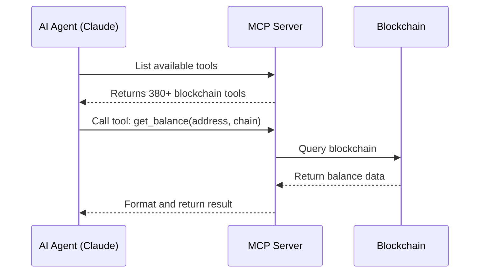
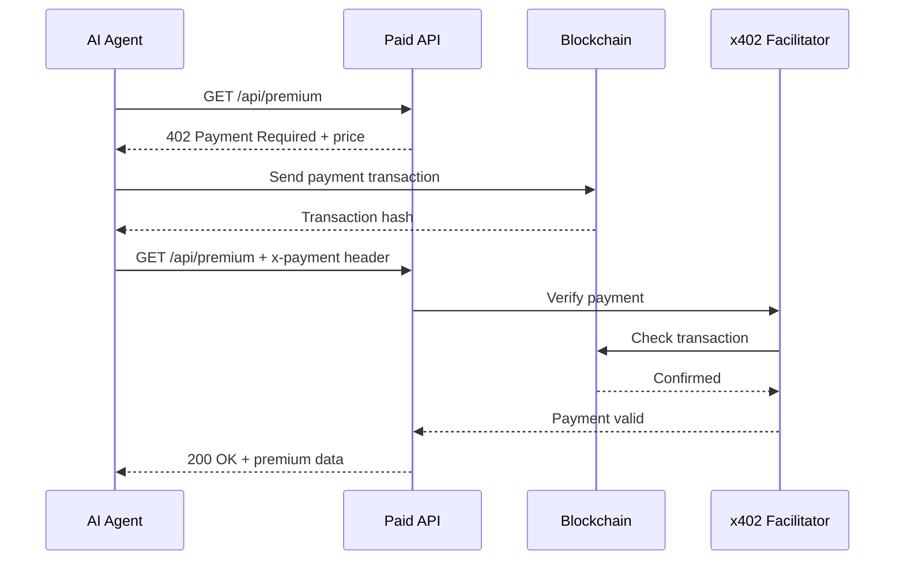

# Complete Documentation

## Universal Crypto MCP - Full Documentation

This is a comprehensive guide to Universal Crypto MCP, the first AI-native blockchain infrastructure that combines a powerful MCP server with the x402 payment protocol.

---

## 📚 Documentation Structure

### Getting Started
- **[Overview](getting-started/overview.md)** - What is Universal Crypto MCP and why use it
- **[Installation](getting-started/installation.md)** - Install and configure in minutes
- **[Quick Start](getting-started/quickstart.md)** - Your first blockchain transaction
- **[Configuration](getting-started/configuration.md)** - Detailed configuration options

### MCP Server
- **[Server Overview](mcp-server/index.md)** - Understanding the MCP server
- **[API Reference](mcp-server/api-reference.md)** - Complete tool documentation (380+ tools)
- **[Tools Guide](mcp-server/tools.md)** - How to use blockchain tools
- **[Architecture](mcp-server/architecture.md)** - System design and components
- **[ChatGPT Setup](mcp-server/chatgpt-setup.md)** - Configure for ChatGPT
- **[Troubleshooting](mcp-server/troubleshooting.md)** - Common issues and solutions

### x402 Payment Protocol
- **[x402 Overview](x402-deploy/overview.md)** - Introduction to x402 payments
- **[Quick Start](x402-deploy/quick-start.md)** - Accept payments in 5 minutes
- **[Configuration](x402-deploy/configuration.md)** - Payment gateway setup
- **[Deployment](x402-deploy/deployment.md)** - Deploy to production
- **[Discovery Protocol](x402-deploy/discovery.md)** - AI agent discovery network
- **[Providers](x402-deploy/providers.md)** - Deployment provider guides

### Packages & Modules
- **[Core Package](packages/core.md)** - @universal-crypto-mcp/core
- **[DeFi Package](packages/defi.md)** - @universal-crypto-mcp/defi
- **[Market Data](packages/market-data.md)** - @universal-crypto-mcp/market-data
- **[Payments](packages/payments.md)** - @universal-crypto-mcp/payments
- **[Trading](packages/trading.md)** - @universal-crypto-mcp/trading
- **[Wallets](packages/wallets.md)** - @universal-crypto-mcp/wallets

### Tutorials
- **[AI Trading Agent](tutorials/ai-crypto-trading-agent.md)** - Build an automated trading bot
- **[Cross-Chain Portfolio](tutorials/cross-chain-portfolio.md)** - Multi-chain portfolio tracker
- **[DeFi Analytics](tutorials/defi-analytics.md)** - DeFi protocol analytics dashboard
- **[Security Scanner](tutorials/security-scanner.md)** - Token security analyzer
- **[Paid API Service](tutorials/paid-api-service.md)** - Create a monetized AI service

### Use Cases
- **[Portfolio Management](use-cases.md#portfolio)** - Track assets across chains
- **[Automated Trading](use-cases.md#trading)** - Execute trading strategies
- **[DeFi Interactions](use-cases.md#defi)** - Lending, borrowing, staking
- **[Payment Services](use-cases.md#payments)** - Accept crypto payments
- **[Data Services](use-cases.md#data)** - Blockchain data APIs

---

## 🚀 Quick Navigation

### By Role

**AI Agent Developer**
1. [Installation](getting-started/installation.md)
2. [Quick Start](getting-started/quickstart.md)
3. [API Reference](mcp-server/api-reference.md)
4. [Tutorials](tutorials/index.md)

**API Developer**
1. [x402 Overview](x402-deploy/overview.md)
2. [Quick Start](x402-deploy/quick-start.md)
3. [Deployment Guide](x402-deploy/deployment.md)
4. [Paid API Tutorial](tutorials/paid-api-service.md)

**Blockchain Developer**
1. [Architecture](mcp-server/architecture.md)
2. [Core Package](packages/core.md)
3. [DeFi Package](packages/defi.md)
4. [Contributing](contributing/subtree-sync.md)

### By Task

**Setting Up**
- [Install Universal Crypto MCP](getting-started/installation.md)
- [Configure Environment](getting-started/configuration.md)
- [Connect to Claude](getting-started/installation.md#configure-claude-desktop)

**Blockchain Operations**
- [Check Balances](mcp-server/tools.md#balance-queries)
- [Send Transactions](mcp-server/tools.md#transfers)
- [Swap Tokens](mcp-server/tools.md#defi-swaps)
- [Query NFTs](mcp-server/tools.md#nft-operations)

**Accepting Payments**
- [Wrap Your API with x402](x402-deploy/quick-start.md)
- [Deploy to Production](x402-deploy/deployment.md)
- [Configure Pricing](x402-deploy/configuration.md#pricing)
- [Monitor Revenue](x402-deploy/analytics.md)

**Building Projects**
- [Trading Bot](tutorials/ai-crypto-trading-agent.md)
- [Portfolio Tracker](tutorials/cross-chain-portfolio.md)
- [DeFi Dashboard](tutorials/defi-analytics.md)
- [Paid API](tutorials/paid-api-service.md)

---

## 🔧 Core Concepts

### Model Context Protocol (MCP)

MCP is an open protocol that standardizes how AI assistants connect to external data sources and tools.

**Key Features:**
- JSON-RPC 2.0 based communication
- Tool discovery and invocation
- Resource management
- Prompt templates

**How it Works:**


### x402 Payment Protocol

x402 is an HTTP 402-based protocol for AI agent payments using cryptocurrency.

**Key Features:**
- HTTP 402 Payment Required status
- On-chain payment verification
- Automatic escrow and settlement
- AI agent discovery network

**How it Works:**


### Multi-Chain Support

Universal Crypto MCP provides a unified interface for 20+ blockchain networks.

**Supported Networks:**

**EVM Chains:**
- Ethereum (mainnet, sepolia, goerli)
- Arbitrum (one, nova)
- Base (mainnet, sepolia)
- Polygon (mainnet, mumbai)
- Optimism (mainnet, goerli)
- BNB Chain (mainnet, testnet)
- Avalanche (c-chain, fuji)
- Fantom (mainnet, testnet)
- zkSync Era
- Linea
- Scroll
- Blast
- Mode
- Mantle

**Other Chains:**
- Solana (mainnet, devnet, testnet)

### DeFi Protocol Integration

**Supported Protocols:**
- **DEXes**: Uniswap V2/V3, SushiSwap, PancakeSwap, Curve
- **Lending**: Aave V2/V3, Compound V2/V3, Maker
- **Derivatives**: GMX, Synthetix, dYdX
- **Yield**: Yearn, Convex, Beefy

---

## 💡 Common Patterns

### Pattern 1: Multi-Chain Balance Check

```typescript
// Check balances across all supported chains
const chains = ['ethereum', 'arbitrum', 'base', 'polygon', 'optimism'];
const address = '0x...';

for (const chain of chains) {
  const balance = await getBalance(address, chain);
  console.log(`${chain}: ${balance} ETH`);
}
```

### Pattern 2: Conditional Token Swap

```typescript
// Swap ETH to USDC if price drops below threshold
const ethPrice = await getTokenPrice('ETH', 'USD');

if (ethPrice < 2000) {
  await swapTokens({
    from: 'ETH',
    to: 'USDC',
    amount: '0.5',
    chain: 'arbitrum'
  });
}
```

### Pattern 3: Paid API with x402

```typescript
import express from 'express';
import { wrapWithX402 } from '@nirholas/universal-crypto-mcp/x402';

const app = express();

// Regular API endpoint
app.get('/api/free', (req, res) => {
  res.json({ message: 'Free data' });
});

// Paid API endpoint
app.get('/api/premium', (req, res) => {
  res.json({ data: 'Premium content' });
});

// Wrap with x402 payment gateway
wrapWithX402(app, {
  pricing: {
    'GET /api/premium': '$0.001'
  },
  wallet: '0x...'
});

app.listen(3000);
```

### Pattern 4: AI Agent Discovery

```typescript
import { discoverServices } from '@nirholas/universal-crypto-mcp/x402';

// Find weather APIs under $0.01 per request
const services = await discoverServices({
  category: 'weather',
  maxPrice: '$0.01',
  minRating: 4.0
});

// Use the best service
const service = services[0];
const weather = await service.call('get_forecast', {
  city: 'New York'
}, {
  payment: {
    amount: service.price,
    token: 'USDC',
    network: 'arbitrum'
  }
});
```

---

## 📖 API Reference Quick Links

### Blockchain Operations
- [Get Balance](mcp-server/api-reference.md#get-balance)
- [Send Transaction](mcp-server/api-reference.md#send-transaction)
- [Get Transaction](mcp-server/api-reference.md#get-transaction)
- [Call Contract](mcp-server/api-reference.md#call-contract)
- [Deploy Contract](mcp-server/api-reference.md#deploy-contract)

### Token Operations
- [Get Token Balance](mcp-server/api-reference.md#get-token-balance)
- [Transfer Token](mcp-server/api-reference.md#transfer-token)
- [Approve Token](mcp-server/api-reference.md#approve-token)
- [Get Token Info](mcp-server/api-reference.md#get-token-info)

### DeFi Operations
- [Swap Tokens (Uniswap)](mcp-server/api-reference.md#swap-tokens)
- [Add Liquidity](mcp-server/api-reference.md#add-liquidity)
- [Supply (Aave)](mcp-server/api-reference.md#supply-aave)
- [Borrow (Aave)](mcp-server/api-reference.md#borrow-aave)
- [Stake](mcp-server/api-reference.md#stake)

### NFT Operations
- [Get NFTs](mcp-server/api-reference.md#get-nfts)
- [Transfer NFT](mcp-server/api-reference.md#transfer-nft)
- [Get NFT Metadata](mcp-server/api-reference.md#get-nft-metadata)

### Market Data
- [Get Token Price](mcp-server/api-reference.md#get-token-price)
- [Get Market Data](mcp-server/api-reference.md#get-market-data)
- [Get Portfolio Value](mcp-server/api-reference.md#get-portfolio-value)

### x402 Operations
- [Wrap Express App](x402-deploy/api-reference.md#wrap-express-app)
- [Verify Payment](x402-deploy/api-reference.md#verify-payment)
- [Register Service](x402-deploy/api-reference.md#register-service)
- [Discover Services](x402-deploy/api-reference.md#discover-services)

---

## 🎓 Learning Path

### Beginner Track

1. **Week 1: Setup & Basics**
   - [Install Universal Crypto MCP](getting-started/installation.md)
   - [First Transaction Tutorial](getting-started/quickstart.md)
   - Practice: Check balances, send small amounts

2. **Week 2: Multi-Chain**
   - [Understanding Chains](mcp-server/universal-evm.md)
   - [Cross-Chain Tutorial](tutorials/cross-chain-portfolio.md)
   - Practice: Query multiple chains, compare prices

3. **Week 3: DeFi Basics**
   - [DeFi Overview](packages/defi.md)
   - [Token Swap Tutorial](tutorials/defi-analytics.md)
   - Practice: Swap tokens, check liquidity

4. **Week 4: Build Project**
   - [Trading Bot Tutorial](tutorials/ai-crypto-trading-agent.md)
   - Build your own simple bot
   - Practice: Automated operations

### Intermediate Track

1. **Payments & Monetization**
   - [x402 Protocol Overview](x402-deploy/overview.md)
   - [Create Paid API](x402-deploy/quick-start.md)
   - Build: Simple paid service

2. **Advanced DeFi**
   - [Lending & Borrowing](packages/defi.md#lending)
   - [Yield Strategies](packages/defi.md#yield)
   - Build: DeFi dashboard

3. **Security & Best Practices**
   - [Security Guide](mcp-server/security.md)
   - [Error Handling](mcp-server/troubleshooting.md)
   - Build: Security scanner

### Advanced Track

1. **Custom Integrations**
   - [Architecture Deep Dive](mcp-server/architecture.md)
   - [Plugin Development](mcp-server/development.md)
   - Build: Custom protocol integration

2. **Production Deployment**
   - [Deployment Guide](x402-deploy/deployment.md)
   - [Scaling Strategies](x402-deploy/scaling.md)
   - Deploy: Production service

3. **Contributing**
   - [Contributing Guide](contributing/subtree-sync.md)
   - [Code Standards](contributing/code-standards.md)
   - Contribute: PR to the project

---

## 🔗 External Resources

### Official Links
- **GitHub**: [nirholas/universal-crypto-mcp](https://github.com/nirholas/universal-crypto-mcp)
- **npm**: [@nirholas/universal-crypto-mcp](https://www.npmjs.com/package/@nirholas/universal-crypto-mcp)
- **Documentation**: [universal-crypto-mcp.vercel.app](https://universal-crypto-mcp.vercel.app)

### Community
- **Discussions**: [GitHub Discussions](https://github.com/nirholas/universal-crypto-mcp/discussions)
- **Issues**: [GitHub Issues](https://github.com/nirholas/universal-crypto-mcp/issues)
- **Discord**: Coming soon

### Related Projects
- **MCP Protocol**: [modelcontextprotocol.io](https://modelcontextprotocol.io)
- **Claude**: [claude.ai](https://claude.ai)
- **x402 Protocol**: [x402.dev](https://x402.dev)

---

## 📄 License

Universal Crypto MCP is open source under the [Apache 2.0 License](https://github.com/nirholas/universal-crypto-mcp/blob/main/LICENSE).

---

## 🤝 Support

Need help? Check these resources:

1. **[FAQ](faq.md)** - Frequently asked questions
2. **[Troubleshooting](mcp-server/troubleshooting.md)** - Common issues
3. **[GitHub Issues](https://github.com/nirholas/universal-crypto-mcp/issues)** - Bug reports
4. **[Discussions](https://github.com/nirholas/universal-crypto-mcp/discussions)** - General questions

---

<div align="center">

**[Get Started →](getting-started/installation.md)**

</div>
