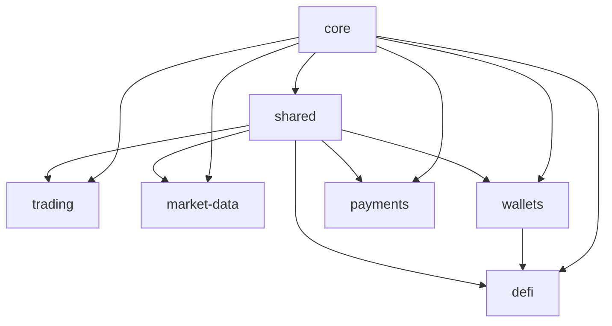

# Package Overview

Universal Crypto MCP is organized as a modular monorepo with specialized packages for different functionality areas.

## Package Architecture

```
packages/
├── core/               # Shared types, utilities, configuration
├── shared/             # Common utilities and helpers
├── trading/            # CEX exchange integrations
├── market-data/        # Prices, news, analytics
├── wallets/            # Wallet management
├── defi/               # On-chain DeFi protocols
├── payments/           # Payment infrastructure
├── agents/             # Autonomous agent tools
├── automation/         # Bots & automation
├── generators/         # Meta-tools for building MCP servers
├── infrastructure/     # Infrastructure tools
└── marketplace/        # Tool marketplace
```

## Package Categories

### Core Packages

| Package | Description | npm |
|---------|-------------|-----|
| `@universal-crypto-mcp/core` | Shared types, configuration, base classes | [](https://www.npmjs.com/package/@universal-crypto-mcp/core) |
| `@universal-crypto-mcp/shared` | Common utilities and helpers | [](https://www.npmjs.com/package/@universal-crypto-mcp/shared) |

### Trading Packages

| Package | Description | npm |
|---------|-------------|-----|
| `@universal-crypto-mcp/trading-binance` | Binance spot & futures trading | [](https://www.npmjs.com/package/@universal-crypto-mcp/trading-binance) |
| `@universal-crypto-mcp/trading-binance-us` | Binance US trading | [](https://www.npmjs.com/package/@universal-crypto-mcp/trading-binance-us) |

### Market Data Packages

| Package | Description | npm |
|---------|-------------|-----|
| `@universal-crypto-mcp/market-data-aggregator` | Multi-provider price aggregation | [](https://www.npmjs.com/package/@universal-crypto-mcp/market-data-aggregator) |
| `@universal-crypto-mcp/market-data-coingecko` | CoinGecko integration | [](https://www.npmjs.com/package/@universal-crypto-mcp/market-data-coingecko) |
| `@universal-crypto-mcp/market-data-news` | Crypto news aggregation | [](https://www.npmjs.com/package/@universal-crypto-mcp/market-data-news) |

### Wallet Packages

| Package | Description | npm |
|---------|-------------|-----|
| `@universal-crypto-mcp/wallet-evm` | Ethereum & EVM wallet management | [](https://www.npmjs.com/package/@universal-crypto-mcp/wallet-evm) |
| `@universal-crypto-mcp/wallet-solana` | Solana wallet management | [](https://www.npmjs.com/package/@universal-crypto-mcp/wallet-solana) |

### DeFi Packages

| Package | Description | npm |
|---------|-------------|-----|
| `@universal-crypto-mcp/defi-protocols` | Multi-protocol DeFi tools | [](https://www.npmjs.com/package/@universal-crypto-mcp/defi-protocols) |
| `@universal-crypto-mcp/defi-aave` | Aave lending integration | [](https://www.npmjs.com/package/@universal-crypto-mcp/defi-aave) |
| `@universal-crypto-mcp/defi-uniswap` | Uniswap DEX integration | [](https://www.npmjs.com/package/@universal-crypto-mcp/defi-uniswap) |

### Payment Packages

| Package | Description | npm |
|---------|-------------|-----|
| `@universal-crypto-mcp/payments-x402` | x402 payment protocol | [](https://www.npmjs.com/package/@universal-crypto-mcp/payments-x402) |

## Installation

### Full Package

Install everything:

```bash
npm install @nirholas/universal-crypto-mcp
```

### Individual Packages

Install only what you need:

```bash
# Core (always required)
npm install @universal-crypto-mcp/core

# Add trading
npm install @universal-crypto-mcp/trading-binance

# Add market data
npm install @universal-crypto-mcp/market-data-aggregator

# Add wallet management
npm install @universal-crypto-mcp/wallet-evm
```

## Package Dependencies



## Quick Start

### Using the Aggregated Package

```typescript
import { createServer } from "@nirholas/universal-crypto-mcp";

const server = createServer({
  modules: ["trading", "market-data", "wallets", "defi", "payments"],
});

await server.start();
```

### Using Individual Packages

```typescript
import { McpServer } from "@modelcontextprotocol/sdk/server/mcp.js";
import { registerMarketDataTools } from "@universal-crypto-mcp/market-data-aggregator";
import { registerTradingTools } from "@universal-crypto-mcp/trading-binance";
import { registerWalletTools } from "@universal-crypto-mcp/wallet-evm";

const server = new McpServer({
  name: "my-crypto-mcp",
  version: "1.0.0",
});

registerMarketDataTools(server);
registerTradingTools(server, { apiKey: "...", apiSecret: "..." });
registerWalletTools(server, { privateKey: "..." });

await server.start();
```

## Package Details

- [Core Package](core.md) - Types, configuration, utilities
- [Trading Package](trading.md) - Exchange integrations
- [Market Data Package](market-data.md) - Price and analytics
- [Wallets Package](wallets.md) - Wallet management
- [DeFi Package](defi.md) - DeFi protocols
- [Payments Package](payments.md) - Payment infrastructure
