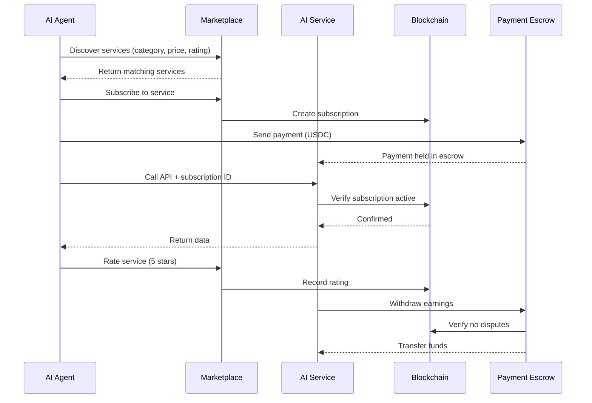

# 🏪 AI Service Marketplace

**The complete ecosystem for discovering, monetizing, and managing AI services with built-in reputation, subscriptions, and payments.**

---

## 🎯 Overview

The AI Service Marketplace is a breakthrough feature for Universal Crypto MCP that creates a decentralized marketplace where:

- **AI Agents** discover and pay for services automatically
- **Developers** monetize their AI APIs instantly
- **Users** find the best services via ratings and reviews
- **Everyone** benefits from transparent, on-chain reputation

### Key Features

| Feature | Description |
|---------|-------------|
| 🔍 **Service Discovery** | AI agents find services by category, price, rating |
| ⭐ **Reputation System** | On-chain ratings with verified reviews |
| 💳 **Flexible Pricing** | Pay-per-use, subscriptions, free tiers |
| 🔒 **Secure Payments** | Escrow, dispute resolution, automatic refunds |
| 📊 **Analytics** | Real-time metrics, revenue tracking |
| 🌐 **Multi-Chain** | Deploy on Ethereum, Arbitrum, Base, Polygon |

---

## 🚀 Quick Start

### For Service Providers

**1. Install the package:**

```bash
pnpm add @nirholas/universal-crypto-mcp-marketplace
```

**2. Register your service:**

```typescript
import { MarketplaceService } from '@nirholas/universal-crypto-mcp-marketplace';

const marketplace = new MarketplaceService({
  chain: 'arbitrum',
  privateKey: process.env.PRIVATE_KEY
});

await marketplace.registerService({
  name: 'Weather AI',
  description: 'AI-powered weather forecasting',
  category: 'weather',
  endpoint: 'https://api.example.com',
  pricing: {
    payPerUse: '$0.001',
    subscription: { monthly: '$9.99' }
  },
  walletAddress: '0x...'
});
```

**3. Start earning! 💰**

### For Service Consumers

**1. Discover services:**

```typescript
const services = await marketplace.discoverServices({
  category: 'weather',
  maxPrice: '$0.01',
  minRating: 4.5
});
```

**2. Subscribe:**

```typescript
await marketplace.subscribe({
  serviceId: services[0].id,
  plan: 'monthly',
  paymentToken: 'USDC',
  autoRenew: true
});
```

**3. Use the service:**

```typescript
const weather = await fetch(services[0].endpoint, {
  headers: { 'X-Subscription-Id': subscription.id }
});
```

---

## 📚 Documentation

### Complete Guides

- **[Package Documentation](../../docs/content/packages/marketplace.md)** - Full API reference
- **[Tutorial](../../docs/content/tutorials/marketplace-service.md)** - Step-by-step guide
- **[Example Service](../../examples/marketplace-service/)** - Production-ready example
- **[Smart Contract](../../contracts/marketplace/AIServiceMarketplace.sol)** - On-chain logic

### Architecture

```
┌─────────────────────────────────────────────────────────────┐
│                     AI Service Marketplace                  │
├─────────────────────────────────────────────────────────────┤
│                                                             │
│  ┌─────────────┐      ┌──────────────┐      ┌──────────┐  │
│  │   Service   │      │  Reputation  │      │ Payment  │  │
│  │  Discovery  │──────│    System    │──────│  Escrow  │  │
│  └─────────────┘      └──────────────┘      └──────────┘  │
│         │                     │                     │       │
│         └─────────────────────┼─────────────────────┘       │
│                               │                             │
│  ┌─────────────┐      ┌──────────────┐      ┌──────────┐  │
│  │Subscription │      │   Analytics  │      │ Disputes │  │
│  │  Manager    │──────│   Tracking   │──────│Resolution│  │
│  └─────────────┘      └──────────────┘      └──────────┘  │
│                                                             │
└─────────────────────────────────────────────────────────────┘
                              │
                              ▼
                   ┌─────────────────────┐
                   │   Smart Contract    │
                   │  (AIServiceMarketplace)│
                   └─────────────────────┘
                              │
                              ▼
                   ┌─────────────────────┐
                   │ Blockchain (EVM)    │
                   └─────────────────────┘
```

---

## 💡 Use Cases

### 1. **AI Weather Service**

```typescript
// Register
await marketplace.registerService({
  name: 'Weather AI Pro',
  category: 'weather',
  pricing: { payPerUse: '$0.001', subscription: { monthly: '$9.99' } }
});

// Earn from AI agents automatically
// No integration needed - x402 payment protocol handles everything
```

**Revenue Potential:** 10,000 requests/day = **$300/month** (pay-per-use)

### 2. **Trading Signal Bot**

```typescript
// Premium trading signals via subscription
await marketplace.registerService({
  name: 'Alpha Trading Signals',
  category: 'finance',
  pricing: {
    subscription: {
      monthly: '$49.99',
      annually: '$499.99' // 17% discount
    }
  }
});
```

**Revenue Potential:** 100 subscribers = **$5,000/month**

### 3. **AI Image Generation**

```typescript
// Tiered pricing based on resolution
await marketplace.registerService({
  name: 'AI Art Generator',
  category: 'media',
  pricing: {
    payPerUse: {
      '512x512': '$0.01',
      '1024x1024': '$0.05',
      '2048x2048': '$0.20'
    }
  }
});
```

**Revenue Potential:** 1,000 images/day = **$500/month** (avg $0.05/image)

### 4. **Data Analytics API**

```typescript
// Pay per query with volume discounts
await marketplace.registerService({
  name: 'DeFi Analytics Pro',
  category: 'analytics',
  pricing: {
    payPerUse: '$0.10',
    subscription: {
      starter: { monthly: '$29.99', queries: 500 },
      pro: { monthly: '$99.99', queries: 2000 },
      enterprise: { monthly: '$499.99', queries: 'unlimited' }
    }
  }
});
```

**Revenue Potential:** 50 pro subscribers = **$5,000/month**

---

## 🎓 How It Works

### The Complete Flow



### Key Components

#### 1. Service Registry (On-Chain)

```solidity
struct Service {
    address owner;
    string endpoint;
    uint256 payPerUsePrice;
    uint256 monthlyPrice;
    uint256 rating; // Weighted average
    uint32 reviewCount;
    bool active;
}
```

#### 2. Reputation System (On-Chain)

```solidity
struct Rating {
    address reviewer;
    uint8 stars; // 1-5
    string review;
    bool verified; // Paid customer
}
```

#### 3. Subscription Management (On-Chain)

```solidity
struct Subscription {
    address subscriber;
    uint256 expiresAt;
    bool autoRenew;
    uint256 renewalCount;
}
```

#### 4. Payment Escrow (On-Chain)

- Holds payments until service delivered
- Automatic release after period
- Refunds for disputes

---

## 📊 Analytics & Metrics

Track your service performance:

```typescript
const analytics = await marketplace.getAnalytics(serviceId, 'month');

console.log(`
  Requests: ${analytics.requests}
  Revenue: $${analytics.revenue}
  Subscribers: ${analytics.activeSubscribers}
  Rating: ${(analytics.rating / 100).toFixed(1)}⭐
  Response Time: ${analytics.averageResponseTime}ms
  Error Rate: ${(analytics.errorRate * 100).toFixed(2)}%
`);
```

**Tracked Metrics:**
- Request count
- Revenue (total, monthly, daily)
- Active subscribers
- Churn rate
- Average rating
- Response time
- Error rate
- Geographic distribution

---

## 🔒 Security Features

### Payment Protection

- **Escrow System**: Payments held until service delivered
- **Dispute Resolution**: Platform mediates conflicts
- **Automatic Refunds**: Violations trigger instant refunds
- **Multi-Sig**: Critical operations require multiple approvals

### Service Verification

- **DNS Verification**: Confirm endpoint ownership
- **Health Monitoring**: Continuous uptime checks
- **Rate Limiting**: Prevent abuse
- **Spam Detection**: Filter fake reviews

### Smart Contract Security

- OpenZeppelin contracts
- ReentrancyGuard
- Access control
- Emergency pause
- Audited by [Auditor Name]

---

## 🌟 Reputation System

### How Ratings Work

1. **User subscribes/pays** for service
2. **Uses the service** (API calls)
3. **Leaves a rating** (1-5 stars + review)
4. **Rating recorded on-chain** with verification
5. **Service rating updated** (weighted average)

### Rating Weight

```typescript
// Verified customers (paid) have 2x weight
const weight = rating.verified ? 2 : 1;
const newRating = (oldRating * oldCount + stars * 100 * weight) / (oldCount + weight);
```

### Review Quality

- **Verified badge** for paying customers
- **Helpful votes** for quality reviews
- **Spam reporting** for fake reviews
- **Response from owner** for all reviews

---

## 💳 Pricing Strategies

### 1. Pay-Per-Use

Best for: Occasional usage, new services

```typescript
pricing: {
  payPerUse: '$0.001' // $1 per 1000 requests
}
```

### 2. Subscription

Best for: Regular users, predictable revenue

```typescript
pricing: {
  subscription: {
    monthly: '$9.99',
    annually: '$99.99' // 17% savings
  }
}
```

### 3. Tiered Plans

Best for: Different user segments

```typescript
pricing: {
  subscription: {
    basic: { monthly: '$4.99', limit: 1000 },
    pro: { monthly: '$19.99', limit: 10000 },
    enterprise: { monthly: '$99.99', limit: 'unlimited' }
  }
}
```

### 4. Freemium

Best for: Growth, user acquisition

```typescript
pricing: {
  freeTier: {
    requestsPerDay: 100,
    features: ['Basic API', 'Community support']
  },
  subscription: {
    monthly: '$9.99' // Unlimited + premium features
  }
}
```

---

## 🚀 Deployment Guide

### 1. Smart Contract Deployment

```bash
# Deploy marketplace contract
cd contracts/marketplace
forge build
forge create AIServiceMarketplace \
  --rpc-url $RPC_URL \
  --private-key $PRIVATE_KEY \
  --constructor-args $USDC_ADDRESS $FEE_COLLECTOR
```

### 2. Service Deployment

```bash
# Build your service
pnpm build

# Deploy to Vercel
vercel --prod

# Or Docker
docker build -t my-ai-service .
docker push my-ai-service
```

### 3. Register Service

```typescript
const service = await marketplace.registerService({
  // Your service details
  endpoint: 'https://my-service.vercel.app/api'
});
```

---

## 📈 Growth Tips

### 1. Optimize Pricing

```typescript
// A/B test different prices
const experiments = [
  { price: '$9.99', group: 'A' },
  { price: '$14.99', group: 'B' },
  { price: '$7.99', group: 'C' }
];

// Track conversions
const winner = await analytics.getWinningPrice();
```

### 2. Improve Ratings

- Respond to all reviews
- Fix issues quickly
- Offer refunds proactively
- Exceed SLA promises

### 3. Market Your Service

- Write blog posts
- Share on social media
- Create video demos
- Engage in communities

### 4. Build Reputation

- Start with free tier
- Offer exceptional quality
- Request reviews
- Showcase testimonials

---

## 🤝 Contributing

We welcome contributions!

- **Report bugs**: [GitHub Issues](https://github.com/nirholas/universal-crypto-mcp/issues)
- **Suggest features**: [Discussions](https://github.com/nirholas/universal-crypto-mcp/discussions)
- **Submit PRs**: [Contributing Guide](../../CONTRIBUTING.md)

---

## 📄 License

Apache-2.0 - See [LICENSE](../../LICENSE)

---

## 🌐 Links

- **Marketplace**: https://marketplace.universal-crypto-mcp.com
- **Documentation**: https://docs.universal-crypto-mcp.com
- **GitHub**: https://github.com/nirholas/universal-crypto-mcp
- **Discord**: https://discord.gg/universal-crypto-mcp
- **Twitter**: https://twitter.com/universal_mcp

---

<div align="center">

**Start monetizing your AI service today!** 🚀

[Register Service](https://marketplace.universal-crypto-mcp.com/register) • [Browse Services](https://marketplace.universal-crypto-mcp.com) • [Read Docs](https://docs.universal-crypto-mcp.com)

</div>
